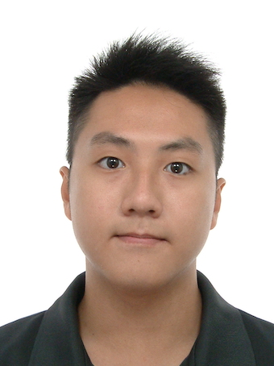
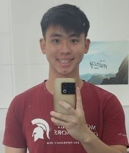
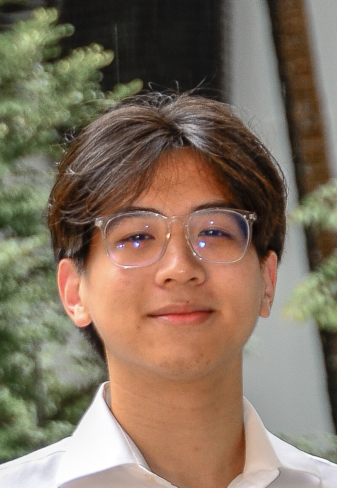

# About Us

We are a team based in the [School of Computing, National University of Singapore](http://www.comp.nus.edu.sg).

You can reach us at the email `seer[at]comp.nus.edu.sg`

## Project F.A.K.E.J.A.R.V.I.S.' Team

### Yeap Rayson

[[homepage](http://linkedin.com/in/rayson-yeap)]
[[github](https://github.com/respirayson)]
[[portfolio](team/respirayson.md)]

* Role: Git expert, Documentation

### Jian Song

[[github](http://github.com/raydenlim)]
[[portfolio](team/raydenlim.md)]

* Role: Morale Booster, Debugger
* Responsibilities: *

### Ding Han

[[github](http://github.com/ldinghan)] [[portfolio](team/ldinghan.md)]

* Role: Developer
* Responsibilities: Data

### Ryan Pang

[[github](https://github.com/Originalidk)]
[[portfolio](team/originalidk.md)]

* Role: Developer
* Responsibilities: Fullstack

### Ho Jia Cheng

[[github](http://github.com/wesho1107)]
[[portfolio](team/wesho1107.md)]

* Role: Developer
* Responsibilities: UI
