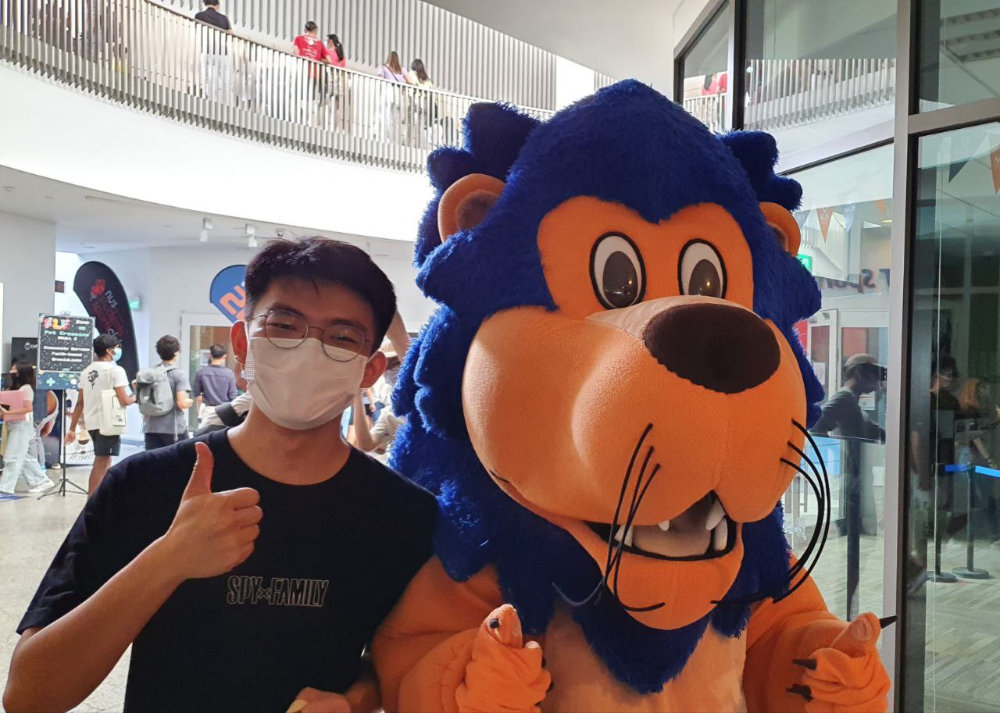

# About Us

We are a team based in the [School of Computing, National University of Singapore](http://www.comp.nus.edu.sg).

You can reach us at the email `seer[at]comp.nus.edu.sg`

## Project FAKEJARVIS' Team

### Yeap Rayson

[[homepage](http://linkedin.com/in/rayson-yeap)]
[[github](https://github.com/respirayson)]
[[portfolio](team/respirayson.md)]

* Role: Git expert, Documentation

### Jian Song

[[github](http://github.com/raydenlim)]
[[portfolio](team/raydenlim.md)]

* Role: Morale Booster, Debugger
* Responsibilities: *

### Johnny Doe

[[github](http://github.com/johndoe)] [[portfolio](team/johndoe.md)]

* Role: Developer
* Responsibilities: Data

### Jean Doe

[[github](http://github.com/johndoe)]
[[portfolio](team/johndoe.md)]

* Role: Developer
* Responsibilities: Dev Ops + Threading

### James Doe

[[github](http://github.com/johndoe)]
[[portfolio](team/johndoe.md)]

* Role: Developer
* Responsibilities: UI
