# F.A.K.E.J.A.R.V.I.S. Developer Guide

<!-- * Table of Contents -->
<page-nav-print />

--------------------------------------------------------------------------------------------------------------------

## **Acknowledgements**

_{ list here sources of all reused/adapted ideas, code, documentation, and third-party libraries -- include links to the original source as well }_

--------------------------------------------------------------------------------------------------------------------

## **Setting up, getting started**

Refer to the guide [_Setting up and getting started_](SettingUp.md).

--------------------------------------------------------------------------------------------------------------------

## **Design**

### Architecture

<puml src="diagrams/ArchitectureDiagram.puml" width="280" />

The ***Architecture Diagram*** given above explains the high-level design of the App.

Given below is a quick overview of main components and how they interact with each other.

**Main components of the architecture**

**`Main`** (consisting of classes [`Main`](https://github.com/AY2324S1-CS2103T-T15-1/tp/tree/master/src/main/java/seedu/address/Main.java) and [`MainApp`](https://github.com/AY2324S1-CS2103T-T15-1/tp/tree/master/src/main/java/seedu/address/MainApp.java)) is in charge of the app launch and shut down.
* At app launch, it initializes the other components in the correct sequence, and connects them up with each other.
* At shut down, it shuts down the other components and invokes cleanup methods where necessary.

The bulk of the app's work is done by the following four components:

* [**`UI`**](#ui-component): The UI of the App.
* [**`Logic`**](#logic-component): The command executor.
* [**`Model`**](#model-component): Holds the data of the App in memory.
* [**`Storage`**](#storage-component): Reads data from, and writes data to, the hard disk.

[**`Commons`**](#common-classes) represents a collection of classes used by multiple other components.

**How the architecture components interact with each other**

The *Sequence Diagram* below shows how the components interact with each other for the scenario where the user issues the command `delete 1`.

<puml src="diagrams/ArchitectureSequenceDiagram.puml" width="574" />

Each of the four main components (also shown in the diagram above),

* defines its *API* in an `interface` with the same name as the Component.
* implements its functionality using a concrete `{Component Name}Manager` class (which follows the corresponding API `interface` mentioned in the previous point.

For example, the `Logic` component defines its API in the `Logic.java` interface and implements its functionality using the `LogicManager.java` class which follows the `Logic` interface. Other components interact with a given component through its interface rather than the concrete class (reason: to prevent outside component's being coupled to the implementation of a component), as illustrated in the (partial) class diagram below.

<puml src="diagrams/ComponentManagers.puml" width="300" />

The sections below give more details of each component.

### UI component

The **API** of this component is specified in [`Ui.java`](https://github.com/AY2324S1-CS2103T-T15-1/tp/tree/master/src/main/java/seedu/address/ui/Ui.java)

<puml src="diagrams/UiClassDiagram.puml" alt="Structure of the UI Component"/>

The UI consists of a `MainWindow` that is made up of parts e.g.`CommandBox`, `ResultDisplay`, `PersonListPanel`, `StatusBarFooter` etc. All these, including the `MainWindow`, inherit from the abstract `UiPart` class which captures the commonalities between classes that represent parts of the visible GUI.

The `UI` component uses the JavaFx UI framework. The layout of these UI parts are defined in matching `.fxml` files that are in the `src/main/resources/view` folder. For example, the layout of the [`MainWindow`](https://github.com/AY2324S1-CS2103T-T15-1/tp/tree/master/src/main/java/seedu/address/ui/MainWindow.java) is specified in [`MainWindow.fxml`](https://github.com/AY2324S1-CS2103T-T15-1/tp/tree/master/src/main/resources/view/MainWindow.fxml)

The `UI` component,

* executes user commands using the `Logic` component.
* listens for changes to `Model` data so that the UI can be updated with the modified data.
* keeps a reference to the `Logic` component, because the `UI` relies on the `Logic` to execute commands.
* depends on some classes in the `Model` component, as it displays `Person` object residing in the `Model`.

### Logic component

**API** : [`Logic.java`](https://github.com/AY2324S1-CS2103T-T15-1/tp/tree/master/src/main/java/seedu/address/logic/Logic.java)

Here's a (partial) class diagram of the `Logic` component:

<puml src="diagrams/LogicClassDiagram.puml" width="550"/>

The sequence diagram below illustrates the interactions within the `Logic` component, taking `execute("delete 1")` API call as an example.

<puml src="diagrams/DeleteSequenceDiagram.puml" alt="Interactions Inside the Logic Component for the `delete 1` Command" />

<box type="info" seamless>

**Note:** The lifeline for `DeleteCommandParser` should end at the destroy marker (X) but due to a limitation of PlantUML, the lifeline reaches the end of diagram.
</box>

How the `Logic` component works:

1. When `Logic` is called upon to execute a command, it is passed to an `AddressBookParser` object which in turn creates a parser that matches the command (e.g., `DeleteCommandParser`) and uses it to parse the command.
1. This results in a `Command` object (more precisely, an object of one of its subclasses e.g., `DeleteCommand`) which is executed by the `LogicManager`.
1. The command can communicate with the `Model` when it is executed (e.g. to delete a person).
1. The result of the command execution is encapsulated as a `CommandResult` object which is returned back from `Logic`.

Here are the other classes in `Logic` (omitted from the class diagram above) that are used for parsing a user command:

<puml src="diagrams/ParserClasses.puml" width="600"/>

How the parsing works:
* When called upon to parse a user command, the `AddressBookParser` class creates an `XYZCommandParser` (`XYZ` is a placeholder for the specific command name e.g., `AddCommandParser`) which uses the other classes shown above to parse the user command and create a `XYZCommand` object (e.g., `AddCommand`) which the `AddressBookParser` returns back as a `Command` object.
* All `XYZCommandParser` classes (e.g., `AddCommandParser`, `DeleteCommandParser`, ...) inherit from the `Parser` interface so that they can be treated similarly where possible e.g, during testing.

### Model component
**API** : [`Model.java`](https://github.com/AY2324S1-CS2103T-T15-1/tp/tree/master/src/main/java/seedu/address/model/Model.java)

<puml src="diagrams/ModelClassDiagram.puml" width="450" />

The `Model` component,

* stores the F.A.K.E.J.A.R.V.I.S. data i.e., all `Person`, `Task`, `Session`, `GradedTest` and `Consultation` objects (which are contained in a `UniquePersonList`, `TaskList`, `SessionList`, `GradedTestList` and `ConsultationList` objects respectively).
* stores the currently 'selected' `Person`, `Task`, `Session`, `GradedTest` and `Consultation` objects (e.g., results of a search query) as separate _filtered_ lists which are exposed to outsiders as unmodifiable `ObservableList<XYZ>` that can be 'observed' e.g. the UI can be bound to this list so that the UI automatically updates when the data in the list change.
* stores a `UserPref` object that represents the user’s preferences. This is exposed to the outside as a `ReadOnlyUserPref` object.
* does not depend on any of the other three components (as the `Model` represents data entities of the domain, they should make sense on their own without depending on other components)

### Storage component

**API** : [`Storage.java`](https://github.com/AY2324S1-CS2103T-T15-1/tp/tree/master/src/main/java/seedu/address/storage/Storage.java)

<puml src="diagrams/StorageClassDiagram.puml" width="550" />

The `Storage` component,
* can save both F.A.K.E.J.A.R.V.I.S. data and user preference data in JSON format, and read them back into corresponding objects.
* inherits from `AddressBookStorage`, `ConsultationListStorage`, `GradedTestListStorage`, `SessionListStorage`, `TaskListStorage` and `UserPrefStorage`, which means it can be treated as either one (if only the functionality of only one is needed).
* depends on some classes in the `Model` component (because the `Storage` component's job is to save/retrieve objects that belong to the `Model`)
* contains data that is separated into distinct files, each catering to specific functionalities, which minimises the impact of potential corruption. Corruption in one set of data does not propagate to others, reinforcing the integrity of the data.

### Common classes

Classes used by multiple components are in the `seedu.addressbook.commons` package.

--------------------------------------------------------------------------------------------------------------------

## **Implementation**

This section describes some noteworthy details on how certain features are implemented.

### Sessions
The Session component consists of the following set of features: Create Session

#### The Session class
The Session Class encompasses several important attributes:
* `SessionNumber`: This unique identifier helps distinguish one session from another. It is an integral part of the Session class and is a primary key when searching for or referencing sessions within the system.

* `SessionStudents`: An essential component of every session is the list of students participating. The SessionStudents class keeps track of the students present in a particular session. This class allows for efficient management of attendance records and plays a vital role in generating attendance reports.

* `SessionRemark`: Sometimes, additional information about a session is necessary, such as special instructions, topics covered, or any other relevant remarks. The SessionRemark field offers the flexibility to include such notes.

The Session class also provides a set of getter methods that enable access to these attributes. For instance, you can retrieve the session number, list of students, or session remarks using these methods.

Below is a class diagram describing the implementation of `Session` and its respective fields.

#### Design Considerations:
**Aspect: How the students are added to a session upon initialisation:**

**Alternative 1 (current choice):** The `CreateSession` feature takes in arguments of varying number of student names.
- Pros:This choice offers a high degree of flexibility when it comes to adding students to a session. You can add any number of students when creating a session, which is essential for accommodating different class sizes and situations.
**Alternative 2:** An alternative design could involve creating two separate constructor methods within the `CreateSession` class. One constructor would be responsible for adding a student to an existing `SessionStudents`, and the other would take an entire `SessionStudents` object as an argument.
- Cons: This alternative introduces additional complexity in terms of validating user input and checking for null values upon execution. It may be less intuitive than the current approach.

By opting for the current choice (Alternative 1), the implementation remains straightforward and user-friendly, allowing for versatile usage scenarios. It ensures that users can efficiently create sessions and add students to them without unnecessary constraints or complications.

**Key Takeaway:** The chosen approach in the implementation of the `CreateSession` feature prioritises flexibility and ease of use for users, providing a more intuitive experience when managing class sessions and student attendance.

### Tasks
The Task component consists of the following set of features: Add Task, Delete Task and Update Progress.

#### The Task class
The Task Class is made up of a `TaskName`, `TaskDescription`, `date`, `TaskPriority`, `TaskProgress`, and a set of getter methods that corresponds to these fields.

Below is a class diagram describing the implementation of `Task` and its respective fields.

#### Design Considerations:
**Aspect: How the status of a task is implemented:**

**Alternative 1 (current choice):** `TaskProgress` Enum for Task Progress. Progress includes `not_started`, `pending`, `done`.
- Pros: This choice offers flexibility in representing task progress.
- Cons: It requires additional checks to validate user input and extensive unit testing.

**Alternative 2:** `isDone` Boolean for Task Completion.
- Cons: Only allows for a binary state, i.e., either the task is done or not.

### Assignments
The Assignment component consists of the following set of features: View Assignments, Edit Grade, Delete Grade, Edit Comment and Delete Comment.

#### The Assignment class
The Assignment Class is made up of an `assignmentName`, `grade`, `comment`, and a set of getter methods that corresponds to most of these fields.

Below is a class diagram describing the implementation of `Assignment` and its respective fields.

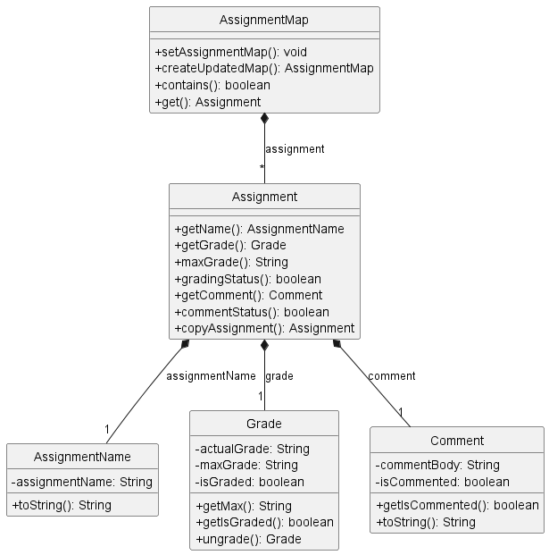

#### Design Considerations:
**Aspect: How an assignment in being assigned to a person:**

**Alternative 1 (current choice):** `AssignmentMap` is a field in `Person` that contains `Assignment` instances which are assigned to that person.
- Pros: This choice makes it easier to ensure that each assignment is only being assigned to one person, and also makes it easier to manage multiple features related to an assignment.
- Cons: It requires additional time to access an assignment since the assignment needs to be obtained from the correct person first.

**Alternative 2:** Create a `PersonList` field in every `Assignment`, which contains `Person` instances.
- Cons: Every person related command will have to update `PersonList` in every `Assignment` instance.

**Alternative 3:** Create a `PersonList` field in every `Assignment`, and an `AssignmentMap` field in every `Person`.
- Cons: It increases coupling which increases the dependency of the classes.

### GradedTest
The GradedTest component is responsible for tracking and managing graded test scores of individuals. It includes features such as creating and updating graded test scores.

#### The GradedTest class
The GradedTest Class is made up of a `ReadingAssessment1`, `ReadingAssessment2`, `MidTerms`, `Finals`, and
`PracticalExam`, each representing a different aspect of an individual's graded test scores. GradedTest Class also have a set of getter methods that corresponds to those fields.

Below is a class diagram describing the implementation of `Task` and its respective fields.

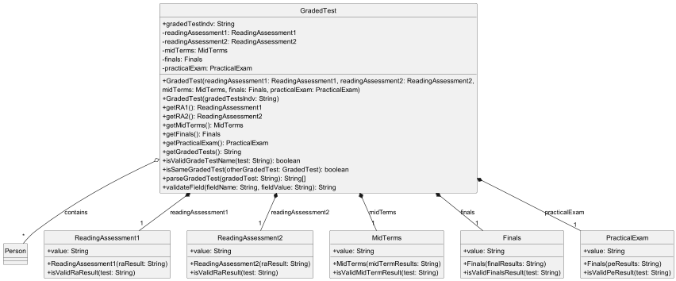

#### Design Considerations:
**Aspect: How to represent the scores of individuals:**

**Alternative 1 (current choice):** Utilizing `String` for individual graded test score.
- Pros: This choice offers flexibility in representing graded tests (e.g Default value of `-`).
- Cons: It requires additional parsing to generate statistics of how the Avenger's students are doing (e.g average,
  highest, lowest score).

**Alternative 2:** Multiple constructors for `GradedTest`.
- Pros: Provides flexibility in how users can create a `GradedTest` object.
- Cons: Requires additional parsing. Different constructor will give different error messages.

### Consultations

The Consultation component consists fo the following set of features: Create Consultation, Delete Consultation, Add
Student to a Consultation.

#### The Consultation Class

The Consultation Class is made up of a `LocalDate`, `LocalTime`, a `HashSet` of `Person` and a set of getter methods
that corresponds to these fields.

Below is a class diagram describing the implementation of `Consultation` and its respective fields.

Consultation Class UML Diagram

#### Design Considerations:

**Aspect: How the students are stored to a consultation:**

* **Alternative 1 (Current choice):** Use Set<Person> to keep track of students in a consultation.
    * Pros: Stores only 1 instance of a unique person, no duplicates.
    * Cons: May have performance issues in terms of memory usage.

* **Alternative 2:** Use ArrayList<Person> to keep track of students.
    * Cons: We must ensure there are no duplicates with additional checks.

**Aspect: Adding students to a new or existing consultation:**

* **Alternative 1 (Current choice):** The `AddToConsult` feature creates a new Consultation object with updated student list
  * Pros: Defensive programming when entirely creating a new Consultation object without modifying previous object.
  * Cons: Require additional checking to inform exception cases.

* **Alternative 2:** `AddToConsult` directly manipulate the attribute `students` in a Consultation object.
  * Cons: Poor abstraction and room for errors.

### Commands
This section explains the general implementation of all commands.

The following activity diagram generally shows the overall flow of events that the user will experience.

[//]: # (INSERT ACTVITY DIAGRAM HERE)

#### Parser Commands
This section explains the implementation and execution of commands that have their own specific parser.

Below is the sequence diagram for the execution of these commands (denoted by `XYZCommand`) after user input is sent to `LogicManager`. The execution of each of the command has been omitted due to their inherent differences and will be covered in their respective command sections below.

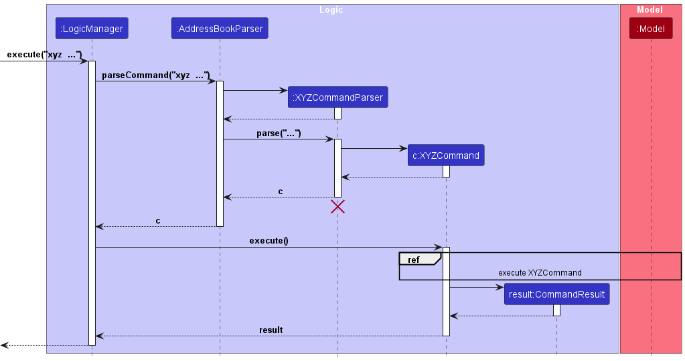

Step 1:
The user enters a command with the necessary parameters which is then passed to the `LogicManager`.

Step 2:
The `LogicManager` calls `AddressBookParser::parseCommand` for it to identify the type of command.

Step 3:
The `AddressBookParser` parses the user input and creates a command parser for that specific command. (denoted by `XYZCommandParser`)

Step 4:
The command parser is returned to the `AddressBookParser` which then calls `XYZCommandParser::parse` to parse the additional parameters.

Step 5:
The `XYZCommandParser` creates its respective command object (denoted by `XYZCommand`) and returns it to `LogicManager`.

Step 6:
The `LogicManager` calls `XYZCommand::execute` where the interaction between the command and the model is handled.

Step 7:
The `XYZCommand` creates a successful `CommandResult` and returns it to the UI.

#### Students

#### Edit Student Feature
This section explains the implementation of the Edit Student feature via the `edit` command. The `EditCommand` updates the fields of the existing specified `Person`. There is 1 compulsory field, which is the Index of the `Person` to update. However, at least 1 optional field must also be provided. The optional fields are name, phone, telegram handle, tag and graded tests.

Below is the sequence diagram outlining the execution of the `EditCommand`.

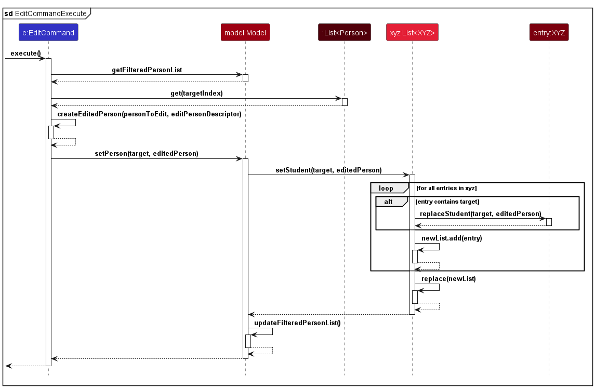

Step 1:
The `LogicManager` invokes `EditCommand::execute`, which in turn calls `Model::getFilteredPersonList` and `List<Person>::get` to get the specified `Person` to edit.

Step 2:
The `EditCommand::createEditedPerson` is invoked to create a new immutable `Person` object with the updated fields.

Step 3:
The `EditCommand` will call `setPerson` in `Model` to replace the original `Person` with the new `Person` object.

Step 4:
The `Model` will also call `setStudent` in the respective lists (denoted by `List<XYZ>`, where XYZ refers to `Consultation` and `Session`) to update the relevant lists containing the original `Person` to the new `Person` object.

Step 5:
The `EditCommand` will call its own `updateFilteredPersonList` method to update the model's filter and display all the students to the user.

Step 6:
The `EditCommand` then continues its execution as defined by [this](#parser-commands) sequence diagram.

#### Delete Student Feature
This section explains the implementation of the Delete Student feature via the `delete` command.
The `DeleteCommand` causes the specified `Person` to be deleted from the application. This includes removing the student from any `consultations` or `sessions` that the student might be in.

This process is summarised in the activity diagram below

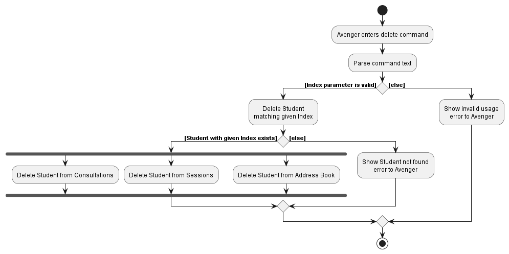

#### Create Session Feature
This section explains the implementation of the Create Session feature via the `createsession` command.
The `CreateSessionCommand` causes the specified `Session` to be added to the Session List in the application.
There are two compulsory fields which are the session number of the session, as well as the names of the students involved.

Below is the activity diagram outlining the execution of `CreateSessionCommand`.

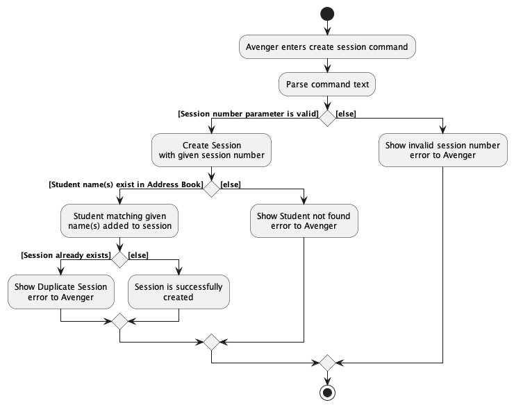

Step 1:
The Avenger(user) enters the command `createsession` and the command is parsed by the `CreateSessionCommandParser`.

Step 2:
The Session Number parameter is checked for its validity, which will display an error message if invalid. Otherwise, a Session with that session number is temporarily created.

Step 3:
The given name(s) of students are then checked if they exist in the Address Book. If there are any invalid names, an error message indicating Student Not Found will be displayed. Otherwise, another check follows.

Step 4:
The final check ensures that there are no duplicate sessions being created, before finally adding the created session to the model. If a duplicate session is detected, an error message will be displayed to alert the Avenger that a duplicate session will be created.

#### Design Considerations:
**Aspect: How to determine if a session is considered a duplicate**

* **Alternative 1 (current choice):** Session is considered duplicate if another session with the same session number already exists in the session list.
    * Pros: It is easier to manage the duplicate session situation if only session number is compared, making other features easier to implement by referring to the session number as the session's identity.
    * Cons: User will not be able to have multiple sessions of the same session number.

* **Alternative 2:** Session will be considered duplicate only if all of its fields, session number, students, and session remark are equal.
    * Pros: It allows for multiple sessions of the same session number to be stored in the same session list.
    * Cons: A small mistake in the inputs will cause two sessions to not be considered duplicate, which could unintentionally lead to multiple sessions with almost the same fields (which would have been considered duplicate otherwise).

#### Take Attendance Feature
This section explains the implementation of the Take Attendance feature via the `takeattendance` command.
The `TakeAttendanceCommand` causes the specified `Person` to be added to the specified session. 
There are two compulsory fields, which are the session number of the session, as well as the names of the students involved.

This process is shown in the sequence diagram below

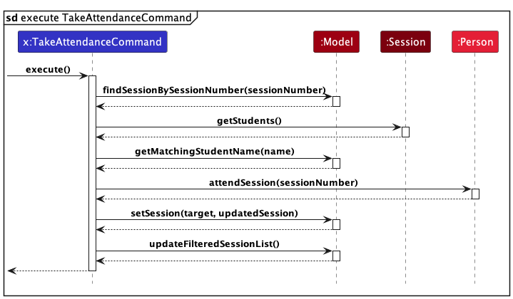

Step 1:
The `LogicManager` invokes `TakeAttendanceCommand::execute`, which then calls `Model::findSessionBySessionNumber` to retrieve the specified session to be updated.

Step 2:
The `TakeAttendanceCommand` then updates the attendance status based on the provided information, utilising the `Model::getMatchingStudentName` to obtain the corresponding `Person` object to be updated.

Step 3:
The `TakeAttendanceCommand` creates an updated `Session` object using the `createUpdatedSession` method, which is saved in the `Model` using `Model::setSession`.

Step 4:
Finally, the `TakeAttendanceCommand` triggers the `Model` to update the filtered session list using the `updateFilteredSessionList` to display all sessions.

#### Design Considerations:
**Aspect: How models are modified to store changes**

* **Alternative 1 (current choice):** Cause updates to both `Session` and `Person` when updating the attendance status of a student to a specified session.
    * Pros: Allows for ease of future enhancements since we can cause the same update from either `Session` or `Person` involved.
    * Cons: The same action is performed twice, but since the student is added to a `StudentSet`, only one instance of student is added.

* **Alternative 2:** Only update the `Session` to store the `Person`
    * Pros: The same action is not performed twice.
    * Cons: It may be difficult to add future enhancements without this method in place as a skeleton.

#### Add Tasks Feature
This section explains the implementation of the Add Task feature via the `addtask` command.
The `AddTaskCommand` causes the specified `Task` to be added to the Task List in the application.
There is only one compulsory field which is the name of the task. There are several optional fields such as the description, priority and deadline.

Below is the sequence diagram outlining the execution of `AddTaskCommand`.

Step 1:
The `LogicManager` invokes `AddTaskCommand::execute`, which in turn calls `Model::addTask` to add the new task into the task list.

Step 2:
The `Model` will call its own `updateFilteredTaskList` method to update the model's filter and display all the tasks to the user.

Step 3:
The `AddTaskCommand` then continues its execution as defined by [this](#parser-commands) sequence diagram.

##### Design Considerations:
**Aspect: How we execute the AddTaskCommand:**

* **Alternative 1 (current choice):** Let the `LogicManager` pass the model to the command to execute.
    * Pros: Promotes information hiding since we do not need to expose the model to the `AddTaskCommand`.

* **Alternative 2:** Store the model in the `AddTaskCommand` itself.
    * Pros: Easier to debug.
    * Cons: The `AddTaskCommand` might be able to call other methods in the model.

#### Delete Tasks Feature
This section explains the implementation of the Delete Task feature via the `deletetask` command. The `DeleteTaskCommand` causes the specified `Task` identified using the `Index` to be deleted from the Task List in the application. There is one compulsory field which is the Index of the Task to delete. 

Below is the sequence diagram outlining the execution of `DeleteTaskCommand`.

Step 1:
The `LogicManager` invokes `DeleteTaskCommand::execute`, which in turn calls `Model::getFilteredTaskList` and `List<Task>::get` to get the relevant task to be deleted.

Step 2:
The `Model` then calls `deleteTask` to remove the specified task from the task list.

Step 3:
The `DeleteTaskCommand` then continues its execution as defined by [this](#parser-commands) sequence diagram.

##### Design Considerations:
**Aspect: How we execute the DeleteTaskCommand:**
* Similar to the `AddTaskCommand`, the main considerations for this command is related to the way that the model is stored.

#### View Tasks Feature
This section explains the implementation of the View Tasks feature via the `viewtasks` command. The `ViewTasksCommand` displays the Tasks filtered using the `predicate` specified by the user. There are multiple optional fields that the user can use to filter the list by, such as the progress, priority, name, description and date. However, only one field is able to be applied as a filter at a specific time. 

Below is the sequence diagram outlining the execution of `ViewTasksCommand`.

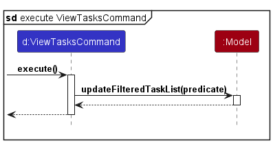

Step 1:
The `LogicManager` invokes `ViewTasksCommand::execute`, which in turn calls `Model::updateFilteredTaskList` with the given `Predicate<Task>`.

Step 2:
The `ViewTasksCommand` then continues its execution as defined by [this](#parser-commands) sequence diagram.

##### Design Considerations:
**Aspect: How we execute the ViewTasksCommand:**

* **Alternative 1 (current choice):** Combine the list and find functionality into one.
    * Pros: Promotes user experience due to the reduction in the number of different commands.
    * Cons: More checks need to be done to ensure that the correct predicate is applied and the correct field is being checked against. 

* **Alternative 2:** Separate out into 2 separate functions.
    * Pros: Easier to debug since they're implemented independently of one another.
    * Cons: More commands make the interface messier, negatively impacting user experience.

#### Update Task Progress Feature
This section explains the implementation of the Update Task Progress feature via the `updateprogress` command. The `UpdateTasksProgressCommand` updates the progress of the task identified using the Index. There are 2 compulsory fields, which are the Index of the task to update, and the new progress status of the task. The progress must be one of the 3 values: `not_started`, `pending`, `done`.

Below is the sequence diagram outlining the execution of `UpdateTasksProgressCommand`.

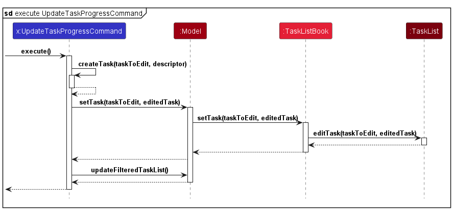

Step 1:
The `LogicManager` invokes `UpdateTaskProgressCommand::execute`, which in turn calls `Model::getFilteredTaskList` and `List<Task>::get` to get the relevant task to be edited.

Step 2:
The `UpdateTaskProgressCommand::createTask` is invoked to create a new immutable Task object with the updated progress.

Step 3:
The `UpdateTaskProgressCommand` will call `setTask` in `Model` to replace the existing `Task` with the new `Task` object.

Step 4:
The `UpdateTaskProgressCommand` will call its own `updateFilteredTaskList` method to update the model's filter and display all the tasks to the user.

Step 5:
The `UpdateTaskProgressCommand` then continues its execution as defined by [this](#parser-commands) sequence diagram.

##### Design Considerations:
**Aspect: How we execute the UpdateTasksProgressCommand:**

* **Alternative 1 (current choice):** Create a new immutable object of the Task and replace the previous Task with the new Task.
    * Pros: Easier to debug since the state of immutable objects cannot be changed.
    * Cons: Performance degradation due to the need to create new objects everytime the Task is updated.

* **Alternative 2:** Mutate the existing Task in the Task list to reflect the new progress.
    * Cons: Risk of the state of mutable objects being changed by other methods or processes.
    * Cons: Reduced maintainability as state of object can keep changing throughout the code.

#### View Assignments Feature
This section explains the implementation of the View Assignments feature via the `viewassignments` command. The `ViewAssignmentsCommand` displays a list of Assignments belonging to a Student identified using the `STUDENT_INDEX` field. There is one compulsory field which is the Index of the Student to be selected.

Below is the sequence diagram outlining the execution of `ViewAssignmentsCommand`.

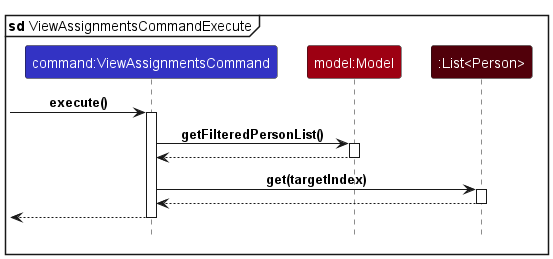

Step 1:
The `LogicManager` invokes `ViewAssignmentsCommand::execute`, which in turn calls `Model::getFilteredPersonList` and List<Person>::get to get the specified Student.

Step 2:
The `ViewAssignmentsCommand` then continues its execution as defined by [this](#parser-commands) sequence diagram.

##### Design Considerations:
**Aspect: How we execute the ViewAssignmentsCommand:**

* **Alternative 1 (current choice):** Let LogicManager store the Index of the Student whose Assignments are going to be displayed.
    * Pros: Enables the list of Assignments to automatically be updated every time the Assignment Grade or Comment is being edited or deleted.
    * Cons: The command details are not fully handled inside ViewAssignmentsCommand, resulting in poor separation of concerns principle.

* **Alternative 2:** Let LogicManager store the list of Assignments belonging to the Student whose Assignments are going to be displayed.
    * Pros: Abides by the separation of concerns principle better.
    * Cons: When the user edits or deletes an Assignment's Grade or Comment, he has to keep typing `viewassignments` to see the list of Assignments getting updated. This negatively impacts the user experience.

#### Edit Grade Feature
This section explains the implementation of the Edit Grade feature via the `editgrade` command. The `EditGradeCommand` edits the Grade of an Assignment belonging to a Student identified using the `STUDENT_INDEX` field. The Assignment is identified using the `ASSIGNMENT_NAME` field. There are three compulsory fields which are the Index of the Student to be selected, the name of the Assignment and the new Grade of the Assignment.

Below is the sequence diagram outlining the execution of `EditGradeCommand`.

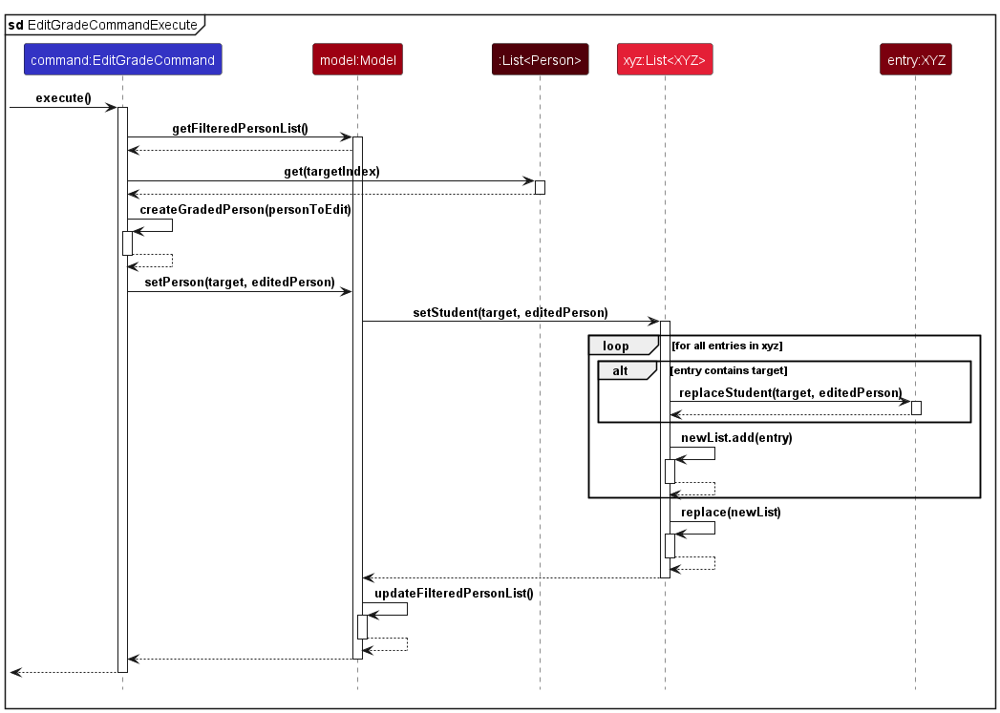

Step 1:
The `LogicManager` invokes `ViewAssignmentsCommand::execute`, which in turn calls `Model::getFilteredPersonList` and `List<Person>::get` to get the specified Student.

Step 2:
The `EditGradeCommand::createGradedPerson` is invoked to create a new immutable Person object with the updated Assignment Grade.

Step 3:
The `EditGradeCommand` will call `setPerson` in `Model` to replace the original `Person` with the new `Person` object.

Step 4:
The `Model` will also call `setStudent` in the respective lists (denoted by `List<XYZ>`, where XYZ refers to `Consultation` and `Session`) to update the relevant lists containing the original `Person` to the new `Person` object.

Step 5:
The `EditGradeCommand` will call its own `updateFilteredPersonList` method to update the model's filter and display all the students to the user.

Step 6:
The `EditGradeCommand` then continues its execution as defined by [this](#parser-commands) sequence diagram.

##### Design Considerations:
**Aspect: How we edit the Grade of a `Person` object's Assignment:**

* **Alternative 1 (current choice):** Create a completely new instance of `Person`.
  * Pros: Enables the `Person` object to remain immutable.
  * Cons: Editing the Grade of an Assignment will keep changing the `Person` found in the Model.

* **Alternative 2:** Update the `Assignment` found in the `Person` object.
  * Pros: Simplifies the process of editing the Grade.
  * Cons: Causes the `Person` object to no longer be immutable, giving rise to potential bugs or complications.

#### Create Consultation Feature
This section explains the implementation of the Create Consultation feature via the `createconsult` command.
The `CreateConsultCommand` creates a `Consultation` and adds it into the Consultation List in the application.
There are multiple compulsory field: date, time and name of students. 

Below is the sequence diagram outlining the execution of `CreateConsultCommand`.

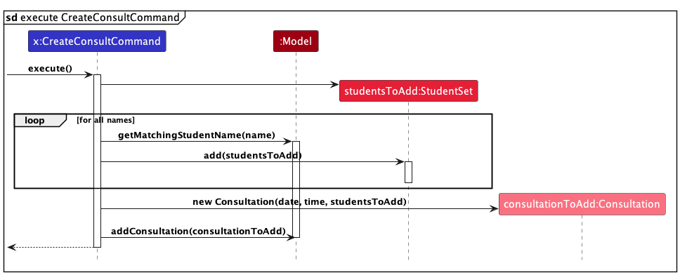

Step 1:
The `LogicManager` invokes `CreateConsult::execute`, which in turn creates a new `StudentSet`.

Step 2:
Then, `Model::getMatchingStudentName` is called in a loop to add `Person` specified by name into the `StudentSet`.

Step 3:
A new `Consultation` is created with specified date, time and the new `StudentSet`.

Step 4:
`Model::addConsultation` is then called to add the newly created `Consultation`.

Step 5:
The `CreateConsultCommand` then continues its execution as defined by [this](#parser-commands) sequence diagram.

##### Design Considerations:
**Aspect: How we execute the CreateConsultCommand:**

* **Alternative 1 (current choice):** Let the `LogicManager` pass the model to the command to execute.
    * Pros: Promotes information hiding since we do not need to expose the model to the `CreateConsultCommand`.

* **Alternative 2:** Store the model in the `CreateConsultCommand` itself.
    * Pros: Easier to debug.
    * Cons: The `CreateConsultCommand` might be able to call other methods in the model.

#### Add To Consultation Feature
This section explains the implementation of the Add To Consultation feature via the `addtoconsult` command.
The `AddToConsultCommand` adds a new student to the consultation identified using the Index.
There are 2 compulsory field, which are the Index of the consultation to add student into, and the name of the student.

Below is the sequence diagram outlining the execution of `AddToConsultCommand`.

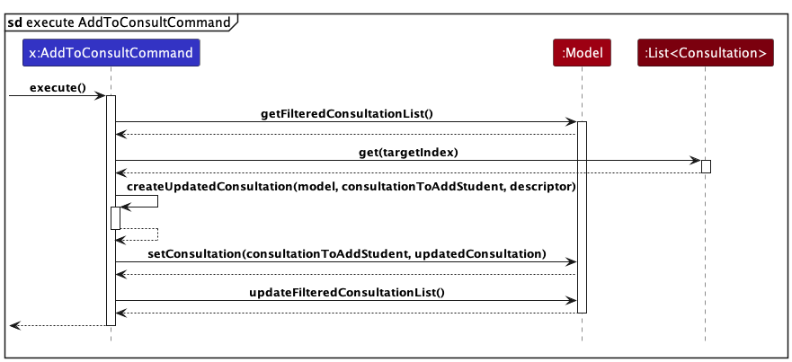

Step 1:
The `LogicManager` invokes `AddToConsultCommand::execute`, which in turn calls `Model::getFilteredConsultationList` and `List<Consultation>::get` to get the relevant consultation to be edited.

Step 2:
The `AddToConsultCommand::createUpdatedConsultation` is invoked to create a new immutable Consultation object with the updated `StudentSet`.

Step 3:
The `AddToConsultCommand` will call `setConsultation` in `Model` to replace the existing `Consultation` with the new `Consultation` object.

Step 4:
The `AddToConsultCommand` will call its own `updateFilteredConsultationList` method to update the model's filter and display all the consultation to the user.

Step 5:
The `AddToConsultCommand` then continues its execution as defined by [this](#parser-commands) sequence diagram.

##### Design Considerations:
**Aspect: How we execute the AddToConsultCommand:**

* **Alternative 1 (current choice):** Create a new immutable object of the updated Consultation and replace the previous Consultation.
    * Pros: Easier to debug since the state of immutable objects cannot be changed.
    * Cons: Performance overhead due creating new objects everytime the Consultation is edited.

* **Alternative 2:** Mutate the existing Consultation in the Consultation list to reflect the new students added.
    * Cons: Risk of the state of mutable objects being changed by other methods or processes.
    * Cons: Reduced maintainability as state of object can keep changing throughout the code.

--------------------------------------------------------------------------------------------------------------------

## **Documentation, logging, testing, configuration, dev-ops**

* [Documentation guide](Documentation.md)
* [Testing guide](Testing.md)
* [Logging guide](Logging.md)
* [Configuration guide](Configuration.md)
* [DevOps guide](DevOps.md)

--------------------------------------------------------------------------------------------------------------------

## **Appendix: Requirements**

### Product scope

**Target user profile**:

* CS1101S Avengers
* has a need to manage a significant number of classes, tutorials and assignments
* prefer desktop apps over other types
* can type fast
* prefers typing to mouse interactions
* is reasonably comfortable using CLI apps

**Value proposition**:  track assignment gradings, student participation and plan their tutorials, consultations and mastery checks

### User stories

Priorities: High (must have) - `* * *`, Medium (nice to have) - `* *`, Low (unlikely to have) - `*`

| Priority | As a …​                                    | I want to …​                                                | So that I can…​                                                        |
|----------|--------------------------------------------|-------------------------------------------------------------|------------------------------------------------------------------------|
| `* * *`  | new user                                   | see usage instructions                                      | refer to instructions when I forget how to use the App                 |
| `* * *`  | user                                       | add a new person                                            |                                                                        |
| `* * *`  | user                                       | delete a person                                             | remove entries that I no longer need                                   |
| `* * *`  | user                                       | find a person by name                                       | locate details of persons without having to go through the entire list |
| `* * *`  | busy avenger                               | keep track of what needs to be done                         | better guide my students.                                              |
| `* * *`  | conscientious avenger                      | view my students' grades and comments for their assignments | better assess my students' competency.                                 |
| `* * *`  | unorganised avenger                        | edit or delete my student's assignment grades and comments  | organise their progress better.                                        |
| `* * *`  | user                                       | create a new consultation with students                     | keep track of when and with who the consultation is held               |
| `* * *`  | user                                       | add students to an existing consultation                    | invite more students to join a consultation discussion                 |
| `* *`    | user                                       | hide private contact details                                | minimize chance of someone else seeing them by accident                |
| `*`      | user with many persons in the address book | sort persons by name                                        | locate a person easily                                                 |

*{More to be added}*

### Use cases

(For all use cases below, the **System** is the `F.A.K.E.J.A.R.V.I.S.` and the **Actor** is the `user`, unless specified otherwise)

**Use case: Delete a person**

**MSS**

1.  User requests to list persons
2.  F.A.K.E.J.A.R.V.I.S. shows a list of persons
3.  User requests to delete a specific person in the list
4.  F.A.K.E.J.A.R.V.I.S. deletes the person

    Use case ends.

**Extensions**

* 2a. The list is empty.

  Use case ends.

* 3a. The given index is invalid.

    * 3a1. F.A.K.E.J.A.R.V.I.S. shows an error message.

      Use case resumes at step 2.

**Use case: Delete a task**

**MSS**

1.  User requests to list tasks
2.  F.A.K.E.J.A.R.V.I.S. shows a list of tasks
3.  User requests to delete a specific task in the list
4.  F.A.K.E.J.A.R.V.I.S. deletes the task

    Use case ends.

**Extensions**

* 2a. The list is empty.

  Use case ends.

* 3a. The given index is invalid.

    * 3a1. F.A.K.E.J.A.R.V.I.S. shows an error message.

      Use case resumes at step 2.

**Use case: View a person's list of assignments**

**MSS**

1.  User requests to list persons
2.  F.A.K.E.J.A.R.V.I.S. shows a list of persons
3.  User requests to view the assignments of a specific person in the list
4.  F.A.K.E.J.A.R.V.I.S. displays the assignments of the selected person

    Use case ends.

**Extensions**

* 2a. The list is empty.

  Use case ends.

* 3a. The given index is invalid.

  * 3a1. F.A.K.E.J.A.R.V.I.S. shows an error message.

    Use case resumes at step 2.

**Use case: Edit the grade of an assignment**

**MSS**

1.  User requests to list persons
2.  F.A.K.E.J.A.R.V.I.S. shows a list of persons
3.  User requests to edit the grade of an assignment for a specific person in the list
4.  F.A.K.E.J.A.R.V.I.S. edits grade of the person's assignment

    Use case ends.

**Extensions**

* 2a. The list is empty.

  Use case ends.

* 3a. The given index is invalid.

    * 3a1. F.A.K.E.J.A.R.V.I.S. shows an error message.

      Use case resumes at step 2.

* 3b. The given assignment name is invalid.

    * 3b1. F.A.K.E.J.A.R.V.I.S. shows an error message.

      Use case resumes at step 2.

* 3c. The given grade is invalid.

    * 3c1. F.A.K.E.J.A.R.V.I.S. shows an error message.

      Use case resumes at step 2.

**Use case: Delete the grade of an assignment**

**MSS**

1.  User requests to list persons
2.  F.A.K.E.J.A.R.V.I.S. shows a list of persons
3.  User requests to delete the grade of an assignment for a specific person in the list
4.  F.A.K.E.J.A.R.V.I.S. deletes the grade of the person's assignment

    Use case ends.

**Extensions**

* 2a. The list is empty.

  Use case ends.

* 3a. The given index is invalid.

    * 3a1. F.A.K.E.J.A.R.V.I.S. shows an error message.

      Use case resumes at step 2.

* 3b. The given assignment name is invalid.

    * 3b1. F.A.K.E.J.A.R.V.I.S. shows an error message.

      Use case resumes at step 2.

* 3c. The given assignment has not been commented on.

    * 3c1. F.A.K.E.J.A.R.V.I.S. shows an error message.

      Use case resumes at step 2.

**Use case: Edit the comment on an assignment**

**MSS**

1.  User requests to list persons
2.  F.A.K.E.J.A.R.V.I.S. shows a list of persons
3.  User requests to edit comment on an assignment for a specific person in the list
4.  F.A.K.E.J.A.R.V.I.S. edits the comment of the person's assignment

    Use case ends.

**Extensions**

* 2a. The list is empty.

  Use case ends.

* 3a. The given index is invalid.

    * 3a1. F.A.K.E.J.A.R.V.I.S. shows an error message.

      Use case resumes at step 2.

* 3b. The given assignment name is invalid.

    * 3b1. F.A.K.E.J.A.R.V.I.S. shows an error message.

      Use case resumes at step 2.

* 3c. The given comment is invalid.

    * 3c1. F.A.K.E.J.A.R.V.I.S. shows an error message.

      Use case resumes at step 2.

**Use case: Delete the comment of an assignment**

**MSS**

1.  User requests to list persons
2.  F.A.K.E.J.A.R.V.I.S. shows a list of persons
3.  User requests to delete the comment of an assignment for a specific person in the list
4.  F.A.K.E.J.A.R.V.I.S. deletes the comment of the person's assignment

    Use case ends.

**Extensions**

* 2a. The list is empty.

  Use case ends.

* 3a. The given index is invalid.

    * 3a1. F.A.K.E.J.A.R.V.I.S. shows an error message.

      Use case resumes at step 2.

* 3b. The given assignment name is invalid.

    * 3b1. F.A.K.E.J.A.R.V.I.S. shows an error message.

      Use case resumes at step 2.

* 3c. The given assignment has been commented on.

    * 3c1. F.A.K.E.J.A.R.V.I.S. shows an error message.

      Use case resumes at step 2.

**Use case: Find Student Profile**

**MSS**

1.  User requests to list persons
2.  F.A.K.E.J.A.R.V.I.S. shows a list of persons
3.  User request a search query to find a student's profile
4.  F.A.K.E.J.A.R.V.I.S. returns matching results from the database

    Use case ends.

**Extensions**

* 2a. The list is empty.

    Use case ends.

* 3a. No matching profiles.

    * 3a1. F.A.K.E.J.A.R.V.I.S. shows an error message.

        Use case resumes at step 2.

**Use case: Filter Results**

**MSS**

1.  User requests to list persons.
2.  F.A.K.E.J.A.R.V.I.S. shows a list of persons.
3.  User requests to apply filters to the results via attribute `FILTER_ATTRIBUTE`, or description `FILTER_DESCRIPTION`.
4.  F.A.K.E.J.A.R.V.I.S. shows the filter results.

    Use case ends.

**Extensions**

* 2a. The list is empty.

  Use case ends.

* 3a. No filtered results.

    * 3a1. F.A.K.E.J.A.R.V.I.S. shows an error message.

      Use case resumes at step 2.

**Use case: Create a consultation**

**MSS**

1.  User requests to create a consultation with specified date, time and student name(s).
2.  F.A.K.E.J.A.R.V.I.S. creates a consultation.

    Use case ends.

**Extensions**

* 1a. The date input is invalid.

    * 1a1. F.A.K.E.J.A.R.V.I.S. shows an error message.

      Use case ends.

* 1b. The time input is invalid.

    * 1b1. F.A.K.E.J.A.R.V.I.S. shows an error message.

      Use case ends.

* 1c. No matching name to students' names.

    * 1c1. F.A.K.E.J.A.R.V.I.S. shows an error message.

      Use case ends.

**Use case: Delete a consultation**

**MSS**

1.  User requests to delete a consultation at a specified index.
2.  F.A.K.E.J.A.R.V.I.S. deletes the consultation.

    Use case ends.

**Extensions**

* 1a. The index input is invalid.

    * 1a1. F.A.K.E.J.A.R.V.I.S. shows an error message.

      Use case ends.

**Use case: Adding a student to a consultation**

**MSS**

1.  User requests to add a student into a consultation at a specified index.
2.  F.A.K.E.J.A.R.V.I.S. updates the consultation.

    Use case ends.

**Extensions**

* 1a. The index input is invalid.

    * 1a1. F.A.K.E.J.A.R.V.I.S. shows an error message.

      Use case ends.

* 1b. The student name input is invalid.

    * 1b1. F.A.K.E.J.A.R.V.I.S. shows an error message.

      Use case ends.
  
* 1c. No matching name to students' name found.

    * 1c1. F.A.K.E.J.A.R.V.I.S. shows an error message.

      Use case ends.

**Use case: Removing a student from a consultation**

**MSS**

1.  User requests to remove a student from a consultation at a specified index.
2.  F.A.K.E.J.A.R.V.I.S. updates the consultation.

    Use case ends.

**Extensions**

* 1a. The index input is invalid.

    * 1a1. F.A.K.E.J.A.R.V.I.S. shows an error message.

      Use case ends.

* 1b. The student name input is invalid.

    * 1b1. F.A.K.E.J.A.R.V.I.S. shows an error message.

      Use case ends.

* 1c. No matching name to students' name found in consultation.

    * 1c1. F.A.K.E.J.A.R.V.I.S. shows an error message.

      Use case ends.

* 1d. No matching name to students' name found in address book.

    * 1d1. F.A.K.E.J.A.R.V.I.S. shows an error message.

      Use case ends.

*{More to be added}*

### Non-Functional Requirements

1.  Should work on any _mainstream OS_ as long as it has Java `11` or above installed.
2.  Should be able to hold up to 1000 persons without a noticeable sluggishness in performance for typical usage.
3.  A user with above average typing speed for regular English text (i.e. not code, not system admin commands) should be able to accomplish most of the tasks faster using commands than using the mouse.
4.  The system should respond within 2 seconds to ensure smooth and efficient user interactions.
5.  The system should be able to handle an increasing number of users and data without a significant decrease in performance.
6.  The system should be user-friendly, with a clean and intuitive interface.
7.  Regular automated backups of data should be performed, and there should be a clear disaster recovery plan in place.

*{More to be added}*

### Glossary

* **Mainstream OS**: Windows, Linux, Unix, OS-X
* **Private contact detail**: A contact detail that is not meant to be shared with others

--------------------------------------------------------------------------------------------------------------------

## **Appendix: Instructions for manual testing**

Given below are instructions to test the app manually.

<box type="info" seamless>

**Note:** These instructions only provide a starting point for testers to work on;
testers are expected to do more *exploratory* testing.

</box>

### Launch and shutdown

1. Initial launch

    1. Download the jar file and copy into an empty folder

    1. Double-click the jar file Expected: Shows the GUI with a set of sample contacts. The window size may not be optimum.

1. Saving window preferences

    1. Resize the window to an optimum size. Move the window to a different location. Close the window.

    1. Re-launch the app by double-clicking the jar file. 
       Expected: The most recent window size and location is retained.

1. _{ more test cases …​ }_

### Deleting a person

1. Deleting a person while all persons are being shown

    1. Prerequisites: List all persons using the `list` command. Multiple persons in the list.

    1. Test case: `delete 1` 
       Expected: First contact is deleted from the list. Details of the deleted contact shown in the status message. Timestamp in the status bar is updated.

    1. Test case: `delete 0` 
       Expected: No person is deleted. Error details shown in the status message. Status bar remains the same.

    1. Other incorrect delete commands to try: `delete`, `delete x`, `...` (where x is larger than the list size) 
       Expected: Similar to previous.

1. _{ more test cases …​ }_

### Saving data

1. Dealing with missing/corrupted data files

    1. _{explain how to simulate a missing/corrupted file, and the expected behavior}_

1. _{ more test cases …​ }_
