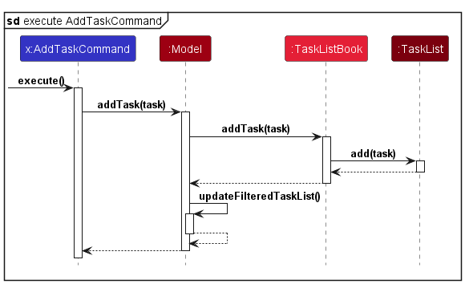

# F.A.K.E.J.A.R.V.I.S. Developer Guide

<!-- * Table of Contents -->
<page-nav-print />

--------------------------------------------------------------------------------------------------------------------

## **Acknowledgements**

* Referenced [linkytime, T13-3](https://github.com/zfs-old-crap/linkytime) for insights on Sequence Diagrams and Activity Diagrams.

--------------------------------------------------------------------------------------------------------------------

## **Setting up, getting started**

Refer to the guide [_Setting up and getting started_](SettingUp.md).

--------------------------------------------------------------------------------------------------------------------

## **Design**

### Architecture

<puml src="diagrams/ArchitectureDiagram.puml" width="280" />

The ***Architecture Diagram*** given above explains the high-level design of the App.

Given below is a quick overview of main components and how they interact with each other.

**Main components of the architecture**

**`Main`** (consisting of classes [`Main`](https://github.com/AY2324S1-CS2103T-T15-1/tp/tree/master/src/main/java/seedu/address/Main.java) and [`MainApp`](https://github.com/AY2324S1-CS2103T-T15-1/tp/tree/master/src/main/java/seedu/address/MainApp.java)) is in charge of the app launch and shut down.
* At app launch, it initializes the other components in the correct sequence, and connects them up with each other.
* At shut down, it shuts down the other components and invokes cleanup methods where necessary.

The bulk of the app's work is done by the following four components:

* [**`UI`**](#ui-component): The UI of the App.
* [**`Logic`**](#logic-component): The command executor.
* [**`Model`**](#model-component): Holds the data of the App in memory.
* [**`Storage`**](#storage-component): Reads data from, and writes data to, the hard disk.

[**`Commons`**](#common-classes) represents a collection of classes used by multiple other components.

**How the architecture components interact with each other**

The *Sequence Diagram* below shows how the components interact with each other for the scenario where the user issues the command `delete 1`.

<puml src="diagrams/ArchitectureSequenceDiagram.puml" width="574" />

Each of the four main components (also shown in the diagram above),

* defines its *API* in an `interface` with the same name as the Component.
* implements its functionality using a concrete `{Component Name}Manager` class (which follows the corresponding API `interface` mentioned in the previous point.

For example, the `Logic` component defines its API in the `Logic.java` interface and implements its functionality using the `LogicManager.java` class which follows the `Logic` interface. Other components interact with a given component through its interface rather than the concrete class (reason: to prevent outside component's being coupled to the implementation of a component), as illustrated in the (partial) class diagram below.

<puml src="diagrams/ComponentManagers.puml" width="300" />

The sections below give more details of each component.

### UI component

The **API** of this component is specified in [`Ui.java`](https://github.com/AY2324S1-CS2103T-T15-1/tp/tree/master/src/main/java/seedu/address/ui/Ui.java)

<puml src="diagrams/UiClassDiagram.puml" alt="Structure of the UI Component"/>

The UI consists of a `MainWindow` that is made up of parts e.g.`CommandBox`, `ResultDisplay`, `PersonListPanel`, `StatusBarFooter` etc. All these, including the `MainWindow`, inherit from the abstract `UiPart` class which captures the commonalities between classes that represent parts of the visible GUI.

The `UI` component uses the JavaFx UI framework. The layout of these UI parts are defined in matching `.fxml` files that are in the `src/main/resources/view` folder. For example, the layout of the [`MainWindow`](https://github.com/AY2324S1-CS2103T-T15-1/tp/tree/master/src/main/java/seedu/address/ui/MainWindow.java) is specified in [`MainWindow.fxml`](https://github.com/AY2324S1-CS2103T-T15-1/tp/tree/master/src/main/resources/view/MainWindow.fxml)

The `UI` component,

* executes user commands using the `Logic` component.
* listens for changes to `Model` data so that the UI can be updated with the modified data.
* keeps a reference to the `Logic` component, because the `UI` relies on the `Logic` to execute commands.
* depends on some classes in the `Model` component, as it displays `Person` object residing in the `Model`.

### Logic component

**API** : [`Logic.java`](https://github.com/AY2324S1-CS2103T-T15-1/tp/tree/master/src/main/java/seedu/address/logic/Logic.java)

Here's a (partial) class diagram of the `Logic` component:

<puml src="diagrams/LogicClassDiagram.puml" width="550"/>

The sequence diagram below illustrates the interactions within the `Logic` component, taking `execute("delete 1")` API call as an example.

<puml src="diagrams/DeleteSequenceDiagram.puml" alt="Interactions Inside the Logic Component for the `delete 1` Command" />

<box type="info" seamless>

**Note:** The lifeline for `DeleteCommandParser` should end at the destroy marker (X) but due to a limitation of PlantUML, the lifeline reaches the end of diagram.
</box>

How the `Logic` component works:

1. When `Logic` is called upon to execute a command, it is passed to an `AddressBookParser` object which in turn creates a parser that matches the command (e.g., `DeleteCommandParser`) and uses it to parse the command.
1. This results in a `Command` object (more precisely, an object of one of its subclasses e.g., `DeleteCommand`) which is executed by the `LogicManager`.
1. The command can communicate with the `Model` when it is executed (e.g. to delete a person).
1. The result of the command execution is encapsulated as a `CommandResult` object which is returned back from `Logic`.

Here are the other classes in `Logic` (omitted from the class diagram above) that are used for parsing a user command:

<puml src="diagrams/ParserClasses.puml" width="600"/>

How the parsing works:
* When called upon to parse a user command, the `AddressBookParser` class creates an `XYZCommandParser` (`XYZ` is a placeholder for the specific command name e.g., `AddCommandParser`) which uses the other classes shown above to parse the user command and create a `XYZCommand` object (e.g., `AddCommand`) which the `AddressBookParser` returns back as a `Command` object.
* All `XYZCommandParser` classes (e.g., `AddCommandParser`, `DeleteCommandParser`, ...) inherit from the `Parser` interface so that they can be treated similarly where possible e.g, during testing.

### Model component
**API** : [`Model.java`](https://github.com/AY2324S1-CS2103T-T15-1/tp/tree/master/src/main/java/seedu/address/model/Model.java)

<puml src="diagrams/ModelClassDiagram.puml" width="600" />


The `Model` component,

* stores the F.A.K.E.J.A.R.V.I.S. data i.e., all `Person`, `Task`, `Session`, `GradedTest` and `Consultation` objects (which are contained in a `UniquePersonList`, `TaskList`, `SessionList`, `GradedTestList` and `ConsultationList` object respectively. The `XYZ` here is used as a placeholder to denote the Components that handle `Person`, `Session` and `Consultation`).
* stores the currently 'selected' `Person`, `Task`, `Session`, `GradedTest` and `Consultation` objects (e.g., results of a search query) as separate _filtered_ lists which are exposed to outsiders as unmodifiable `ObservableList<XYZ>` that can be 'observed' e.g. the UI can be bound to this list so that the UI automatically updates when the data in the list change.
* stores a `UserPref` object that represents the user’s preferences. This is exposed to the outside as a `ReadOnlyUserPref` object.
* does not depend on any of the other three components (as the `Model` represents data entities of the domain, they should make sense on their own without depending on other components)


### Storage component

**API** : [`Storage.java`](https://github.com/AY2324S1-CS2103T-T15-1/tp/tree/master/src/main/java/seedu/address/storage/Storage.java)

<puml src="diagrams/StorageClassDiagram.puml" width="550" />

The `Storage` component,
* can save both F.A.K.E.J.A.R.V.I.S. data and user preference data in JSON format, and read them back into corresponding objects. (`XYZ` is a placeholder that denotes `ConsultationList`, `AddressBook` and `SessionList`)
* inherits from `AddressBookStorage`, `ConsultationListStorage`, `GradedTestListStorage`, `SessionListStorage`, `TaskListStorage` and `UserPrefStorage`, which means it can be treated as either one (if only the functionality of only one is needed).
* depends on some classes in the `Model` component (because the `Storage` component's job is to save/retrieve objects that belong to the `Model`)
* contains data that is separated into distinct files, each catering to specific functionalities, which minimises the impact of potential corruption. Corruption in one set of data does not propagate to others, reinforcing the integrity of the data.

### Common classes

Classes used by multiple components are in the `seedu.addressbook.commons` package.

--------------------------------------------------------------------------------------------------------------------

## **Implementation**

This section describes some noteworthy details on how certain features are implemented.

### Sessions
The Session component consists of the following set of features: Create Session

#### The Session class
The Session Class encompasses several important attributes:
* `SessionNumber`: This unique identifier helps distinguish one session from another. It is an integral part of the Session class and is a primary key when searching for or referencing sessions within the system.

* `StudentSet`: An essential component of every session is the list of students participating. The StudentSet class keeps track of the students present in a particular session. This class allows for efficient management of attendance records and plays a vital role in generating attendance reports.

* `SessionRemark`: Sometimes, additional information about a session is necessary, such as special instructions, topics covered, or any other relevant remarks. The SessionRemark field offers the flexibility to include such notes.

The Session class also provides a set of getter methods that enable access to these attributes. For instance, you can retrieve the session number, list of students, or session remarks using these methods.

Below is a class diagram describing the implementation of `Session` and its respective fields.


#### Design Considerations:
**Aspect: How the students are added to a session upon initialisation:**

**Alternative 1 (current choice):** The `CreateSession` feature takes in arguments of varying number of student names.
- Pros:This choice offers a high degree of flexibility when it comes to adding students to a session. You can add any number of students when creating a session, which is essential for accommodating different class sizes and situations.

**Alternative 2:** An alternative design could involve creating two separate constructor methods within the `CreateSession` class. One constructor would be responsible for adding a student to an existing `StudentSet`, and the other would take an entire `StudentSet` object as an argument.
- Cons: This alternative introduces additional complexity in terms of validating user input and checking for null values upon execution. It may be less intuitive than the current approach.

By opting for the current choice (Alternative 1), the implementation remains straightforward and user-friendly, allowing for versatile usage scenarios. It ensures that users can efficiently create sessions and add students to them without unnecessary constraints or complications.

**Key Takeaway:** The chosen approach in the implementation of the `CreateSession` feature prioritises flexibility and ease of use for users, providing a more intuitive experience when managing class sessions and student attendance.

### Tasks
The Task component consists of the following set of features: Add Task, Delete Task and Update Progress.

#### The Task class
The Task Class is made up of a `TaskName`, `TaskDescription`, `date`, `TaskPriority`, `TaskProgress`, and a set of getter methods that corresponds to these fields.

Below is a class diagram describing the implementation of `Task` and its respective fields.


#### Design Considerations:
**Aspect: How the status of a task is implemented:**

**Alternative 1 (current choice):** `TaskProgress` Enum for Task Progress. Progress includes `not_started`, `pending`, `done`.
- Pros: This choice offers flexibility in representing task progress.
- Cons: It requires additional checks to validate user input and extensive unit testing.

**Alternative 2:** `isDone` Boolean for Task Completion.
- Cons: Only allows for a binary state, i.e., either the task is done or not.

### Assignments
The Assignment component consists of the following set of features: View Assignments, Edit Grade, Delete Grade, Edit Comment and Delete Comment.

#### The Assignment class
The Assignment Class is made up of an `assignmentName`, `grade`, `comment`, and a set of getter methods that corresponds to most of these fields.

Below is a class diagram describing the implementation of `Assignment` and its respective fields.


#### Design Considerations:
**Aspect: How an assignment in being assigned to a person:**

**Alternative 1 (current choice):** `AssignmentMap` is a field in `Person` that contains `Assignment` instances which are assigned to that person.
- Pros: This choice makes it easier to ensure that each assignment is only being assigned to one person, and also makes it easier to manage multiple features related to an assignment.
- Cons: It requires additional time to access an assignment since the assignment needs to be obtained from the correct person first.

**Alternative 2:** Create a `PersonList` field in every `Assignment`, which contains `Person` instances.
- Cons: Every person related command will have to update `PersonList` in every `Assignment` instance.

**Alternative 3:** Create a `PersonList` field in every `Assignment`, and an `AssignmentMap` field in every `Person`.
- Cons: It increases coupling which increases the dependency of the classes.

### GradedTest
The GradedTest component is responsible for tracking and managing graded test scores of individuals. It includes features such as creating and updating graded test scores.

#### The GradedTest class
The GradedTest Class is made up of a `ReadingAssessment1`, `ReadingAssessment2`, `MidTerms`, `Finals`, and
`PracticalExam`, each representing a different aspect of an individual's graded test scores. GradedTest Class also have a set of getter methods that corresponds to those fields.

Below is a class diagram describing the implementation of `GradedTest` and its respective fields.


#### Design Considerations:
**Aspect 1: How to represent the scores of individuals:**

**Alternative 1 (current choice):** Utilizing `String` for individual graded test score.
- Pros:
  * Flexibility: This choice offers flexibility in representing the graded tests, allowing for customization (e.g. usage of default value, `-`).
  * Clarity: The string format of `gt/RA1:<SCORE> | RA2:<SCORE> | MidTerms:<SCORE> | Finals:<SCORE> | PE:<SCORE>` is self-explanatory.
- Cons:
  * Parsing Overhead: It requires additional parsing to generate statistics of how the Avenger's students are doing (e.g average, highest, lowest score).
  * Documentation Issues: The usage of `|` causes conflict with the table notation. Hence, more work is needed to get around this issue in markdown.

**Alternative 2 :** Using floats for graded test score.
- Pros:
  * Numeric Operations: Easier and more efficient numeric operations without the need for extensive parsing.
- Cons:
  * Lesser Flexibility and Customisation: Doesn't allow for special characters.

<br>

**Aspect 2: What should be the inputs for GradedTest Constructor:**

**Alternative 1:** Using Strings for Graded Test Constructor.
- Pros:
  * Versatility: Utilizing strings allows for versatile inputs, accommodating various formats and representations.
  * Customization: Users can input graded test scores in a way that suits their preferences, including default values or special symbols.
- Cons:
  * Parsing Overhead: The need for additional parsing introduces complexity, especially when validating inputs.
  * Type Safety: The reliance on strings may lead to potential type-related issues during runtime.
  * Complexity: Since all the scores are in a single string, additional parsing will be needed to implement getters and setters.
  * Learning Curve: Users might need to adapt to a more structured input format, potentially increasing the learning curve.

**Alternative 2:** Using Structured Object for Graded Test Constructors.
- Pros:
  * Type Safety: A structured object ensures type safety, reducing the risk of runtime errors related to data types.
  * Clarity and Readability: A well-defined object provides clarity and improves the readability of the code, making it easier to understand.
- Cons:
  * Less Flexibility: All 5 fields, `ra1, ra2, midterms, finals, pe` needs to be present at all times. Need to create 5 objects for 1 graded test.
  * Logging/Documentation: Additional parsing is needed to store these fields in the json file properly.

**Alternative 3 (current choice):** Use both Strings and Structured Objects for Graded Test Calculators.
- Pros:
  * Type Safety Utilization: Ensures type safety with objects and allows the use of strings for flexibility. We can take advantage of the strings to enable the use of `default` values.
  * Robust Testing: Better bug identification, as the two constructors can check each other, since there are 2 constructors that creates the GradedTest Object.

<box type="definition" light>
  Example:

```java
// Using Structured Object Constructor
GradedTest testFromObjects = new GradedTest(
        new ReadingAssessment1("90"), new ReadingAssessment2("85"),
        new MidTerms("75"), new Finals("80"), new PracticalExam("95")
        );

// Using String Constructor
        GradedTest testFromString = new GradedTest("RA1:90 | RA2:85 | MidTerms:75 | Finals:80 | PE:95");

// Check if both objects are equal
        assertEquals(testFromObjects, testFromString);
```
</box>

- Cons:
  * Extra caution is needed to ensure that both these constructors are compatible with one another.

<br>

**Aspect 3: How to store graded test scores for individuals:**

**Alternative 1(current choice):** Edit the graded test field directly on the Person Object.
- Pros:
  * Coherence: Graded test information is closely associated with the person(student) it belongs to.
  * Simplicity: Simplifies the overall structure by leveraging the existing Person object.
- Cons:
  * Immutability: Any updates to graded test scores to the Person Objects may cause issues down stream on methods referencing to the old Person object.
  * Complex Handling of Person: More logic will have to be implemented to update the references of the new Person object.

**Alternative 2:** Isolate the GradedTest Object as its own.
- Pros:
  * Easier to debug: Since the GradedTest Object is isolated.
- Cons:
  * Immutability: Any updates to Person Object will result in the GradedTest Object referencing the deleted person.

<br>

**Aspect 4: How to initialise a graded test instance for users:**

**Alternative 1:** Use the Person methods via the `AddCommand` and `EditCommand` class, with `add` and `edit` respectively.
- Pros:
  * Convenience: Building on Aspect 2, it enables users to easily set graded test scores to the default values with `gt/default`.
  * Object safety: Building on Aspect 3, since all objects are `private final` and hence immutable, any edits/updates to the person's object will not cause issues to the graded test, as the Person parser logic will handle the new Person object creation.
- Cons:
  * Inflexibility: The strict GradedTest string constructor does not allow the dynamic edits/updates of scores. (i.e If a person just wants to update a specific test score, they will still have to type out all the scores as input).

- For the UML diagram of `EditCommand` refer to [Edit Student Feature](#edit-student-feature). `AddCommand` is similar to `EditCommand`.

**Alternative 2:** Have a separate class `EditGradedTest` to update graded test scores.
- Pros:
  * Dynamic: It enables users to dynamically update their graded test scores without having to use the String format.
- Cons:
  * Command Prefixes: Users will have to get used to the command prefix.

**Alternative 3 (current choice):** Implement both Alternatives 1 and 2.
- Pros:
  * Flexibility: Users are able to decide how the want to edit the graded test scores, be it dynamically, or as a whole.
  * Balance: Strikes a balance between the benefits of both alternatives by utilizing strings for flexibility and structured objects for type safety.
- Cons:
  * Testing Overhead: The implementation of both alternatives increases testing complexity, requiring thorough testing to ensure compatibility and proper functionality.

- For the UML diagram of `EditGradedTest` refer to [Edit Graded Test](#).

  

### Consultations

The Consultation component consists fo the following set of features: Create Consultation, Delete Consultation, Add
Student to a Consultation and Remove Student from a Consultation.

#### The Consultation Class

The Consultation Class is made up of a `LocalDate`, `LocalTime`, a `StudentSet` and a set of getter methods
that corresponds to these fields.

Below is a class diagram describing the implementation of `Consultation` and its respective fields.

<p align="center"></p>
<p align="center">Consultation Class UML Diagram</p>

#### Design Considerations:

**Aspect 1: How the students are stored to a consultation:**

* **Alternative 1:** Use Set<Person> to keep track of students in a consultation.
    * Pros: Stores only 1 instance of a unique person, no duplicates.
    * Cons: May have performance issues in terms of memory usage.

* **Alternative 2:** Use ArrayList<Person> to keep track of students.
  * Cons: We must ensure there are no duplicates with additional checks.

* **Alternative 3 (current choice):** Use a `StudentSet` class to keep track of students.
    * Pros: Better abstraction and easier maintainability.
    * Cons: Performance overhead related to creation and manipulation of new class.

**Aspect 2: Adding or removing students to or from a consultation:**

* **Alternative 1 (Current choice):** The `AddToConsult` and `RemoveFromConsult` features creates a new Consultation object with updated `StudentSet`
  * Pros: Defensive programming when entirely creating a new Consultation object without modifying previous object.
  * Cons: Require additional checking to inform exception cases.

* **Alternative 2:** `AddToConsult` or `RemoveFromConsult` directly manipulate the `StudentSet` in a Consultation object.
  * Cons: Poor abstraction and room for errors.


### Commands
This section explains the general implementation of all commands.

The following activity diagram generally shows the overall flow of events that the user will experience.


[//]: # (INSERT ACTVITY DIAGRAM HERE)


#### Parser Commands
This section explains the implementation and execution of commands that have their own specific parser.

Below is the sequence diagram for the execution of these commands (denoted by `XYZCommand`) after user input is sent to `LogicManager`. The execution of each of the command has been omitted due to their inherent differences and will be covered in their respective command sections below.


Step 1:
The user enters a command with the necessary parameters which is then passed to the `LogicManager`.

Step 2:
The `LogicManager` calls `AddressBookParser::parseCommand` for it to identify the type of command.

Step 3:
The `AddressBookParser` parses the user input and creates a command parser for that specific command. (denoted by `XYZCommandParser`)

Step 4:
The command parser is returned to the `AddressBookParser` which then calls `XYZCommandParser::parse` to parse the additional parameters.

Step 5:
The `XYZCommandParser` creates its respective command object (denoted by `XYZCommand`) and returns it to `LogicManager`.

Step 6:
The `LogicManager` calls `XYZCommand::execute` where the interaction between the command and the model is handled.

Step 7:
The `XYZCommand` creates a successful `CommandResult` and returns it to the UI.


#### Students

#### Edit Student Feature
This section explains the implementation of the Edit Student feature via the `edit` command. The `EditCommand` updates the fields of the existing specified `Person`. There is 1 compulsory field, which is the Index of the `Person` to update. However, at least 1 optional field must also be provided. The optional fields are name, phone, telegram handle, tag and graded tests.

Below is the sequence diagram outlining the execution of the `EditCommand`.


Step 1:
The `LogicManager` invokes `EditCommand::execute`, which in turn calls `Model::getFilteredPersonList` and `List<Person>::get` to get the specified `Person` to edit.

Step 2:
The `EditCommand::createEditedPerson` is invoked to create a new immutable `Person` object with the updated fields.

Step 3:
The `EditCommand` will call `setPerson` in `Model` to replace the original `Person` with the new `Person` object.

Step 4:
The `Model` will also call `setStudent` in the respective lists (denoted by `List<XYZ>`, where XYZ refers to `Consultation` and `Session`) to update the relevant lists containing the original `Person` to the new `Person` object.

Step 5:
The `EditCommand` will call its own `updateFilteredPersonList` method to update the model's filter and display all the students to the user.

Step 6:
The `EditCommand` then continues its execution as defined by [this](#parser-commands) sequence diagram.


#### Delete Student Feature
This section explains the implementation of the Delete Student feature via the `delete` command.
The `DeleteCommand` causes the specified `Person` to be deleted from the application. This includes removing the student from any `consultations` or `sessions` that the student might be in.

This process is summarised in the activity diagram below


#### Create Session Feature
This section explains the implementation of the Create Session feature via the `createsession` command.
The `CreateSessionCommand` causes the specified `Session` to be added to the Session List in the application.
There are two compulsory fields which are the session number of the session, as well as the names of the students involved.

Below is the activity diagram outlining the execution of `CreateSessionCommand`.


Step 1:
The Avenger(user) enters the command `createsession` and the command is parsed by the `CreateSessionCommandParser`.

Step 2:
The Session Number parameter is checked for its validity, which will display an error message if invalid. Otherwise, a Session with that session number is temporarily created.

Step 3:
The given name(s) of students are then checked if they exist in the Address Book. If there are any invalid names, an error message indicating Student Not Found will be displayed. Otherwise, another check follows.

Step 4:
The final check ensures that there are no duplicate sessions being created, before finally adding the created session to the model. If a duplicate session is detected, an error message will be displayed to alert the Avenger that a duplicate session will be created.

#### Design Considerations:
**Aspect: How to determine if a session is considered a duplicate**

* **Alternative 1 (current choice):** Session is considered duplicate if another session with the same session number already exists in the session list.
  * Pros: It is easier to manage the duplicate session situation if only session number is compared, making other features easier to implement by referring to the session number as the session's identity.
  * Cons: User will not be able to have multiple sessions of the same session number.

* **Alternative 2:** Session will be considered duplicate only if all of its fields, session number, students, and session remark are equal.
  * Pros: It allows for multiple sessions of the same session number to be stored in the same session list.
  * Cons: A small mistake in the inputs will cause two sessions to not be considered duplicate, which could unintentionally lead to multiple sessions with almost the same fields (which would have been considered duplicate otherwise).


#### Take Attendance Feature
This section explains the implementation of the Take Attendance feature via the `takeattendance` command.
The `TakeAttendanceCommand` causes the specified `Person` to be added to the specified session.
There are two compulsory fields, which are the session number of the session, as well as the names of the students involved.

This process is shown in the sequence diagram below


Step 1:
The `LogicManager` invokes `TakeAttendanceCommand::execute`, which then calls `Model::findSessionBySessionNumber` to retrieve the specified session to be updated.

Step 2:
The `TakeAttendanceCommand` then updates the attendance status based on the provided information, utilising the `Model::getMatchingStudentName` to obtain the corresponding `Person` object to be updated.

Step 3:
The `TakeAttendanceCommand` creates an updated `Session` object using the `createUpdatedSession` method, which is saved in the `Model` using `Model::setSession`.

Step 4:
Finally, the `TakeAttendanceCommand` triggers the `Model` to update the filtered session list using the `updateFilteredSessionList` to display all sessions.


#### Design Considerations:
**Aspect: How models are modified to store changes**

* **Alternative 1 (current choice):** Cause updates to both `Session` and `Person` when updating the attendance status of a student to a specified session.
  * Pros: Allows for ease of future enhancements since we can cause the same update from either `Session` or `Person` involved.
  * Cons: The same action is performed twice, but since the student is added to a `StudentSet`, only one instance of student is added.

* **Alternative 2:** Only update the `Session` to store the `Person`
  * Pros: The same action is not performed twice.
  * Cons: It may be difficult to add future enhancements without this method in place as a skeleton.


#### Add Tasks Feature
This section explains the implementation of the Add Task feature via the `addtask` command.
The `AddTaskCommand` causes the specified `Task` to be added to the Task List in the application.
There is only one compulsory field which is the name of the task. There are several optional fields such as the description, priority and deadline.

Below is the sequence diagram outlining the execution of `AddTaskCommand`.



Step 1:
The `LogicManager` invokes `AddTaskCommand::execute`, which in turn calls `Model::addTask` to add the new task into the task list.

Step 2:
The `Model` will call its own `updateFilteredTaskList` method to update the model's filter and display all the tasks to the user.

Step 3:
The `AddTaskCommand` then continues its execution as defined by [this](#parser-commands) sequence diagram.


##### Design Considerations:
**Aspect: How we execute the AddTaskCommand:**

* **Alternative 1 (current choice):** Let the `LogicManager` pass the model to the command to execute.
  * Pros: Promotes information hiding since we do not need to expose the model to the `AddTaskCommand`.


* **Alternative 2:** Store the model in the `AddTaskCommand` itself.
  * Pros: Easier to debug.
  * Cons: The `AddTaskCommand` might be able to call other methods in the model.


#### Delete Tasks Feature
This section explains the implementation of the Delete Task feature via the `deletetask` command. The `DeleteTaskCommand` causes the specified `Task` identified using the `Index` to be deleted from the Task List in the application. There is one compulsory field which is the Index of the Task to delete.

Below is the sequence diagram outlining the execution of `DeleteTaskCommand`.


Step 1:
The `LogicManager` invokes `DeleteTaskCommand::execute`, which in turn calls `Model::getFilteredTaskList` and `List<Task>::get` to get the relevant task to be deleted.

Step 2:
The `Model` then calls `deleteTask` to remove the specified task from the task list.

Step 3:
The `DeleteTaskCommand` then continues its execution as defined by [this](#parser-commands) sequence diagram.


##### Design Considerations:
**Aspect: How we execute the DeleteTaskCommand:**
* Similar to the `AddTaskCommand`, the main considerations for this command is related to the way that the model is stored.


#### View Tasks Feature
This section explains the implementation of the View Tasks feature via the `viewtasks` command. The `ViewTasksCommand` displays the Tasks filtered using the `predicate` specified by the user. There are multiple optional fields that the user can use to filter the list by, such as the progress, priority, name, description and date. However, only one field is able to be applied as a filter at a specific time.

Below is the sequence diagram outlining the execution of `ViewTasksCommand`.


Step 1:
The `LogicManager` invokes `ViewTasksCommand::execute`, which in turn calls `Model::updateFilteredTaskList` with the given `Predicate<Task>`.

Step 2:
The `ViewTasksCommand` then continues its execution as defined by [this](#parser-commands) sequence diagram.

##### Design Considerations:
**Aspect: How we execute the ViewTasksCommand:**

* **Alternative 1 (current choice):** Combine the list and find functionality into one.
  * Pros: Promotes user experience due to the reduction in the number of different commands.
  * Cons: More checks need to be done to ensure that the correct predicate is applied and the correct field is being checked against.

* **Alternative 2:** Separate out into 2 separate functions.
  * Pros: Easier to debug since they're implemented independently of one another.
  * Cons: More commands make the interface messier, negatively impacting user experience.


#### Update Task Progress Feature
This section explains the implementation of the Update Task Progress feature via the `updateprogress` command. The `UpdateTasksProgressCommand` updates the progress of the task identified using the Index. There are 2 compulsory fields, which are the Index of the task to update, and the new progress status of the task. The progress must be one of the 3 values: `not_started`, `pending`, `done`.

Below is the sequence diagram outlining the execution of `UpdateTasksProgressCommand`.


Step 1:
The `LogicManager` invokes `UpdateTaskProgressCommand::execute`, which in turn calls `Model::getFilteredTaskList` and `List<Task>::get` to get the relevant task to be edited.

Step 2:
The `UpdateTaskProgressCommand::createTask` is invoked to create a new immutable Task object with the updated progress.

Step 3:
The `UpdateTaskProgressCommand` will call `setTask` in `Model` to replace the existing `Task` with the new `Task` object.

Step 4:
The `UpdateTaskProgressCommand` will call its own `updateFilteredTaskList` method to update the model's filter and display all the tasks to the user.

Step 5:
The `UpdateTaskProgressCommand` then continues its execution as defined by [this](#parser-commands) sequence diagram.


##### Design Considerations:
**Aspect: How we execute the UpdateTasksProgressCommand:**

* **Alternative 1 (current choice):** Create a new immutable object of the Task and replace the previous Task with the new Task.
  * Pros: Easier to debug since the state of immutable objects cannot be changed.
  * Cons: Performance degradation due to the need to create new objects everytime the Task is updated.

* **Alternative 2:** Mutate the existing Task in the Task list to reflect the new progress.
  * Cons: Risk of the state of mutable objects being changed by other methods or processes.
  * Cons: Reduced maintainability as state of object can keep changing throughout the code.


#### View Assignments Feature
This section explains the implementation of the View Assignments feature via the `viewassignments` command. The `ViewAssignmentsCommand` displays a list of Assignments belonging to a Student identified using the `STUDENT_INDEX` field. There is one compulsory field which is the Index of the Student to be selected.

Below is the sequence diagram outlining the execution of `ViewAssignmentsCommand`.


Step 1:
The `LogicManager` invokes `ViewAssignmentsCommand::execute`, which in turn calls `Model::getFilteredPersonList` and `List<Person>::get` to get the specified Student.

Step 2:
The `ViewAssignmentsCommand` then continues its execution as defined by [this](#parser-commands) sequence diagram.

##### Design Considerations:
**Aspect: How we execute the ViewAssignmentsCommand:**

* **Alternative 1 (current choice):** Let LogicManager store the Index of the Student whose Assignments are going to be displayed.
  * Pros: Enables the list of Assignments to automatically be updated every time the Assignment Grade or Comment is being edited or deleted.
  * Cons: The command details are not fully handled inside ViewAssignmentsCommand, resulting in poor separation of concerns principle.

* **Alternative 2:** Let LogicManager store the list of Assignments belonging to the Student whose Assignments are going to be displayed.
  * Pros: Abides by the separation of concerns principle better.
  * Cons: When the user edits or deletes an Assignment's Grade or Comment, he has to keep typing `viewassignments` to see the list of Assignments getting updated. This negatively impacts the user experience.


#### Edit Grade Feature
This section explains the implementation of the Edit Grade feature via the `editgrade` command. The `EditGradeCommand` edits the Grade of an Assignment belonging to a Student identified using the `STUDENT_INDEX` field. The Assignment is identified using the `ASSIGNMENT_NAME` field. There are three compulsory fields which are the Index of the Student to be selected, the name of the Assignment and the new Grade of the Assignment.

Below is the sequence diagram outlining the execution of `EditGradeCommand`.


Step 1:
The `LogicManager` invokes `EditGradeCommand::execute`, which in turn calls `Model::getFilteredPersonList` and `List<Person>::get` to get the specified Student.

Step 2:
The `EditGradeCommand::createGradedPerson` is invoked to create a new immutable Person object with the updated Assignment Grade.

Step 3:
The `EditGradeCommand` will call `setPerson` in `Model` to replace the original `Person` with the new `Person` object.

Step 4:
The `Model` will also call `setStudent` in the respective lists (denoted by `List<XYZ>`, where XYZ refers to `Consultation` and `Session`) to update the relevant lists containing the original `Person` to the new `Person` object.

Step 5:
The `EditGradeCommand` will call its own `updateFilteredPersonList` method to update the model's filter and display all the students to the user.

Step 6:
The `EditGradeCommand` then continues its execution as defined by [this](#parser-commands) sequence diagram.

##### Design Considerations:
**Aspect: How we edit the Grade of a `Person` object's Assignment:**

* **Alternative 1 (current choice):** Create a completely new instance of `Person`.
  * Pros: Enables the `Person` object to remain immutable.
  * Cons: Editing the Grade of an Assignment will keep changing the `Person` found in the Model.

* **Alternative 2:** Update the `Assignment` found in the `Person` object.
  * Pros: Simplifies the process of editing the Grade.
  * Cons: Causes the `Person` object to no longer be immutable, giving rise to potential bugs or complications.


#### Edit Graded Test Feature
This section explains the implementation of the Edit Grade Test feature via the `editgradedtest` command. The `EditGradeTestCommand` edits the Scores of a Graded Test belonging to a Student identified using the `STUDENT_INDEX` field. The Graded Test is identified using the 5 optional graded test fields, namely `Reading_Assessment_1`, `Reading_Assessment_2`, `MidTerms`, `Finals` and `Practical_Exam`. At least one of these optional fields must be included after the Student Index of the Student to be selected.

Below is the sequence diagram outlining the execution of `EditGradeTestCommand`.


Step 1:
The `LogicManager` invokes `EditGradedTestCommand::execute`, which in turn calls `Model::getFilteredPersonList` and `List<Person>::get` to get the specified Student.

Step 2:
The `EditGradeTestCommand::createEditedGradedTestPerson` is invoked to create a new immutable Person object with the updated Graded Test Score(s).

Step 3:
The `EditGradedTestCommand` will call `setPerson` in `Model` to replace the original `Person` with the new `Person` object.

Step 4:
The `EditGradedTestCommand` will call its own `updateFilteredPersonList` method to update the model's filter and display all the students to the user.

Step 5:
The `EditGradedTestCommand` then continues its execution as defined by [this](#parser-commands) sequence diagram.


<div class="alert alert-info"> 
<md>

:information_source: **Note**:

* The process of `createEditedGradedTestPerson` is summarised in the activity diagram below:


</md>


<br>

##### Design Considerations:
**Aspect 1: How we execute the EditGradedTestCommand:**

* **Alternative 1 (current choice):** Direct Model Interaction via LogicManager.
  * Pros:
    * Immutability: Enables the `Person` object to remain immutable.
    * Assurance: Since the objects are immutable, there will be little to no side effects on the objects.
    * Readability: Straightforward logic execution. Clear on UML diagrams.

  * Cons:
    * Limited Extensibility: Additional modifications may be needed if there are changes in any data storage mechanisms. (i.e the json files of (sample) data MUST be compatible with one another. Any mismatch will cause compilation error.)
    * Tight Coupling: The strong dependencies between the models make it difficult for alterations without affecting the other components, especially when the objects are immutable.

* **Alternative 2:** Command Dispatcher via LogicManager.
  * Pros:
    * Decoupling: Details of interactions between the models are abstracted away.
  * Cons:
    * Excessive: For a small scaled project like F.A.K.E.J.A.R.V.I.S. this approach may be over-engineered, and adds additional complexity.
    * Overhead: Additional dispatcher class is needed, which may slow down the processing time.


**Aspect 2: How we edit the Graded Test Scores of a `Person` object's Assignment:**

* **Alternative 1 (current choice):** Immutable Objects i.e create a completely new instance of `Person`.
  * Pros: 
    * Immutability: Enables the `Person` object to remain immutable.
    * Assurance: Since the objects are immutable, there will be little to no side effects on the objects. 
    
  * Cons:
    * Resource Intensive: Any edits to the Score(s) of a Graded Test will create new `Person` instances, this may be resource-intensive when done in large-scale.

* **Alternative 2:** Dynamic Objects i.e update the `GradedTest` found in the `Person` object.
  * Pros:
    * Simplicity: Simplifies the process of editing the Grade.
    * Reduce redundancy: Avoids creating new instance for every change to an Object.
  * Cons: 
    * Mutable Objects: Causes the `Person` object to no longer be immutable, giving rise to potential bugs or complications during the integration process.
    * Testing/Maintenance Challenges: Requires extra attention when making test cases to prevent unintended side effects.


#### Create Consultation Feature
This section explains the implementation of the Create Consultation feature via the `createconsult` command.
The `CreateConsultCommand` creates a `Consultation` and adds it into the Consultation List in the application.
There are multiple compulsory field: date, time and name of students.

Below is the sequence diagram outlining the execution of `CreateConsultCommand`.


Step 1:
The `LogicManager` invokes `CreateConsult::execute`, which in turn creates a new `StudentSet`.

Step 2:
Then, `Model::getMatchingStudentName` is called in a loop to add `Person` specified by name into the `StudentSet`.

Step 3:
A new `Consultation` is created with specified date, time and the new `StudentSet`.

Step 4:
`Model::addConsultation` is then called to add the newly created `Consultation`.

Step 5:
The `CreateConsultCommand` then continues its execution as defined by [this](#parser-commands) sequence diagram.


##### Design Considerations:
**Aspect: How we execute the CreateConsultCommand:**

* **Alternative 1 (current choice):** Let the `LogicManager` pass the model to the command to execute.
  * Pros: Promotes information hiding since we do not need to expose the model to the `CreateConsultCommand`.


* **Alternative 2:** Store the model in the `CreateConsultCommand` itself.
  * Pros: Easier to debug.
  * Cons: The `CreateConsultCommand` might be able to call other methods in the model.


#### Add To Consultation Feature
This section explains the implementation of the Add To Consultation feature via the `addtoconsult` command.
The `AddToConsultCommand` adds a new student to the consultation identified using an Index.
There are two compulsory field, which are the Index of the consultation to add student into, and the name of the student.

Below is the sequence diagram outlining the execution of `AddToConsultCommand`.


Step 1:
The `LogicManager` invokes `AddToConsultCommand::execute`, which in turn calls `Model::getFilteredConsultationList` and `List<Consultation>::get` to get the relevant consultation to be edited.

Step 2:
The `AddToConsultCommand::createUpdatedConsultation` is invoked to create a new immutable Consultation object with the updated `StudentSet`.

Step 3:
The `AddToConsultCommand` will call `setConsultation` in `Model` to replace the existing `Consultation` with the new `Consultation` object.

Step 4:
The `AddToConsultCommand` will call its own `updateFilteredConsultationList` method to update the model's filter and display all the consultation to the user.

Step 5:
The `AddToConsultCommand` then continues its execution as defined by [this](#parser-commands) sequence diagram.


##### Design Considerations:
**Aspect: How we execute the AddToConsultCommand:**

* **Alternative 1 (current choice):** Create a new immutable object of the updated Consultation and replace the previous Consultation.
  * Pros: Easier to debug since the state of immutable objects cannot be changed.
  * Cons: Performance overhead due creating new objects everytime the Consultation is edited.

* **Alternative 2:** Mutate the existing Consultation in the Consultation list to reflect the new students added.
  * Cons: Risk of the state of mutable objects being changed by other methods or processes.
  * Cons: Reduced maintainability as state of object can keep changing throughout the code.


#### Remove From Consultation Feature
This section explains the implementation of the Remove From Consultation feature via the `removefromconsult` command.
The `RemoveFromConsultCommand` removes a student specified by name from the consultation identified using an Index.
There are two compulsory fields which are the index of the consultation to remove from, as well as the name of the students to be removed.

Below is the activity diagram outlining the execution of `RemoveFromConsultCommand`.


Step 1:
The Avenger(user) enters the command `removefromconsult` and the command is parsed by the `RemoveFromConsultCommandParser`.

Step 2:
The Index parameter is checked for its validity, which will display an error message if invalid. Otherwise, the Consultation at that Index will be retrieved.

Step 3:
The given name of student is then checked if there is a matching person in the Address Book and the retrieved Consultation. If there are any invalid names, an error message indicating Student Not Found will be displayed.

Step 4:
If all checks are passed, the student will be removed from the Consultation.

#### Design Considerations:
**Aspect: How we execute the RemoveFromConsultCommand:**

* **Alternative 1 (current choice):** Similar to `AddToConsult`, create a new immutable object of the updated Consultation and replace the previous Consultation.
  * Pros: Easier to debug since the state of immutable objects cannot be changed.
  * Cons: Performance overhead due creating new objects everytime the Consultation is edited.

* **Alternative 2:** Mutate the existing Consultation in the Consultation list to reflect the new students added.
  * Cons: Risk of the state of mutable objects being changed by other methods or processes.
  * Cons: Reduced maintainability as state of object can keep changing throughout the code.

--------------------------------------------------------------------------------------------------------------------

## **Documentation, logging, testing, configuration, dev-ops**

* [Documentation guide](Documentation.md)
* [Testing guide](Testing.md)
* [Logging guide](Logging.md)
* [Configuration guide](Configuration.md)
* [DevOps guide](DevOps.md)

--------------------------------------------------------------------------------------------------------------------

## **Appendix: Requirements**

### Product scope

**Target user profile**:

* CS1101S Avengers
* has a need to manage a significant number of classes, tutorials and assignments
* prefer desktop apps over other types
* can type fast
* prefers typing to mouse interactions
* is reasonably comfortable using CLI apps

**Value proposition**:  track assignment gradings, student participation and plan their tutorials, consultations and mastery checks


### User stories

Priorities: High (must have) - `* * *`, Medium (nice to have) - `* *`, Low (unlikely to have) - `*`

| Priority | As a …​                                    | I want to …​                                                | So that I can…​                                                         |
|----------|--------------------------------------------|-------------------------------------------------------------|-------------------------------------------------------------------------|
| `* * *`  | new user                                   | see usage instructions                                      | refer to instructions when I forget how to use the App.                 |
| `* * *`  | organised Avenger                          | add a new person                                            | keep track of my student's details.                                     |
| `* * *`  | organised Avenger                          | delete a person                                             | remove entries that I no longer need.                                   |
| `* * *`  | curious Avenger                            | find a person by name                                       | locate details of persons without having to go through the entire list. |
| `* * *`  | busy Avenger                               | keep track of what needs to be done                         | better guide my students.                                               |
| `* * *`  | conscientious avenger                      | view my students' grades and comments for their assignments | better assess my students' competency.                                  |
| `* * *`  | unorganised avenger                        | edit or delete my student's assignment grades and comments  | organise their progress better.                                         |
| `* * *`  | responsible Avenger                        | create a new consultation with students                     | keep track of when and with who the consultation is held.               |
| `* * *`  | accommodating Avenger                      | add students to an existing consultation                    | invite more students to join a consultation discussion.                 |
| `* * *`  | responsible Avenger                        | easily track and record my student's attendance             | conduct attendance taking more efficiently.                             |
| `* * *`  | conscientious Avenger                      | view my students' attendance                                | easily identify any sessions that they may have missed.                 |
| `* * *`  | organised Avenger                          | create tutorial sessions with students                      | keep track of students who have attended each session.                  |
| `* * *`  | efficient Avenger                          | view my student's Graded Test at a glance                   | more effectively keep track of their performance.                       |
| `* * *`  | reflective Avenger                         | store insightful remarks on each session                    | improve my teaching methods.                                            |
| `* *`    | responsible Avenger                        | store my students' Telegram contacts                        | easily contact them.                                                    |
| `* *`    | careless Avenger                           | delete sessions that were wrongly created                   | clean up my list of sessions.                                           |
| `* *`    | careful Avenger                            | hide private contact details                                | minimize chance of someone else seeing them by accident.                |
| `*`      | user with many persons in the address book | sort persons by name                                        | locate a person easily.                                                 |


### Use cases

(For all use cases below, the **System** is the `F.A.K.E.J.A.R.V.I.S.` and the **Actor** is the `user`, unless specified otherwise)

**Use case 1: Delete a person**

**MSS**

1.  User requests to list persons
2.  F.A.K.E.J.A.R.V.I.S. shows a list of persons
3.  User requests to delete a specific person in the list
4.  F.A.K.E.J.A.R.V.I.S. deletes the person

    Use case ends.

**Extensions**

* 2a. The list is empty.

  Use case ends.

* 3a. The given index is invalid.

  * 3a1. F.A.K.E.J.A.R.V.I.S. shows an error message.

    Use case resumes at step 2.


**Use case 2: Add a task**

**MSS**

1.  User requests to add task.
2.  F.A.K.E.J.A.R.V.I.S. adds and displays the task.

    Use case ends.

**Extensions**

* 1a. The date input is invalid.

  * 1a1. F.A.K.E.J.A.R.V.I.S. shows an error message.

    Use case ends.

* 1b. The task priority input is invalid.

  * 1b1. F.A.K.E.J.A.R.V.I.S. shows an error message.

    Use case ends.


**Use case 3: Delete a task**

**MSS**

1.  User requests to list tasks
2.  F.A.K.E.J.A.R.V.I.S. shows a list of tasks
3.  User requests to delete a specific task in the list
4.  F.A.K.E.J.A.R.V.I.S. deletes the task

    Use case ends.

**Extensions**

* 2a. The list is empty.

  Use case ends.

* 3a. The given index is invalid.

  * 3a1. F.A.K.E.J.A.R.V.I.S. shows an error message.

    Use case resumes at step 2.

**Use case 4: View list of tasks**

**MSS**

1.  User requests to view tasks
2.  F.A.K.E.J.A.R.V.I.S. shows a list of tasks matching search criteria.

    Use case ends.

**Extensions**

* 1a. No fields provided

  * 1a1. F.A.K.E.J.A.R.V.I.S. shows list of all tasks.

    Use case ends.

* 1b. Multiple fields provided

  * 1b1. F.A.K.E.J.A.R.V.I.S. shows an error message.

    Use case ends.

* 1c. Invalid fields provided

  * 1c1. F.A.K.E.J.A.R.V.I.S. shows an error message.

    Use case ends.

* 2a. The list is empty.

  Use case ends.


**Use case 5: Update task progress**

**MSS**

1.  User requests to update a task progress
2.  F.A.K.E.J.A.R.V.I.S. updates task progress and displays updated progress.

    Use case ends.

**Extensions**

* 1a. Invalid index provided

  * 1a1. F.A.K.E.J.A.R.V.I.S. shows an error message.

    Use case ends.

* 1b. Invalid task progress provided

  * 1b1. F.A.K.E.J.A.R.V.I.S. shows an error message.

    Use case ends.

* 1c. Task progress provided is the same as current progress

  * 1c1. F.A.K.E.J.A.R.V.I.S. displays success message.

    Use case ends.


**Use case 6: View a person's list of assignments**

**MSS**

1.  User requests to list persons
2.  F.A.K.E.J.A.R.V.I.S. shows a list of persons
3.  User requests to view the assignments of a specific person in the list
4.  F.A.K.E.J.A.R.V.I.S. displays the assignments of the selected person

    Use case ends.

**Extensions**

* 2a. The list is empty.

  Use case ends.

* 3a. The given index is invalid.

  * 3a1. F.A.K.E.J.A.R.V.I.S. shows an error message.

    Use case resumes at step 2.


**Use case 7: Edit the grade of an assignment**

**MSS**

1.  User requests to list persons
2.  F.A.K.E.J.A.R.V.I.S. shows a list of persons
3.  User requests to edit the grade of an assignment for a specific person in the list
4.  F.A.K.E.J.A.R.V.I.S. edits grade of the person's assignment

    Use case ends.

**Extensions**

* 2a. The list is empty.

  Use case ends.

* 3a. The given index is invalid.

  * 3a1. F.A.K.E.J.A.R.V.I.S. shows an error message.

    Use case resumes at step 2.

* 3b. The given assignment name is invalid.

  * 3b1. F.A.K.E.J.A.R.V.I.S. shows an error message.

    Use case resumes at step 2.

* 3c. The given grade is invalid.

  * 3c1. F.A.K.E.J.A.R.V.I.S. shows an error message.

    Use case resumes at step 2.


**Use case 8: Delete the grade of an assignment**

**MSS**

1.  User requests to list persons
2.  F.A.K.E.J.A.R.V.I.S. shows a list of persons
3.  User requests to delete the grade of an assignment for a specific person in the list
4.  F.A.K.E.J.A.R.V.I.S. deletes the grade of the person's assignment

    Use case ends.

**Extensions**

* 2a. The list is empty.

  Use case ends.

* 3a. The given index is invalid.

  * 3a1. F.A.K.E.J.A.R.V.I.S. shows an error message.

    Use case resumes at step 2.

* 3b. The given assignment name is invalid.

  * 3b1. F.A.K.E.J.A.R.V.I.S. shows an error message.

    Use case resumes at step 2.

* 3c. The given assignment has not been commented on.

  * 3c1. F.A.K.E.J.A.R.V.I.S. shows an error message.

    Use case resumes at step 2.

**Use case 9: Edit the comment on an assignment**

**MSS**

1.  User requests to list persons
2.  F.A.K.E.J.A.R.V.I.S. shows a list of persons
3.  User requests to edit comment on an assignment for a specific person in the list
4.  F.A.K.E.J.A.R.V.I.S. edits the comment of the person's assignment

    Use case ends.

**Extensions**

* 2a. The list is empty.

  Use case ends.

* 3a. The given index is invalid.

  * 3a1. F.A.K.E.J.A.R.V.I.S. shows an error message.

    Use case resumes at step 2.

* 3b. The given assignment name is invalid.

  * 3b1. F.A.K.E.J.A.R.V.I.S. shows an error message.

    Use case resumes at step 2.

* 3c. The given comment is invalid.

  * 3c1. F.A.K.E.J.A.R.V.I.S. shows an error message.

    Use case resumes at step 2.

**Use case 10: Delete the comment of an assignment**

**MSS**

1.  User requests to list persons
2.  F.A.K.E.J.A.R.V.I.S. shows a list of persons
3.  User requests to delete the comment of an assignment for a specific person in the list
4.  F.A.K.E.J.A.R.V.I.S. deletes the comment of the person's assignment

    Use case ends.

**Extensions**

* 2a. The list is empty.

  Use case ends.

* 3a. The given index is invalid.

  * 3a1. F.A.K.E.J.A.R.V.I.S. shows an error message.

    Use case resumes at step 2.

* 3b. The given assignment name is invalid.

  * 3b1. F.A.K.E.J.A.R.V.I.S. shows an error message.

    Use case resumes at step 2.

* 3c. The given assignment has been commented on.

  * 3c1. F.A.K.E.J.A.R.V.I.S. shows an error message.

    Use case resumes at step 2.

**Use case 11: Find Student Profile**

**MSS**

1.  User requests to list persons
2.  F.A.K.E.J.A.R.V.I.S. shows a list of persons
3.  User request a search query to find a student's profile
4.  F.A.K.E.J.A.R.V.I.S. returns matching results from the database

    Use case ends.

**Extensions**

* 2a. The list is empty.

  Use case ends.

* 3a. No matching profiles.

  * 3a1. F.A.K.E.J.A.R.V.I.S. shows an error message.

    Use case resumes at step 2.

**Use case 12: Filter Results**

**MSS**

1.  User requests to list persons.
2.  F.A.K.E.J.A.R.V.I.S. shows a list of persons.
3.  User requests to apply filters to the results via attribute `FILTER_ATTRIBUTE`, or description `FILTER_DESCRIPTION`.
4.  F.A.K.E.J.A.R.V.I.S. shows the filter results.

    Use case ends.

**Extensions**

* 2a. The list is empty.

  Use case ends.

* 3a. No filtered results.

  * 3a1. F.A.K.E.J.A.R.V.I.S. shows an error message.

    Use case resumes at step 2.


**Use case 13: Create a consultation**

**MSS**

1.  User requests to create a consultation with specified date, time and student name(s).
2.  F.A.K.E.J.A.R.V.I.S. creates a consultation.

    Use case ends.

**Extensions**

* 1a. The date input is invalid.

  * 1a1. F.A.K.E.J.A.R.V.I.S. shows an error message.

    Use case ends.

* 1b. The time input is invalid.

  * 1b1. F.A.K.E.J.A.R.V.I.S. shows an error message.

    Use case ends.

* 1c. No matching name to students' names.

  * 1c1. F.A.K.E.J.A.R.V.I.S. shows an error message.

    Use case ends.


**Use case 14: Delete a consultation**

**MSS**

1.  User requests to delete a consultation at a specified index.
2.  F.A.K.E.J.A.R.V.I.S. deletes the consultation.

    Use case ends.

**Extensions**

* 1a. The index input is invalid.

  * 1a1. F.A.K.E.J.A.R.V.I.S. shows an error message.

    Use case ends.


**Use case 15: Add a student to a consultation**

**MSS**

1.  User requests to add a student into a consultation at a specified index.
2.  F.A.K.E.J.A.R.V.I.S. updates the consultation.

    Use case ends.

**Extensions**

* 1a. The index input is invalid.

  * 1a1. F.A.K.E.J.A.R.V.I.S. shows an error message.

    Use case ends.

* 1b. The student name input is invalid.

  * 1b1. F.A.K.E.J.A.R.V.I.S. shows an error message.

    Use case ends.

* 1c. No matching name to students' name found.

  * 1c1. F.A.K.E.J.A.R.V.I.S. shows an error message.

    Use case ends.


**Use case 16: Removing a student from a consultation**

**MSS**

1.  User requests to remove a student from a consultation at a specified index.
2.  F.A.K.E.J.A.R.V.I.S. updates the consultation.

    Use case ends.

**Extensions**

* 1a. The index input is invalid.

  * 1a1. F.A.K.E.J.A.R.V.I.S. shows an error message.

    Use case ends.

* 1b. The student name input is invalid.

  * 1b1. F.A.K.E.J.A.R.V.I.S. shows an error message.

    Use case ends.

* 1c. No matching name to students' name found in consultation.

  * 1c1. F.A.K.E.J.A.R.V.I.S. shows an error message.

    Use case ends.

* 1d. No matching name to students' name found in address book.

  * 1d1. F.A.K.E.J.A.R.V.I.S. shows an error message.

    Use case ends.


**Use case 17: Create a session**

**MSS**

1.  User requests to create a session with session number and student name(s).
2.  F.A.K.E.J.A.R.V.I.S. creates a session.

    Use case ends.

**Extensions**

* 1a. The session number has already been used.

  * 1a1. F.A.K.E.J.A.R.V.I.S. shows an error message.

    Use case ends.

* 1b. The student name input is invalid.

  * 1b1. F.A.K.E.J.A.R.V.I.S. shows an error message.

    Use case ends.

* 1c. No matching name to students' names.

  * 1c1. F.A.K.E.J.A.R.V.I.S. shows an error message.

    Use case ends.

**Use case 18: Update a session's remarks**

**MSS**

1.  User requests to update a session's remark.
2.  F.A.K.E.J.A.R.V.I.S. updates the session's remark.

    Use case ends.

**Extensions**

* 1a. The session number input is invalid.

  * 1a1. F.A.K.E.J.A.R.V.I.S. shows an error message.

    Use case ends.

* 1b. The session remark input is invalid.

  * 1b1. F.A.K.E.J.A.R.V.I.S. shows an error message.

    Use case ends.


**Use case 19: Delete a session**

**MSS**

1.  User requests to delete a session by a specified session number.
2.  F.A.K.E.J.A.R.V.I.S. deletes the session.

    Use case ends.

**Extensions**

* 1a. The session number input is invalid.

  * 1a1. F.A.K.E.J.A.R.V.I.S. shows an error message.

    Use case ends.


**Use case 20: Take the attendance of a student for a session**

**MSS**

1.  User requests to take the attendance of a student for a session by a specified session number.
2.  F.A.K.E.J.A.R.V.I.S. updates the attendance status of that student for that session according to the specified attendance status.

    Use case ends.

**Extensions**

* 1a. The session number input is invalid.

  * 1a1. F.A.K.E.J.A.R.V.I.S. shows an error message.

    Use case ends.

* 1b. The student name input is invalid.

  * 1b1. F.A.K.E.J.A.R.V.I.S. shows an error message.

    Use case ends.

* 1c. No matching name to students' name found.

  * 1c1. F.A.K.E.J.A.R.V.I.S. shows an error message.

    Use case ends.

* 1d. The attendance status input is invalid.

  * 1d1. F.A.K.E.J.A.R.V.I.S. shows an error message.

    Use case ends.


**Use case 21: View the overall attendance of a student**

**MSS**

1.  User requests to view the overall attendance of a student.
2.  F.A.K.E.J.A.R.V.I.S. displays the sessions that have been attended by the student.

    Use case ends.

**Extensions**

* 1a. The student name input is invalid.

  * 1b1. F.A.K.E.J.A.R.V.I.S. shows an error message.

    Use case ends.

* 1b. No matching name to students' name found.

  * 1c1. F.A.K.E.J.A.R.V.I.S. shows an error message.

    Use case ends.

**Use case 22: Edit the score(s) of a graded test**

**MSS**

1.  User requests to list persons.
2.  F.A.K.E.J.A.R.V.I.S. shows a list of persons.
3.  User requests to edit the score(s) of a graded test for a specific person in the list.
4.  F.A.K.E.J.A.R.V.I.S. edits score(s) of the person's graded test.

    Use case ends.

**Extensions**

* 2a. The list is empty.

  Use case ends.

* 3a. The given index is invalid.

  * 3a1. F.A.K.E.J.A.R.V.I.S. shows an error message.

    Use case resumes at step 2.

* 3b. The parameter(s) given is/are invalid.

  * 3b1. F.A.K.E.J.A.R.V.I.S. shows an error message.

    Use case resumes at step 2.

* 3c. Extra parameter(s) is/are given (e.g `editgradedtest 1 ra1/<SCORE> ra2/<SCORE> mt/<SCORE> f/<SCORE> pe/<SCORE> ra1/<SCORE>`)

  * 3c1. F.A.K.E.J.A.R.V.I.S. shows an error message.

    Use case resumes at step 2.

* 3d. Fewer parameter(s) is/are given (e.g `editgradedtest 1 ra1/<SCORE> ra2/<SCORE>`)

  * 3d1. F.A.K.E.J.A.R.V.I.S. shows an success message.

    Use case resumes at step 4.

* 3e. The parameter(s) are in different order (e.g `editgradedtest 1 ra1/<SCORE> pe/<SCORE> f/<SCORE> ra2/<SCORE> mt/<SCORE>`)

  * 3e1. F.A.K.E.J.A.R.V.I.S. shows an success message.

    Use case resumes at step 4.

* 3f. The given parameter is invalid. (e.g `editgradedtest 1 ra3/<SCORE> pee/<SCORE>`)

  * 3f1. F.A.K.E.J.A.R.V.I.S. shows an error message.

    Use case resumes at step 2.

* 3g. The given score is invalid.

  * 3g1. F.A.K.E.J.A.R.V.I.S. shows an error message.

    Use case resumes at step 2.


### Non-Functional Requirements

1.  Should work on any _mainstream OS_ as long as it has Java `11` or above installed.
2.  Should be able to hold up to 1000 persons without a noticeable sluggishness in performance for typical usage.
3.  A user with above average typing speed for regular English text (i.e. not code, not system admin commands) should be able to accomplish most of the tasks faster using commands than using the mouse.
4.  The system should respond within 2 seconds to ensure smooth and efficient user interactions.
5.  The system should be able to handle an increasing number of users and data without a significant decrease in performance.
6.  The system should be user-friendly, with a clean and intuitive interface.
7.  Regular automated backups of data should be performed, and there should be a clear disaster recovery plan in place.


### Glossary

* **API (Application Programming Interface)**: A set of protocols and tools for building software applications, specifying how software components should interact.
* **Assignment**: A work or task assigned to students.
* **Attendance**: Feature for tracking and recording student attendance in Sessions.
* **Avenger**: A teaching assistant or teacher of the module CS1101S: Programming Methodology.
* **Command**: An instruction given by an Avenger to perform specific actions within the application.
* **Command Line Interface (CLI)**: A text-based user interface (UI) used to run programs, manage computer files and interact with the computer.
* **Consultation**: A scheduled meeting between an Avenger and students for academic discussions.
* **Graded Test**: An assessment or test assigned to students with a score.
* **Graphical User Interface (GUI)**: A digital interface in which a user interacts with graphical components.
* **Logic Component**: Manages the execution of commands and the application's logic processing.
* **MainWindow**: The primary window of the UI, containing other UI parts.
* **Mainstream OS**: Windows, Linux, Unix, OS-X
* **Model Component**: Manages and stores the application data in memory.
* **NUS**: National University of Singapore.
* **Private contact detail**: A contact detail that is not meant to be shared with others.
* **Session**: A class or tutorial organized by an Avenger.
* **Session Number**: A unique identifier for each Session, used for organising and referencing Sessions.
* **Storage Component**: Manages reading from and writing data to the hard disk.
* **Task**: An activity that needs to be completed, often with specific characteristics like deadlines, priority, and progress status.
* **UI (User Interface) Component**: Manages the graphical interface of the application.
* **UML (Unified Modeling Language)**: A standardized modeling language in the field of software engineering.
* **User Pref (User Preferences)**: Settings and preferences customized by the user to enhance their experience with the application.


--------------------------------------------------------------------------------------------------------------------

## **Appendix: Instructions for manual testing**

Given below are instructions to test the app manually.

<box type="info" seamless>

**Note:** These instructions only provide a starting point for testers to work on;
testers are expected to do more *exploratory* testing.

</box>

### Launch and shutdown

1. Initial launch

2. Download the jar file and copy into an empty folder

3. Double-click the jar file Expected: Shows the GUI with a set of sample data. The window size will be maximised.


1. _{ more test cases …​ }_

### Students

#### Deleting a student

1. Deleting a person while all persons are being shown

  1. Prerequisites: List all persons using the `list` command. Multiple persons in the list.

  1. Test case: `delete 1`<br>
     Expected: First contact is deleted from the list. Details of the deleted contact shown in the status message. Timestamp in the status bar is updated.

  1. Test case: `delete 0`<br>
     Expected: No person is deleted. Error details shown in the status message. Status bar remains the same.

  1. Other incorrect delete commands to try: `delete`, `delete x`, `...` (where x is larger than the list size)<br>
     Expected: Similar to previous.


### Assignments

### Viewing assignments

1. Viewing assignments with _valid parameters_
   1. Prerequisites:
      1. There is at least 1 student being displayed in the students list.
   2. Test case: `viewasssignments 1` <br>
      Expected: List of assignments belonging to the student of index 1 is shown.

2. Viewing assignments with _invalid index_
   1. Test case: `viewasssignments 0` <br>
      Expected: F.A.K.E.J.A.R.V.I.S. displays an error. Assignments are not shown. <br> Reason: The person index provided does not exist.


### Edit grades

1. Editing an assignment grade with _valid parameters_
   1. Prerequisites:
      1. There is at least 1 student being displayed in the students list.
   2. Test case: `editgrade 1 as/Functional Expressionism g/500`
      Expected: Grade of the specified assignment has been edited to 500/500.

2. Editing an assignment grade with _invalid index_
   1. Test case: `editgrade 0 as/Functional Expressionism g/500`
      Expected: F.A.K.E.J.A.R.V.I.S. displays an error. Assignment grade is not edited. <br> Reason: The person index provided does not exist.

3. Editing an assignment grade with _invalid assignment name_
   1. Prerequisites:
      1. There is at least 1 student being displayed in the students list.
   2. Test case: `editgrade 1 as/Finding Boyd g/500`
      Expected: F.A.K.E.J.A.R.V.I.S. displays an error. Assignment grade is not edited. <br> Reason: The assignment name does not exist.

4. Editing an assignment grade with _invalid grade_
   1. Prerequisites:
      1. There is at least 1 student being displayed in the students list.
   2. Test case: `editgrade 1 as/Functional Expressionism g/700`
    Expected: F.A.K.E.J.A.R.V.I.S. displays an error. Assignment grade is not edited. <br> Reason: The grade exceeds the maximum grade by more than 75.


### Delete grades

1. Deleting an assignment grade with _valid parameters_
   1. Prerequisites:
      1. There is at least 1 student being displayed in the students list.
      2. The assignment has already been graded.
   2. Test case: `deletegrade 1 as/Functional Expressionism`
      Expected: Grade of the specified assignment has been deleted.

2. Deleting an assignment grade with _invalid index_
   1. Test case: `deletegrade 0 as/Functional Expressionism`
      Expected: F.A.K.E.J.A.R.V.I.S. displays an error. Assignment grade is not deleted. <br> Reason: The person index provided does not exist.

3. Deleting an assignment grade with _invalid assignment name_
   1. Prerequisites:
      1. There is at least 1 student being displayed in the students list.
   2. Test case: `deletegrade 1 as/Finding Boyd`
      Expected: F.A.K.E.J.A.R.V.I.S. displays an error. Assignment grade is not deleted. <br> Reason: The assignment name does not exist.


### Edit comments

1. Editing an assignment comment with _valid parameters_
   1. Prerequisites:
      1. There is at least 1 student being displayed in the students list.
   2. Test case: `editcomment 1 as/Functional Expressionism c/Good job!`
      Expected: Comment of the specified assignment has been edited to "Good job!".

2. Editing an assignment comment with _invalid index_
   1. Test case: `editcomment 0 as/Functional Expressionism c/Good job!`
      Expected: F.A.K.E.J.A.R.V.I.S. displays an error. Assignment comment is not edited. <br> Reason: The person index provided does not exist.

3. Editing an assignment comment with _invalid assignment name_
   1. Prerequisites:
      1. There is at least 1 student being displayed in the students list.
   2. Test case: `editcomment 1 as/Finding Boyd c/Good job!`
      Expected: F.A.K.E.J.A.R.V.I.S. displays an error. Assignment comment is not edited. <br> Reason: The assignment name does not exist.

4. Editing an assignment comment with _invalid comment_
   1. Prerequisites:
      1. There is at least 1 student being displayed in the students list.
   2. Test case: `editcomment 1 as/Functional Expressionism c/`
      Expected: F.A.K.E.J.A.R.V.I.S. displays an error. Assignment grade is not edited. <br> Reason: The comment cannot be empty.


### Delete comments

1. Deleting an assignment comment with _valid parameters_
   1. Prerequisites:
      1. There is at least 1 student being displayed in the students list.
      2. The assignment has already been commented on.
   2. Test case: `deletecomment 1 as/Functional Expressionism`
      Expected: Comment of the specified assignment has been deleted.

2. Deleting an assignment comment with _invalid index_
   1. Test case: `deletecomment 0 as/Functional Expressionism`
      Expected: F.A.K.E.J.A.R.V.I.S. displays an error. Assignment comment is not deleted. <br> Reason: The person index provided does not exist.

3. Deleting an assignment comment with _invalid assignment name_
   1. Prerequisites:
      1. There is at least 1 student being displayed in the students list.
   2. Test case: `deletecomment 1 as/Finding Boyd`
      Expected: F.A.K.E.J.A.R.V.I.S. displays an error. Assignment comment is not deleted. <br> Reason: The assignment name does not exist.

### Graded Test

### Edit graded test scores

1. Editing the score(s) of a graded test with _valid parameters_
   1. Prerequisites:
      1. There is at least 1 student being displayed in the students list.
   2. Test case: editgradedtest 1 ra1/90 ra2/85 mt/95 f/80 pe/75 ra1/88
      Expected: F.A.K.E.J.A.R.V.I.S. successfully edits the scores for the specified person's graded test.

2. Editing the score(s) of a graded test with an _empty list_
   1. Prerequisites:
      1. The list of persons is empty.
   2. Test case: editgradedtest 1 ra1/90 ra2/85 mt/95 f/80 pe/75 ra1/88
      F.A.K.E.J.A.R.V.I.S. displays an error. Graded Test scores are not edited <br> Reason: The student list is empty.

3. Editing the score(s) of a graded test with an _invalid index_
   1. Prerequisites:
      1. There is at least 1 student being displayed in the students list.
   2. Test case: `editgradedtest 0 ra1/90 ra2/85 mt/95 f/80 pe/75 ra1/88`
      Expected: F.A.K.E.J.A.R.V.I.S. displays an error. Graded Test scores are not edited. <br> Reason: The given index is invalid.

4. Editing the score(s) of a graded test with _empty parameter(s)_
   1. Prerequisites:
      1. There is at least 1 student being displayed in the students list.
   2. Test case: `editgradedtest 1`
      Expected: F.A.K.E.J.A.R.V.I.S. displays an error. Graded Test scores are not edited. <br> Reason: The parameter(s) given is empty.

5. Editing the score(s) of a graded test with _invalid parameter(s)_
   1. Prerequisites:
      1. There is at least 1 student being displayed in the students list.
   2. Test case: `editgradedtest 1 ra3/90 pee/100`
      Expected: F.A.K.E.J.A.R.V.I.S. displays an error. Graded Test scores are not edited. <br> Reason: The parameter(s) given is/are invalid.

6. Editing the score(s) of a graded test with _extra parameter(s)_
   1. Prerequisites:
      1. There is at least 1 student being displayed in the students list.
   2. Test case: `editgradedtest 1 ra1/90 ra2/85 mt/95 f/80 pe/75 ra1/88 ra2/75`
      Expected: F.A.K.E.J.A.R.V.I.S. displays an error. Graded Test scores are not edited. <br> Reason: Extra parameter(s) is/are given.

7. Editing the score(s) of a graded test with _fewer parameter(s)_
   1. Prerequisites:
      1. There is at least 1 student being displayed in the students list.
   2. Test case: `editgradedtest 1 ra1/90 ra2/85 mt/95`
      Expected: F.A.K.E.J.A.R.V.I.S. displays a success message. Graded Test scores are edited. Reason: Graded Test fields are optional.

8. Editing the score(s) of a graded test with _parameters in different order_
   1. Prerequisites:
      1. There is at least 1 student being displayed in the students list.
   2. Test case: `editgradedtest 1 ra1/90 pe/75 f/80 ra2/85 mt/95`
      Expected: F.A.K.E.J.A.R.V.I.S. displays a success message. Graded Test scores are edited. Reason: The order of Graded Test fields does not matter.

9. Editing the score(s) of a graded test with _an invalid score_
   1. Prerequisites:
      1. There is at least 1 student being displayed in the students list.
   2. Test case: `editgradedtest 1 ra1/-100 ra2/85 mt/105 f/80 pe/75 ra1/88`
      Expected: F.A.K.E.J.A.R.V.I.S. displays an error. Graded Test scores are not edited. <br> Reason: The given score is invalid.

10. Editing the score(s) of a graded test with _multiple invalid scores_
    1. Prerequisites:
       1. There is at least 1 student being displayed in the students list.
    2. Test case: `editgradedtest 1 ra1/-90 ra2/-85 mt/-100 f/invalid pe/-75 ra1/-88`
       Expected: F.A.K.E.J.A.R.V.I.S. displays an error. Graded Test scores are not edited. <br> Reason: The given scores are invalid.

### Creating a consultation

1. Creating a consultation with specified date, time and student(s).

    1. Prerequisites: Date and time inputs must be valid and student names must exist in address book. There must not be a duplicate consultation (same date, time and students).
    1. Test case: `createconsult d/10/11/2023 tt/13:00 n/Alex Yeoh`<br>
       Expected: A consultation on 10/11/2023 at 13:00 with student Alex Yeoh, is created and stored in the list of consultations.
    1. Test case: `createconsult d/10/11/2023 tt/13:00 n/Alex Yeoh n/Bernice Yu`<br>
       Expected: A consultation on 10/11/2023 at 13:00 with student Alex Yeoh and Bernice Yu, is created and stored in the list of consultations.
    1. Test case: `createconsult d/10/11/2023 tt/13:00 n/Alex Yeoh` `createconsult d/10/11/2023 tt/13:00 n/Alex Yeoh`<br>
       Expected: No new consultation is created on the second command. Error details shown in the status message.
    1. Other invalid create consultation commands to try: `createconsult` (missing fields), `createconsult n/Alex Yeoh`, `createconsult d/10/11/2023 tt/13:60 n/Bernice Yu` (invalid time), `createconsult d/40/11/2023 tt/13:00 n/Bernice Yu` (invalid date)<br>
       Expected: Similar to previous.

### Deleting a consultation

1. Deleting a consultation by specifying index.
    1. Prerequisites: Consultation must exist in the consultation list.
    1. Test case: `deleteconsult 2`<br>
       Expected: Consultation at index 2 is deleted from the consultation list. Details of the deleted consultation is shown in the status message.
    1. Test case: `deleteconsult 2` `deleteconsult 2`<br>
       Expected: No consultation is deleted on the second command. Error details shown in the status message.
    1. Other incorrect delete consultation commands to try: `deleteconsult`, `deleteconsult x` (where x is greater than the consultation list size or a non-positive integer)
       Expected: Similar to previous.

### Adding a student to a consultation

1. Adding a student specified by name to a consultation at specified index.
    1. Prerequisites: Consultation specified by index must exist in the consultation list. Student must exist in the address book and not already in the consultation.
    1. Test case: `addtoconsult 2 n/Alex Yeoh`<br>
       Expected: Alex Yeoh is added to the consultation at index 2. Details of the updated consultation is shown in the status message.
    1. Test case: `addtoconsult 2 n/Alex Yeoh` `addtoconsult 2 n/Alex Yeoh`<br>
       Expected: No consultation is updated on the second command. Error details shown in the status message.
    1. Other incorrect add to consultation commands to try: `addtoconsult`, `addtoconsult x n/Alex Yeoh` (where x is greater than the consultation list size or a non-positive integer), `addtoconsult 2 n/UNKNOWN` (name not found in address book), `addtoconsult 2 n/KNOWN` (name already found in the consultation).
       Expected: Similar to previous.

### Removing a student from a consultation

1. Removing a student specified by name from a consultation at specified index.
    1. Prerequisites: Consultation specified by index must exist in the consultation list. Student must exist in the address book and the consultation.
    1. Test case: `removefromconsult 2 n/Alex Yeoh`<br>
       Expected: Alex Yeoh is removed from the consultation at index 2. Details of the updated consultation is shown in the status message.
    1. Test case: `removefromconsult 2 n/Alex Yeoh` `removefromconsult 2 n/Alex Yeoh`<br>
       Expected: No consultation is updated on the second command. Error details shown in the status message.
    1. Other incorrect remove from consultation commands to try: `removefromconsult`, `removefromconsult x n/Alex Yeoh` (where x is greater than the consultation list size or a non-positive integer), `removefromconsult 2 n/UNKNOWN` (name not found in address book or consultation).
       Expected: Similar to previous.


### Task

#### Adding tasks

1. Adding a task with _valid parameters_
   1. Prerequisites: 
      1. There is no other task with the same name and description.
   2. Test case: `addtask tn/finish up user guide td/please by tonight d/14/11/2023 tp/high` <br>
   Expected: Task is added.

2. Adding a task with _invalid name_
   1. Test case: `addtask tn/--` <br>
       Expected: F.A.K.E.J.A.R.V.I.S. displays an error. Task is not added. <br> Reason: Name should only consist of alphanumeric characters.

3. Adding a task with _invalid description_
    1. Test case: `addtask tn/do up developer guide td/the quick brown fox jumped over the lazy dog the quick brown fox jumped over the lazy dog the quick brown fox jumped over the lazy dog the quick brown fox jumped over the lazy dog` <br>
       Expected: F.A.K.E.J.A.R.V.I.S. displays an error. Task is not added. <br> Reason: Description should be less than 100 characters.

4. Adding a task with _invalid date_
    1. Test case: `addtask tn/test number 4 td/test number 4 please work d/29/02/2023` <br>
       Expected: F.A.K.E.J.A.R.V.I.S. displays an error. Task is not added. <br> Reason: Date should be a valid date that exists in the calendar. 

5. Adding a task with _invalid priority_
    1. Test case: `addtask tn/test number 5 td/test number 5 please work d/27/02/2023 tp/asdasdsa` <br>
       Expected: F.A.K.E.J.A.R.V.I.S. displays an error. Task is not added. <br> Reason: Priority should only be `HIGH`, `MEDIUM`, or `LOW`.


#### Viewing tasks

1. Listing all tasks with _no filters_
    1. Prerequisites:
        1. There are multiple tasks in the task list which have been added using the `AddTask` command. 
    2. Test case: `viewtasks` <br>
       Expected: Displays all the tasks in the task list.

2. Listing tasks filtered using _date filter_
    1. Prerequisites:
        1. There are tasks that have the date `22/10/2023`.
    2. Test case: `viewtasks d/22/10/2023` <br>
       Expected: Displays all the tasks in the task list that have the date `22/10/2023`.

3. Listing tasks filtered using _name filter_
    1. Prerequisites:
        1. There are tasks that have the keywords `user guide` in the Task Name.
    2. Test case: `viewtasks tn/user guide` <br>
       Expected: Displays all the tasks in the task list that have `user guide` in the Task Name.

4. Listing tasks filtered using _description filter_
    1. Prerequisites:
        1. There are tasks that have the keywords `homework` in the Task Description.
    2. Test case: `viewtasks td/homework` <br>
       Expected: Displays all the tasks in the task list that have `homework` in the Task Description.

5. Listing tasks filtered using _priority filter_
    1. Prerequisites:
        1. There are tasks that have `HIGH` priority.
    2. Test case: `viewtasks tp/HIGH` <br>
       Expected: Displays all the tasks in the task list that have `HIGH` priority.

6. Listing tasks filtered using _progress filter_
    1. Prerequisites:
        1. There are tasks that have `PENDING` progress.
    2. Test case: `viewtasks tprog/PENDING` <br>
       Expected: Displays all the tasks in the task list that have `PENDING` progress.

7. Listing all tasks with no tasks in the task list
    1. Prerequisites:
        1. There are no tasks in the task list. 
    2. Test case: `viewtasks tprog/PENDING` <br>
       Expected: No tasks will be shown.

8. Listing all tasks with _invalid parameters_
    1. Test case: `viewtasks tprog/asdasdasd`
       Expected: F.A.K.E.J.A.R.V.I.S. displays an error. <br> Reason: Progress should only be `NOT_STARTED`, `PENDING`, or `DONE`. Furthermore, the constraints of the parameters detailed in `AddTask` also apply here. 


#### Updating progress of tasks

1. Updating progress of a task as _pending_
    1. Prerequisites:
        1. There is at least one task in the task list currently shown.
    2. Test case: `updateprogress 1 tprog/PENDING` <br>
       Expected: Updates the task's progress to `PENDING`. 

2. Updating progress of a task as _not_started_
    1. Prerequisites:
        1. There is at least one task in the task list currently shown.
    2. Test case: `updateprogress 1 tprog/NOT_STARTED` <br>
       Expected: Updates the task's progress to `NOT_STARTED`.

3. Updating progress of a task as _done_
    1. Prerequisites:
        1. There is at least one task in the task list currently shown.
    2. Test case: `updateprogress 1 tprog/DONE` <br>
       Expected: Updates the task's progress to `DONE`.

4. Updating progress of a task as an _invalid parameter_
    1. Prerequisites:
        1. There is at least one task in the task list currently shown.
    2. Test case: `updateprogress 1 tprog/asdasdasdsad` <br>
       Expected: F.A.K.E.J.A.R.V.I.S. displays an error. Progress is not updated. <br> Reason: Progress should only be `NOT_STARTED`, `PENDING`, or `DONE`.

5. Updating progress of a task with a non-integer index.
    1. Test case: `updateprogress abcd tprog/DONE` <br>
       Expected: F.A.K.E.J.A.R.V.I.S. displays an error invalid command format. Progress is not updated. <br> Reason: Index must be a positive integer.

6. Updating progress of a task with a negative index.
    1. Prerequisite:
        1. There is at least one task in the task list currently shown. 
    2. Test case: `updateprogress -1 tprog/DONE` <br>
        Expected: F.A.K.E.J.A.R.V.I.S. displays an error invalid command format. Progress is not updated. <br> Reason: Index must be an integer.

7. Updating progress of a task with an out-of-bounds index.
    1. Prerequisite:
       1. There is at least one task in the task list currently shown. For this test, assume there are `X` number of tasks in the task list.
    2. Test case: `updateprogress [X + 1] tprog/DONE` <br>
          Expected: F.A.K.E.J.A.R.V.I.S. displays an error invalid index. Progress is not updated. <br> Reason: Index must be within the range of the size of the task list.

8. Updating progress of a task without an index.
    1. Test case: `updateprogress tprog/DONE` <br>
       Expected: F.A.K.E.J.A.R.V.I.S. displays an error invalid command format. Progress is not updated. <br> Reason: Index must not be blank.


#### Deleting a task

1. Deleting the first task currently shown in the task list.
    1. Prerequisite:
        1. There is at least one task in the task list currently shown.
    2. Test case: `deletetask 1` <br>
       Expected: First task is deleted.

2. Deleting the task with a non-integer index.
    1. Prerequisite:
        1. There is at least one task in the task list currently shown.
    2. Test case: `deletetask wasd` <br>
       Expected: F.A.K.E.J.A.R.V.I.S. displays an error invalid command format. Task is not deleted. <br> Reason: Index must be an integer.

3. Deleting the task with an out-of-bounds index.
    1. Prerequisite:
        1. There is at least one task in the task list currently shown. For this test, assume there are `X` number of tasks in the task list.
    2. Test case: `deletetask [X + 1]` <br>
       Expected: F.A.K.E.J.A.R.V.I.S. displays an error invalid index. Task is not deleted. <br> Reason: Index must be within the range of the size of the task list.

4. Deleting the task with a negative index.
    1. Prerequisite:
        1. There is at least one task in the task list currently shown.
    2. Test case: `deletetask -1` <br>
       Expected: F.A.K.E.J.A.R.V.I.S. displays an error invalid command format. Task is not deleted. <br> Reason: Index must be a positive integer.

5. Deleting the task without an index.
    1. Test case: `deletetask` <br>
       Expected: F.A.K.E.J.A.R.V.I.S. displays an error invalid command format. Task is not deleted. <br> Reason: Index must not be blank.


### Saving data

1. Dealing with corrupted data files
   1. Prerequisite:
      1. F.A.K.E.J.A.R.V.I.S. has been initialized.
   2. Test case: Delete a part of any `.json` file in `data` folder, or add some random symbols (e.g `@#$%^&*()`. Then relaunch F.A.K.E.J.A.R.V.I.S.<br>
      Expected: F.A.K.E.J.A.R.V.I.S. recognizes the corrupted data file. The corresponding tabs will be empty (i.e if `tasklist.json` is corrupted, `Task List` will be empty).

2. Dealing with missing data files
   1. Prerequisite:
      1. F.A.K.E.J.A.R.V.I.S. has been initialized.
   2. Test case: Delete the whole `.json` file in `data` folder. Then relaunch F.A.K.E.J.A.R.V.I.S.<br>
      Expected: F.A.K.E.J.A.R.V.I.S. recognizes the missing data file and add a sample data file inplace of the missing file.


## **Appendix: Planned Enhancements**

1. **Text Overflow Handling**
   * Current Implementation: Currently, long emails, long task descriptions or names may extend beyond the allocated space, making it challenging for users to view the complete information. The enhancement will truncate or wrap the text appropriately, maintaining a clean and organized display.
   * Enhancement: Implement a mechanism to handle text overflow, to ensure that lengthy text entries do not disrupt the user interface.
   * Reason: To improve the readability and visual clarity of GUI.
   * Suggested Fixes:
     * Have character limits on certain fields (e.g `Email`, `Name`, `TaskName`).
     * Have a character length checker that auto wraps the text when it "overflowed".
   
<br>
   
2. **Phone Number Validation**
   * Current Implementation: Currently, any number that is longer than 3 digits are considered valid. It doesn't allow for special characters too.
   * Enhancement: Introduce a validation mechanism for phone numbers to ensure that entered phone numbers adhere to a specified format. (e.g SG phone number starts with 8 or 9 and have 8 digits)
   * Reason: To enhance the accuracy of the phone numbers by validating them according to a standard format.
   * Suggested Fixes:
     * Have a validation regex to check for starting number = 8 or 9 and phone number length = 8 (For SG phone numbers).
     * Allow some special characters such as `+` to enable the adding of country codes in the phone number field.

<br>

3. **CSV File and Json File Download**
   * Current Implementation: Currently, there is no download function of `.csv` or `.json` files.
   * Enhancement: Implement the function to download the data in either a `.csv` or `.json` format, enabling users to conveniently import/export data.
   * Reason: To enhance user convenience and data interchangeability, allowing for seamless integration with external applications that support `.csv` formats.
   * Suggested Fixes:
     * Have a `downloadCsvDataFile` and `downloadJsonDataFile` method to enable the download of the respectively files.
     
<br>


4. **Better Name Validation**
  * Current Implementation: Currently, names can only contain alphanumeric characters and spaces. (e.g Names such as `Shaquille O'Neal` or `Rohan s/o Mohan` are considered invalid)
  * Enhancement: Allow special characters such as `'` or `/` to be allowed in the name field.
  * Reason: To accommodate to more users, and be more inclusive.
  * Suggested Fixes: 
    * Update the validation regex to enable special characters specific to names.

<br>

5. **Task Alert Functionality**
   * Current Implementation: Currently, although the deadlines of tasks are tracked and color coded, there is no notification function to alert users of upcoming tasks.
   * Enhancement: Introduce an alert function for tasks, allowing users to set reminders or receive notifications for specific tasks.
   * Reason: To enhance task management by providing users with timely alerts and reminders for important tasks or deadlines.
   * Suggested Fixes: 
     * Have a `setAlert` command for users to set an alarm for their tasks.
     * Have a `notification` feature to alert users of their upcoming tasks/deadlines. 

<br>

6. **Max Score Function for Graded Tests**
   * Current Implementation: Currently, users can input any score for any graded test field, and there is no specified upperbound for the Max Score.
   * Enhancement: Implement a function to set a maximum score for each component of graded tests, ensuring that scores adhere to predefined limits.
   * Reason: To standardize grading practices and prevent errors or discrepancies in scored assessments.
   * Suggested Fixes: 
     * Have a `setMaxScore` command to specify the maximum score for each component of graded tests, preventing entry of scores that exceed these limits.

<br>

7. **Statistics function for Graded Tests**
   * Current Implementation: Currently, users can only view the graded test scores for their student, with no other features.
   * Enhancement: Implement a function to calculate the statistics of the graded test field.
   * Reason: To allow the Avengers to have a better overview of the student's scores.
   * Suggested Fixes:
     * Have a `getMean`, `getMedian`, `getMode` command to return the Avenger's session's mean, median and mode for the graded tests.


## **Appendix: Effort**

If the effort required to create AB3 is 100, the amount of effort our group placed into F.A.K.E.J.A.R.V.I.S. would be a 500.

Our group has put in a significant amount of effort into our tP. AB3 has a total of 8 commands (2 of which are just help and exit commands) and 1 file to store all of the data. F.A.K.E.J.A.R.V.I.S. has a total of 28 commands and 4 different files to store different data. We have also made significant changes to the GUI, enabling users to toggle the information being displayed.
As testament to our effort, among all the teams in this module, our team has the [second-highest](https://nus-cs2103-ay2324s1.github.io/tp-dashboard/?search=&sort=totalCommits%20dsc&sortWithin=totalCommits%20dsc&timeframe=commit&mergegroup=&groupSelect=groupByRepos&breakdown=true&checkedFileTypes=docs~functional-code~test-code~other&since=2023-09-22) lines of code added.
This is inclusive of our 981 automated test cases which covers more than 80% of our code.


### Notable Changes

* Added many new features
  * In total, we added 20 new features to F.A.K.E.J.A.R.V.I.S.
  * Compared to AB3, F.A.K.E.J.A.R.V.I.S. has a lot more information being stored and managed.
  * We created many command classes to support each of the features being added.
  * To better support features related to the UI, we had to edit existing classes (LogicManager, CommandResult etc.) while following the architecture diagram used for AB3.
* Updated GUI
  * Compared to the GUI components found in AB3, F.A.K.E.J.A.R.V.I.S. has more GUI components to support its additional features and data. Each of the GUI components were added to enhance user experience.
  * In AB3, the panel containing the list of persons is found below the command result display (refer to UG to see what it means). For F.A.K.E.J.A.R.V.I.S., this panel is placed on the left side and has 5 tabs which users can toggle between to show different information. This creates space below the command result display to show even more information.
  * To ensure that our GUI is intuitive and user-friendly, we asked family members and friends to help test our application and give feedback.
  * We also changed the color scheme of the GUI components to enhance the visuals.
* Unit Testing
  * Compared to AB3's 300 test cases, F.A.K.E.J.A.R.V.I.S. has a total of 981 test cases. This enabled us to cove more than 80% of our code.
  * Some test cases check for multiple cases as we wanted to be thorough with our tests.
  * As we had to edit some existing components in AB3, we had to edit some existing test cases found in AB3 to suit our product.
* Adding new models
  * To support the new features implemented in F.A.K.E.J.A.R.V.I.S., we had to create multiple new model classes to represent the information required.
  * For assignment and graded test features, we had to edit the Person class to contain information regarding both and also create new model classes on top of the changes.
* Storing data
  * To better manage the additional data being stored and handled by F.A.K.E.J.A.R.V.I.S., we are using 4 JSON files to store information related to different features.
  * To support the additional data being stored, we had to create many additional classes to store and retrieve different types of data in JSON format.
  * We had to edit each of the sample AddressBook JSON files to contain assignment and graded test details to support those features.
