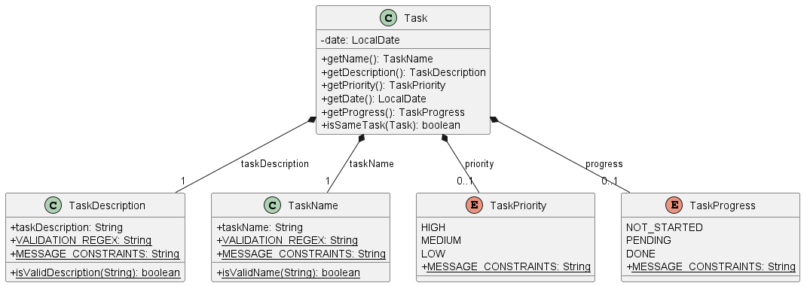

# F.A.K.E.J.A.R.V.I.S. Developer Guide

<!-- * Table of Contents -->
<page-nav-print />

--------------------------------------------------------------------------------------------------------------------

## **Acknowledgements**

_{ list here sources of all reused/adapted ideas, code, documentation, and third-party libraries -- include links to the original source as well }_

--------------------------------------------------------------------------------------------------------------------

## **Setting up, getting started**

Refer to the guide [_Setting up and getting started_](SettingUp.md).

--------------------------------------------------------------------------------------------------------------------

## **Design**

### Architecture

<puml src="diagrams/ArchitectureDiagram.puml" width="280" />

The ***Architecture Diagram*** given above explains the high-level design of the App.

Given below is a quick overview of main components and how they interact with each other.

**Main components of the architecture**

**`Main`** (consisting of classes [`Main`](https://github.com/AY2324S1-CS2103T-T15-1/tp/tree/master/src/main/java/seedu/address/Main.java) and [`MainApp`](https://github.com/AY2324S1-CS2103T-T15-1/tp/tree/master/src/main/java/seedu/address/MainApp.java)) is in charge of the app launch and shut down.
* At app launch, it initializes the other components in the correct sequence, and connects them up with each other.
* At shut down, it shuts down the other components and invokes cleanup methods where necessary.

The bulk of the app's work is done by the following four components:

* [**`UI`**](#ui-component): The UI of the App.
* [**`Logic`**](#logic-component): The command executor.
* [**`Model`**](#model-component): Holds the data of the App in memory.
* [**`Storage`**](#storage-component): Reads data from, and writes data to, the hard disk.

[**`Commons`**](#common-classes) represents a collection of classes used by multiple other components.

**How the architecture components interact with each other**

The *Sequence Diagram* below shows how the components interact with each other for the scenario where the user issues the command `delete 1`.

<puml src="diagrams/ArchitectureSequenceDiagram.puml" width="574" />

Each of the four main components (also shown in the diagram above),

* defines its *API* in an `interface` with the same name as the Component.
* implements its functionality using a concrete `{Component Name}Manager` class (which follows the corresponding API `interface` mentioned in the previous point.

For example, the `Logic` component defines its API in the `Logic.java` interface and implements its functionality using the `LogicManager.java` class which follows the `Logic` interface. Other components interact with a given component through its interface rather than the concrete class (reason: to prevent outside component's being coupled to the implementation of a component), as illustrated in the (partial) class diagram below.

<puml src="diagrams/ComponentManagers.puml" width="300" />

The sections below give more details of each component.

### UI component

The **API** of this component is specified in [`Ui.java`](https://github.com/AY2324S1-CS2103T-T15-1/tp/tree/master/src/main/java/seedu/address/ui/Ui.java)

<puml src="diagrams/UiClassDiagram.puml" alt="Structure of the UI Component"/>

The UI consists of a `MainWindow` that is made up of parts e.g.`CommandBox`, `ResultDisplay`, `PersonListPanel`, `StatusBarFooter` etc. All these, including the `MainWindow`, inherit from the abstract `UiPart` class which captures the commonalities between classes that represent parts of the visible GUI.

The `UI` component uses the JavaFx UI framework. The layout of these UI parts are defined in matching `.fxml` files that are in the `src/main/resources/view` folder. For example, the layout of the [`MainWindow`](https://github.com/AY2324S1-CS2103T-T15-1/tp/tree/master/src/main/java/seedu/address/ui/MainWindow.java) is specified in [`MainWindow.fxml`](https://github.com/AY2324S1-CS2103T-T15-1/tp/tree/master/src/main/resources/view/MainWindow.fxml)

The `UI` component,

* executes user commands using the `Logic` component.
* listens for changes to `Model` data so that the UI can be updated with the modified data.
* keeps a reference to the `Logic` component, because the `UI` relies on the `Logic` to execute commands.
* depends on some classes in the `Model` component, as it displays `Person` object residing in the `Model`.

### Logic component

**API** : [`Logic.java`](https://github.com/AY2324S1-CS2103T-T15-1/tp/tree/master/src/main/java/seedu/address/logic/Logic.java)

Here's a (partial) class diagram of the `Logic` component:

<puml src="diagrams/LogicClassDiagram.puml" width="550"/>

The sequence diagram below illustrates the interactions within the `Logic` component, taking `execute("delete 1")` API call as an example.

<puml src="diagrams/DeleteSequenceDiagram.puml" alt="Interactions Inside the Logic Component for the `delete 1` Command" />

<box type="info" seamless>

**Note:** The lifeline for `DeleteCommandParser` should end at the destroy marker (X) but due to a limitation of PlantUML, the lifeline reaches the end of diagram.
</box>

How the `Logic` component works:

1. When `Logic` is called upon to execute a command, it is passed to an `AddressBookParser` object which in turn creates a parser that matches the command (e.g., `DeleteCommandParser`) and uses it to parse the command.
1. This results in a `Command` object (more precisely, an object of one of its subclasses e.g., `DeleteCommand`) which is executed by the `LogicManager`.
1. The command can communicate with the `Model` when it is executed (e.g. to delete a person).
1. The result of the command execution is encapsulated as a `CommandResult` object which is returned back from `Logic`.

Here are the other classes in `Logic` (omitted from the class diagram above) that are used for parsing a user command:

<puml src="diagrams/ParserClasses.puml" width="600"/>

How the parsing works:
* When called upon to parse a user command, the `AddressBookParser` class creates an `XYZCommandParser` (`XYZ` is a placeholder for the specific command name e.g., `AddCommandParser`) which uses the other classes shown above to parse the user command and create a `XYZCommand` object (e.g., `AddCommand`) which the `AddressBookParser` returns back as a `Command` object.
* All `XYZCommandParser` classes (e.g., `AddCommandParser`, `DeleteCommandParser`, ...) inherit from the `Parser` interface so that they can be treated similarly where possible e.g, during testing.

### Model component
**API** : [`Model.java`](https://github.com/AY2324S1-CS2103T-T15-1/tp/tree/master/src/main/java/seedu/address/model/Model.java)

<puml src="diagrams/ModelClassDiagram.puml" width="450" />

The `Model` component,

* stores the address book data i.e., all `Person` objects (which are contained in a `UniquePersonList` object).
* stores the currently 'selected' `Person` objects (e.g., results of a search query) as a separate _filtered_ list which is exposed to outsiders as an unmodifiable `ObservableList<Person>` that can be 'observed' e.g. the UI can be bound to this list so that the UI automatically updates when the data in the list change.
* stores a `UserPref` object that represents the user’s preferences. This is exposed to the outside as a `ReadOnlyUserPref` objects.
* does not depend on any of the other three components (as the `Model` represents data entities of the domain, they should make sense on their own without depending on other components)

<box type="info" seamless>

**Note:** An alternative (arguably, a more OOP) model is given below. It has a `Tag` list in the `AddressBook`, which `Person` references. This allows `AddressBook` to only require one `Tag` object per unique tag, instead of each `Person` needing their own `Tag` objects. 

<puml src="diagrams/BetterModelClassDiagram.puml" width="450" />

</box>

### Storage component

**API** : [`Storage.java`](https://github.com/AY2324S1-CS2103T-T15-1/tp/tree/master/src/main/java/seedu/address/storage/Storage.java)

<puml src="diagrams/StorageClassDiagram.puml" width="550" />

The `Storage` component,
* can save both address book data and user preference data in JSON format, and read them back into corresponding objects.
* inherits from both `AddressBookStorage` and `UserPrefStorage`, which means it can be treated as either one (if only the functionality of only one is needed).
* depends on some classes in the `Model` component (because the `Storage` component's job is to save/retrieve objects that belong to the `Model`)

### Common classes

Classes used by multiple components are in the `seedu.addressbook.commons` package.

--------------------------------------------------------------------------------------------------------------------

## **Implementation**

This section describes some noteworthy details on how certain features are implemented.

### Sessions
The Session component consists of the following set of features: Create Session

#### The Session class
The Session Class encompasses several important attributes:
* `SessionNumber`: This unique identifier helps distinguish one session from another. It is an integral part of the Session class and is a primary key when searching for or referencing sessions within the system.

* `SessionStudents`: An essential component of every session is the list of students participating. The SessionStudents class keeps track of the students present in a particular session. This class allows for efficient management of attendance records and plays a vital role in generating attendance reports.

* `SessionRemark`: Sometimes, additional information about a session is necessary, such as special instructions, topics covered, or any other relevant remarks. The SessionRemark field offers the flexibility to include such notes.

The Session class also provides a set of getter methods that enable access to these attributes. For instance, you can retrieve the session number, list of students, or session remarks using these methods.

Below is a class diagram describing the implementation of `Session` and its respective fields.

#### Design Considerations:
**Aspect: How the students are added to a session upon initialisation:**

**Alternative 1 (current choice):** The `CreateSession` feature takes in arguments of varying number of student names.
- Pros:This choice offers a high degree of flexibility when it comes to adding students to a session. You can add any number of students when creating a session, which is essential for accommodating different class sizes and situations.
**Alternative 2:** An alternative design could involve creating two separate constructor methods within the `CreateSession` class. One constructor would be responsible for adding a student to an existing `SessionStudents`, and the other would take an entire `SessionStudents` object as an argument.
- Cons: This alternative introduces additional complexity in terms of validating user input and checking for null values upon execution. It may be less intuitive than the current approach.

By opting for the current choice (Alternative 1), the implementation remains straightforward and user-friendly, allowing for versatile usage scenarios. It ensures that users can efficiently create sessions and add students to them without unnecessary constraints or complications.

**Key Takeaway:** The chosen approach in the implementation of the `CreateSession` feature prioritises flexibility and ease of use for users, providing a more intuitive experience when managing class sessions and student attendance.

### Tasks
The Task component consists of the following set of features: Add Task, Delete Task and Update Progress.

#### The Task class
The Task Class is made up of a `TaskName`, `TaskDescription`, `date`, `TaskPriority`, `TaskProgress`, and a set of getter methods that corresponds to these fields.

Below is a class diagram describing the implementation of `Task` and its respective fields.

#### Design Considerations:
**Aspect: How the status of a task is implemented:**

**Alternative 1 (current choice):** `TaskProgress` Enum for Task Progress. Progress includes `not_started`, `pending`, `done`.
- Pros: This choice offers flexibility in representing task progress.
- Cons: It requires additional checks to validate user input and extensive unit testing.

**Alternative 2:** `isDone` Boolean for Task Completion.
- Cons: Only allows for a binary state, i.e., either the task is done or not.

### Grades
The Grade component consists of the following set of features: Edit Grade, Delete Grade and View Grade.

#### The Grade class
The Grade Class is made up of an `actualGrade`, `maxGrade`, `isGraded`, and a set of getter methods that corresponds to most of these fields.

Below is a class diagram describing the implementation of `Grade` and its respective fields.

#### Design Considerations:
**Aspect: How the assignment a grade is being given to is determined:**

**Alternative 1 (current choice):** `Grade` is a field in the `Assignment` it is being graded to.
- Pros: This choice makes it easier to ensure that each assignment only has one grade, and also makes it easier to manage multiple features related to an assignment.
- Cons: It requires additional time to add a grade to an assignment since the assignment needs to be obtained first.

**Alternative 2:** `Assignment` is a field in the `Grade` being given to it.
- Cons: It requires more checks to be done to ensure that each assignment only has one Grade.

**Alternative 3:** `Assignment` is a field in the `Grade` being given to it and vice versa.
- Cons: It increases coupling which increases the dependency of the classes.

### Comments
The Comment component consists of the following set of features: Edit Comment, Delete Comment and View Comment.

#### The Comment class
The Comment Class is made up of a `commentBody`, `isCommented`, and a set of getter methods that corresponds to most of these fields.

Below is a class diagram describing the implementation of `Comment` and its respective fields.

#### Design Considerations:
**Aspect: How the comment a grade is being given to is determined:**

**Alternative 1 (current choice):** `Comment` is a field in the `Assignment` it is being graded to.
- Pros: This choice makes it easier to ensure that each assignment only has one comment, and also makes it easier to manage multiple features related to an assignment.
- Cons: It requires additional time to add a comment to an assignment since the assignment needs to be obtained first.

**Alternative 2:** `Assignment` is a field in the `Comment` being given to it.
- Cons: It requires more checks to be done to ensure that each assignment only has one Comment.

**Alternative 3:** `Assignment` is a field in the `Comment` being given to it and vice versa.
- Cons: It increases coupling which increases the dependency of the classes.

### GradedTest
The GradedTest component is responsible for tracking and managing graded test scores of individuals. It includes features such as creating and updating graded test scores.

#### The GradedTest class
The GradedTest Class is made up of a `ReadingAssessment1`, `ReadingAssessment2`, `MidTerms`, `Finals`, and
`PracticalExam`, each representing a different aspect of an individual's graded test scores. GradedTest Class also have a set of getter methods that corresponds to those fields.

Below is a class diagram describing the implementation of `Task` and its respective fields.

#### Design Considerations:
**Aspect: How to represent the scores of individuals:**

**Alternative 1 (current choice):** Utilizing `String` for individual graded test score.
- Pros: This choice offers flexibility in representing graded tests (e.g Default value of `-`).
- Cons: It requires additional parsing to generate statistics of how the Avenger's students are doing (e.g average,
  highest, lowest score).

**Alternative 2:** Multiple constructors for `GradedTest`.
- Pros: Provides flexibility in how users can create a `GradedTest` object.
- Cons: Requires additional parsing. Different constructor will give different error messages.

### Consultations:

The Consultation component consists fo the following set of features: Create Consultation, Delete Consultation, Add
Student to a Consultation.

#### The Consultation Class

The Consultation Class is made up of a `LocalDate`, `LocalTime`, a `HashSet` of `Person` and a set of getter methods
that corresponds to these fields.

Below is a class diagram describing the implementation of `Consultation` and its respective fields.

Consultation Class UML Diagram

#### Design Considerations:

**Aspect: How the students are stored to a consultation:**

* **Alternative 1 (Current choice):** Use Set<Person> to keep track of students in a consultation.
    * Pros: Stores only 1 instance of a unique person, no duplicates.
    * Cons: May have performance issues in terms of memory usage.

* **Alternative 2:** Use ArrayList<Person> to keep track of students.
    * Cons: We must ensure there are no duplicates with additional checks.

**Aspect: Adding students to a new or existing consultation:**

* **Alternative 1 (Current choice):** The `AddToConsult` feature creates a new Consultation object with updated student list
  * Pros: Defensive programming when entirely creating a new Consultation object without modifying previous object.
  * Cons: Require additional checking to inform exception cases.

* **Alternative 2:** `AddToConsult` directly manipulate the attribute `students` in a Consultation object.
  * Cons: Poor abstraction and room for errors.

### Commands
This section explains the general implementation of all commands.

The following activity diagram generally shows the overall flow of events that the user will experience.

[//]: # (INSERT ACTVITY DIAGRAM HERE)

#### Parser Commands
This section explains the implementation and execution of commands that have their own specific parser.

Below is the sequence diagram for the execution of these commands (denoted by `XYZCommand`) after user input is sent to `LogicManager`. The execution of each of the command has been omitted due to their inherent differences and will be covered in their respective command sections below.

Step 1:
The user enters a command with the necessary parameters which is then passed to the `LogicManager`.

Step 2:
The `LogicManager` calls `AddressBookParser::parseCommand` for it to identify the type of command.

Step 3:
The `AddressBookParser` parses the user input and creates a command parser for that specific command. (denoted by `XYZCommandParser`)

Step 4:
The command parser is returned to the `AddressBookParser` which then calls `XYZCommandParser::parse` to parse the additional parameters.

Step 5:
The `XYZCommandParser` creates its respective command object (denoted by `XYZCommand`) and returns it to `LogicManager`.

Step 6:
The `LogicManager` calls `XYZCommand::execute` where the interaction between the command and the model is handled.

Step 7:
The `XYZCommand` creates a successful `CommandResult` and returns it to the UI.

#### Add Tasks Feature
This section explains the implementation of the Add Task feature via the `addtask` command.
The `AddTaskCommand` causes the specified `Task` to be added to the Task List in the application.
There is only one compulsory field which is the name of the task. There are several optional fields such as the description, priority and deadline.

Below is the sequence diagram outlining the execution of `AddTaskCommand`.

Step 1:
The `LogicManager` invokes `AddTaskCommand::execute`, which in turn calls `Model::addTask`.

Step 2:
The `Model` will invoke `addTask` in `TaskListBook`, which in turn calls `add` in `TaskList` to add it to the list.

Step 3:
The `Model` will call its own `updateFilteredTaskList` method in order to update the model's filter to display all tasks.

Step 4:
The `AddTaskCommand` then continues its execution as defined by [this](#parser-commands) sequence diagram.

##### Design Considerations:
**Aspect: How we execute the AddTaskCommand:**

* **Alternative 1 (current choice):** Let the `LogicManager` pass the model to the command to execute.
    * Pros: Promotes information hiding since we do not need to expose the model to the `AddTaskCommand`.

* **Alternative 2:** Store the model in the `AddTaskCommand` itself.
    * Pros: Easier to debug.
    * Cons: The `AddTaskCommand` might be able to call other methods in the model.

#### Delete Tasks Feature
This section explains the implementation of the Delete Task feature via the `deletetask` command. The `DeleteTaskCommand` causes the specified `Task` identified using the `Index` to be deleted from the Task List in the application. There is one compulsory field which is the Index of the Task to delete. 

Below is the sequence diagram outlining the execution of `DeleteTaskCommand`.

Step 1:
The `LogicManager` invokes `DeleteTaskCommand::execute`, which in turn calls `Model::deleteTask`.

Step 2:
The `Model` will invoke `removeTask` in `TaskListBook`, which in turn calls `remove` in `TaskList` to remove it from the list.

Step 3:
The `DeleteTaskCommand` then continues its execution as defined by [this](#parser-commands) sequence diagram.

--------------------------------------------------------------------------------------------------------------------

## **Documentation, logging, testing, configuration, dev-ops**

* [Documentation guide](Documentation.md)
* [Testing guide](Testing.md)
* [Logging guide](Logging.md)
* [Configuration guide](Configuration.md)
* [DevOps guide](DevOps.md)

--------------------------------------------------------------------------------------------------------------------

## **Appendix: Requirements**

### Product scope

**Target user profile**:

* CS1101S Avengers
* has a need to manage a significant number of classes, tutorials and assignments
* prefer desktop apps over other types
* can type fast
* prefers typing to mouse interactions
* is reasonably comfortable using CLI apps

**Value proposition**:  track assignment gradings, student participation and plan their tutorials, consultations and mastery checks

### User stories

Priorities: High (must have) - `* * *`, Medium (nice to have) - `* *`, Low (unlikely to have) - `*`

| Priority | As a …​                                    | I want to …​                                     | So that I can…​                                                        |
|----------|--------------------------------------------|--------------------------------------------------|------------------------------------------------------------------------|
| `* * *`  | new user                                   | see usage instructions                           | refer to instructions when I forget how to use the App                 |
| `* * *`  | user                                       | add a new person                                 |                                                                        |
| `* * *`  | user                                       | delete a person                                  | remove entries that I no longer need                                   |
| `* * *`  | user                                       | find a person by name                            | locate details of persons without having to go through the entire list |
| `* * *`  | busy avenger                               | keep track of what needs to be done              | better guide my students.                                              |
| `* * *`  | conscientious avenger                      | view my students' grades for their assignments   | better assess my students' competency.                                 |
| `* * *`  | caring avenger                             | view my students' comments for their assignments | take note of my students' strengths and weaknesses.                    |
| `* * *`  | user                                       | create a new consultation with students          | keep track of when and with who the consultation is held               |
| `* * *`  | user                                       | add students to an existing consultation         | invite more students to join a consultation discussion                 |
| `* *`    | user                                       | hide private contact details                     | minimize chance of someone else seeing them by accident                |
| `*`      | user with many persons in the address book | sort persons by name                             | locate a person easily                                                 |

*{More to be added}*

### Use cases

(For all use cases below, the **System** is the `F.A.K.E.J.A.R.V.I.S.` and the **Actor** is the `user`, unless specified otherwise)

**Use case: Delete a person**

**MSS**

1.  User requests to list persons
2.  F.A.K.E.J.A.R.V.I.S. shows a list of persons
3.  User requests to delete a specific person in the list
4.  F.A.K.E.J.A.R.V.I.S. deletes the person

    Use case ends.

**Extensions**

* 2a. The list is empty.

  Use case ends.

* 3a. The given index is invalid.

    * 3a1. F.A.K.E.J.A.R.V.I.S. shows an error message.

      Use case resumes at step 2.

**Use case: Delete a task**

**MSS**

1.  User requests to list persons
2.  F.A.K.E.J.A.R.V.I.S. shows a list of persons
3.  User requests to delete a specific person in the list
4.  F.A.K.E.J.A.R.V.I.S. deletes the person

    Use case ends.

**Extensions**

* 2a. The list is empty.

  Use case ends.

* 3a. The given index is invalid.

    * 3a1. F.A.K.E.J.A.R.V.I.S. shows an error message.

      Use case resumes at step 2.

**Use case: Edit grade of an assignment**

**MSS**

1.  User requests to list persons
2.  F.A.K.E.J.A.R.V.I.S. shows a list of persons
3.  User requests to edit the grade of an assignment for a specific person in the list
4.  F.A.K.E.J.A.R.V.I.S. edits grade of the student's assignment

    Use case ends.

**Extensions**

* 2a. The list is empty.

  Use case ends.

* 3a. The given index is invalid.

    * 3a1. F.A.K.E.J.A.R.V.I.S. shows an error message.

      Use case resumes at step 2.

* 3b. The given assignment name is invalid.

    * 3b1. F.A.K.E.J.A.R.V.I.S. shows an error message.

      Use case resumes at step 2.

* 3c. The given grade is invalid.

    * 3c1. F.A.K.E.J.A.R.V.I.S. shows an error message.

      Use case resumes at step 2.

**Use case: Delete the grade of an assignment**

**MSS**

1.  User requests to list persons
2.  F.A.K.E.J.A.R.V.I.S. shows a list of persons
3.  User requests to delete the grade of an assignment for a specific person in the list
4.  F.A.K.E.J.A.R.V.I.S. deletes the grade of the student's assignment

    Use case ends.

**Extensions**

* 2a. The list is empty.

  Use case ends.

* 3a. The given index is invalid.

    * 3a1. F.A.K.E.J.A.R.V.I.S. shows an error message.

      Use case resumes at step 2.

* 3b. The given assignment name is invalid.

    * 3b1. F.A.K.E.J.A.R.V.I.S. shows an error message.

      Use case resumes at step 2.

* 3c. The given assignment has not been commented on.

    * 3c1. F.A.K.E.J.A.R.V.I.S. shows an error message.

      Use case resumes at step 2.

**Use case: Edit comment on an assignment**

**MSS**

1.  User requests to list persons
2.  F.A.K.E.J.A.R.V.I.S. shows a list of persons
3.  User requests to edit comment on an assignment for a specific person in the list
4.  F.A.K.E.J.A.R.V.I.S. edits the comment of the student's assignment

    Use case ends.

**Extensions**

* 2a. The list is empty.

  Use case ends.

* 3a. The given index is invalid.

    * 3a1. F.A.K.E.J.A.R.V.I.S. shows an error message.

      Use case resumes at step 2.

* 3b. The given assignment name is invalid.

    * 3b1. F.A.K.E.J.A.R.V.I.S. shows an error message.

      Use case resumes at step 2.

* 3c. The given comment is invalid.

    * 3c1. F.A.K.E.J.A.R.V.I.S. shows an error message.

      Use case resumes at step 2.

**Use case: Delete the comment of an assignment**

**MSS**

1.  User requests to list persons
2.  F.A.K.E.J.A.R.V.I.S. shows a list of persons
3.  User requests to delete the comment of an assignment for a specific person in the list
4.  F.A.K.E.J.A.R.V.I.S. deletes the comment of the student's assignment

    Use case ends.

**Extensions**

* 2a. The list is empty.

  Use case ends.

* 3a. The given index is invalid.

    * 3a1. F.A.K.E.J.A.R.V.I.S. shows an error message.

      Use case resumes at step 2.

* 3b. The given assignment name is invalid.

    * 3b1. F.A.K.E.J.A.R.V.I.S. shows an error message.

      Use case resumes at step 2.

* 3c. The given assignment has been commented on.

    * 3c1. F.A.K.E.J.A.R.V.I.S. shows an error message.

      Use case resumes at step 2.

**Use case: Find Student Profile**

**MSS**

1.  User requests to list persons
2.  F.A.K.E.J.A.R.V.I.S. shows a list of persons
3.  User request a search query to find a student's profile
4.  F.A.K.E.J.A.R.V.I.S. returns matching results from the database

    Use case ends.

**Extensions**

* 2a. The list is empty.

    Use case ends.

* 3a. No matching profiles.

    * 3a1. F.A.K.E.J.A.R.V.I.S. shows an error message.

        Use case resumes at step 2.

**Use case: Filter Results**

**MSS**

1.  User requests to list persons.
2.  F.A.K.E.J.A.R.V.I.S. shows a list of persons.
3.  User requests to apply filters to the results via attribute `FILTER_ATTRIBUTE`, or description `FILTER_DESCRIPTION`.
4.  F.A.K.E.J.A.R.V.I.S. shows the filter results.

    Use case ends.

**Extensions**

* 2a. The list is empty.

  Use case ends.

* 3a. No filtered results.

    * 3a1. F.A.K.E.J.A.R.V.I.S. shows an error message.

      Use case resumes at step 2.

**Use case: Create a consultation**

**MSS**

1.  User requests to create a consultation with specified date, time and student name(s)
2.  F.A.K.E.J.A.R.V.I.S. creates a consultation.

    Use case ends.

**Extensions**

* 2a. The date input is invalid.

    * 2a1. F.A.K.E.J.A.R.V.I.S. shows an error message.

      Use case ends.

* 3a. The time input is invalid.

    * 3a1. F.A.K.E.J.A.R.V.I.S. shows an error message.

      Use case ends.

* 3a. No matching name to students' names.

    * 3a1. F.A.K.E.J.A.R.V.I.S. shows an error message.

      Use case ends.

*{More to be added}*

### Non-Functional Requirements

1.  Should work on any _mainstream OS_ as long as it has Java `11` or above installed.
2.  Should be able to hold up to 1000 persons without a noticeable sluggishness in performance for typical usage.
3.  A user with above average typing speed for regular English text (i.e. not code, not system admin commands) should be able to accomplish most of the tasks faster using commands than using the mouse.
4. System should respond within 2 seconds to ensure smooth and efficient user interactions.
5. The system should be able to handle an increasing number of users and data without a significant decrease in performance.
6. The system should be user-friendly, with a clean and intuitive interface.
7. Regular automated backups of data should be performed, and there should be a clear disaster recovery plan in place.

*{More to be added}*

### Glossary

* **Mainstream OS**: Windows, Linux, Unix, OS-X
* **Private contact detail**: A contact detail that is not meant to be shared with others

--------------------------------------------------------------------------------------------------------------------

## **Appendix: Instructions for manual testing**

Given below are instructions to test the app manually.

<box type="info" seamless>

**Note:** These instructions only provide a starting point for testers to work on;
testers are expected to do more *exploratory* testing.

</box>

### Launch and shutdown

1. Initial launch

    1. Download the jar file and copy into an empty folder

    1. Double-click the jar file Expected: Shows the GUI with a set of sample contacts. The window size may not be optimum.

1. Saving window preferences

    1. Resize the window to an optimum size. Move the window to a different location. Close the window.

    1. Re-launch the app by double-clicking the jar file. 
       Expected: The most recent window size and location is retained.

1. _{ more test cases …​ }_

### Deleting a person

1. Deleting a person while all persons are being shown

    1. Prerequisites: List all persons using the `list` command. Multiple persons in the list.

    1. Test case: `delete 1` 
       Expected: First contact is deleted from the list. Details of the deleted contact shown in the status message. Timestamp in the status bar is updated.

    1. Test case: `delete 0` 
       Expected: No person is deleted. Error details shown in the status message. Status bar remains the same.

    1. Other incorrect delete commands to try: `delete`, `delete x`, `...` (where x is larger than the list size) 
       Expected: Similar to previous.

1. _{ more test cases …​ }_

### Saving data

1. Dealing with missing/corrupted data files

    1. _{explain how to simulate a missing/corrupted file, and the expected behavior}_

1. _{ more test cases …​ }_
