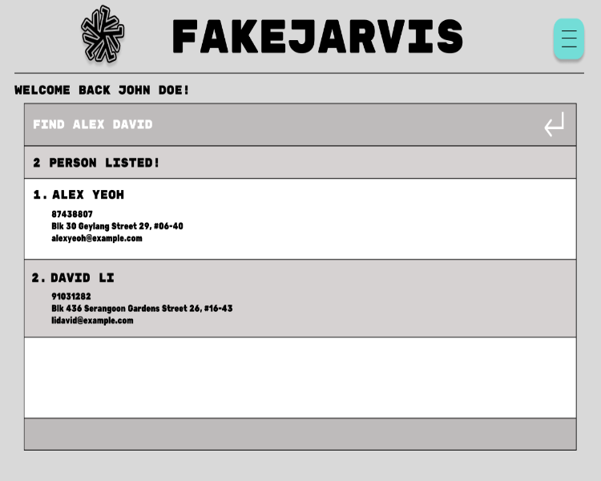

# F.A.K.E.J.A.R.V.I.S. User Guide

## Introduction
_Say goodbye to chaos and hello to an organized and efficient classroom experience._

  

F.A.K.E.J.A.R.V.I.S. is the **ultimate solution for CS1101S Avengers who manage a multitude of tutoring tasks.** This platform empowers you to efficiently track assignment gradings, monitor student participation, and seamlessly plan tutorials, consultations, and mastery checks. This is your one-stop solution to managing your time and students as a CS1101S Avenger!

The application is designed for efficient usage through a Command-Line Interface, all while preserving the advantages of having a Graphical User Interface.

If you're new to the Command-Line Interface and need assistance, this User Guide is here to help you become familiar with it and use the application with ease.

<!-- * Table of Contents -->
<page-nav-print />

### Table of Contents

* [Introduction](#introduction)
  * [Table of Contents](#table-of-contents) 
  * [How to use the User Guide](#how-to-use-the-user-guide)
* [Graphical User Interface](#graphical-user-interface)
  * [Task Card](#task-card)
  * [Consultation Card](#consultation-card)
  * [Session Card](#session-card)
* [Quick start](#quick-start)
* [Command Format](#command-format)
  * [Command Parameters](#command-parameters)
* [Features](#features)
  * [Viewing help : `help`](#viewing-help--help)
  * [Adding a person: `add`](#adding-a-person--add)
  * [Listing all persons : `list`](#listing-all-persons--list)
  * [Editing a person : `edit`](#editing-a-person--edit)
  * [Locating persons by name: `find`](#locating-persons-by-name--find)
  * [Deleting a person : `delete`](#deleting-a-person--delete)
  * [Clearing all entries : `clear`](#clearing-all-entries--clear)
  * [Exiting the program : `exit`](#exiting-the-program--exit)
  * [Saving the data](#saving-the-data)
  * [Editing the data file](#editing-the-data-file)
  * [Archiving data files `[coming in v2.0]`](#archiving-data-files-coming-in-v20)
  * [Adding a Task: `addtask`](#adding-a-task--addtask)
  * [Viewing Tasks: `viewtasks`](#viewing-tasks--viewtasks)
  * [Updating a Task's Progress: `updateprogress`](#updating-a-tasks-progress--updateprogress)
  * [Deleting a Task: `deletetask`](#deleting-a-task--deletetask)
  * [Creating a Consult: `createconsult`](#creating-a-consult--createconsult)
  * [Showing list of consultations: `showconsults`](#showing-list-of-consultations--showconsults)
  * [Viewing details of a consultation: `viewconsult`](#viewing-details-of-a-consultation--viewconsult)
  * [Adding students to a consultation: `addtoconsult`](#adding-students-to-a-consultation--addtoconsult)
  * [Removing students from a consultation: `removefromconsult`](#removing-students-from-a-consultation--removefromconsult)
  * [Deleting a consultation: `deleteconsult`](#deleting-a-consultation--deleteconsult)
* [FAQ](#faq)
* [Known issues](#known-issues)
* [Command summary](#command-summary)

### How to use the User Guide
You may refer to the **Table of Contents** on the right for easy navigation of the User Guide.

The F.A.K.E.J.A.R.V.I.S. User Guide employs a variety of visual cues to enhance the information it presents. The table below offers an overview of the typographical conventions used.

| Convention                                                                          | Description                                                     |
|-------------------------------------------------------------------------------------|-----------------------------------------------------------------|
| `Monospace`                                                                         | Used for command inputs, syntax, and file paths.                |
| [Hyperlink](#)                                                                      | Indicates hyperlinks to external websites or within the guide.  |
| **Bold text**                                                                       | Highlights important keywords.                                  |
| **
 :information_source: Note 
** | Provides information of special interest or importance.         |
| **
 :bangbang: Warning 
**     | Alerts to potentially irreversible actions with data loss risk. |

--------------------------------------------------------------------------------------------------------------------

## Graphical User Interface

F.A.K.E.J.A.R.V.I.S.'s graphical user interface consists of 5 main components:
* Command Box
* Command Result Display
* Task List Panel
* Consultations Panel
* Tutorials Panel

You may enter your commands in the **Command Box** and then press Enter to execute them. The resulting message will be shown in the **Command Result Display** box.

The following describes what each panel contains:
* **Task List Panel:** Displays your set of tasks
* **Consultations Panel:** Displays your consultations
* **Tutorials Panel:** Displays your sessions

### Task Card
[Coming soon]

### Consultation Card
[Coming soon]

### Session Card
[Coming soon]

--------------------------------------------------------------------------------------------------------------------

## Quick start

1. Ensure you have [Java 11](https://www.openlogic.com/openjdk-downloads?field_java_parent_version_target_id=406&field_operating_system_target_id=All&field_architecture_target_id=All&field_java_package_target_id=401) or above installed in your Computer.

2. Download the latest `fakejarvis.jar` from [here](https://github.com/AY2324S1-CS2103T-T15-1/tp/releases). _[Coming Soon]_

3. Copy the file to the folder you want to use as the _home folder_ for your F.A.K.E.J.A.R.V.I.S..

4. Open a command terminal, `cd` into the folder you put the jar file in, and use the `java -jar fakejarvis.jar` command to run the application. 
   A GUI similar to the image below should appear in a few seconds. (Currently, the image below is a mock-up of our GUI) Note how the app contains some sample data. 

    

5. Type the command in the command box and press Enter to execute it. e.g. typing **`help`** and pressing Enter will open the help window. 
   Some example commands you can try:

    * `viewtasks` : Lists all tasks.
    * `deletetask 3`: Deletes the 3rd task shown in the current task list.

    * `createconsult d/10/10/2023 tt/15:00 n/John Doe n/ Foo Bar` : Creates a consultation with the students `John Doe` and `Foo Bar`.

    * `createsession 3 n/John Doe` : Creates a `No. 3` Session with the student `John Doe`.

    * `exit` : Exits the app.

6. Refer to the [Features](#features) below for details of each command and the [Command Format](#command-format) for the specifications of each command.

--------------------------------------------------------------------------------------------------------------------

## Command Format

**The commands in the user guide adopt the following conventions:** 

* Words in `UPPER_CASE` are the parameters to be supplied by the user. 
  e.g. in `addtask tn/TASK_NAME`, `TASK_NAME` is a parameter which can be specified, such as `addtask tn/Do User Guide`.

* Items in square brackets are optional. 
  e.g `tn/TASK_NAME [td/do before feedback]` can be used as `tn/Do User Guide td/do before feedback` or as `tn/Do user Guide`.

* Items with `…`​ after them can be used multiple times including zero times. 
  e.g. `[n/NAME]…​` can be used as ` ` (i.e. 0 times), `n/John Doe`, `n/John Doe n/ Foo Bar` etc.

* Parameters can be in any order. 
  e.g. if the command specifies `tn/TASK_NAME td/TASK_DESCRIPTION`, `td/TASK_DESCRIPTION tn/TASK_NAME` is also acceptable.

* Extraneous parameters for commands that do not take in parameters (such as `help`, `list`, `exit` and `clear`) will be ignored. 
  e.g. if the command specifies `help 123`, it will be interpreted as `help`.

* If you are using a PDF version of this document, be careful when copying and pasting commands that span multiple lines as space characters surrounding line-breaks may be omitted when copied over to the application.

### Command Parameters
Most commands given in the user guide utilise various parameters. Their formats and constraints are provided in the table below.

[Table Coming soon]

## Features
This section describes each of the commands and features available in F.A.K.E.J.A.R.V.I.S.

### Viewing help : `help`

Shows a message explaining how to access the help page.

Format: `help`

### Adding a person: `add`

Adds a person to the address book.

Format: `add n/NAME p/PHONE_NUMBER e/EMAIL a/ADDRESS [t/TAG]…​`

<box type="tip" seamless>
**Tip:** A person can have any number of tags (including 0)
</box>

Examples:
* `add n/John Doe p/98765432 e/johnd@example.com a/John street, block 123, #01-01`
* `add n/Betsy Crowe t/friend e/betsycrowe@example.com a/Newgate Prison p/1234567 t/criminal`

### Listing all persons : `list`

Shows a list of all persons in the address book.

Format: `list`

### Editing a person : `edit`

Edits an existing person in the address book.

Format: `edit INDEX [n/NAME] [p/PHONE] [e/EMAIL] [a/ADDRESS] [t/TAG]…​`

* Edits the person at the specified `INDEX`. The index refers to the index number shown in the displayed person list. The index **must be a positive integer** 1, 2, 3, …​
* At least one of the optional fields must be provided.
* Existing values will be updated to the input values.
* When editing tags, the existing tags of the person will be removed i.e adding of tags is not cumulative.
* You can remove all the person’s tags by typing `t/` without
  specifying any tags after it.

Examples:
*  `edit 1 p/91234567 e/johndoe@example.com` Edits the phone number and email address of the 1st person to be `91234567` and `johndoe@example.com` respectively.
*  `edit 2 n/Betsy Crower t/` Edits the name of the 2nd person to be `Betsy Crower` and clears all existing tags.

### Locating persons by name: `find`

Finds persons whose names contain any of the given keywords.

Format: `find KEYWORD [MORE_KEYWORDS]`

* The search is case-insensitive. e.g `hans` will match `Hans`
* The order of the keywords does not matter. e.g. `Hans Bo` will match `Bo Hans`
* Only the name is searched.
* Only full words will be matched e.g. `Han` will not match `Hans`
* Persons matching at least one keyword will be returned (i.e. `OR` search).
  e.g. `Hans Bo` will return `Hans Gruber`, `Bo Yang`

Examples:
* `find John` returns `john` and `John Doe`
* `find alex david` returns `Alex Yeoh`, `David Li` 
  

### Deleting a person : `delete`

Deletes the specified person from the address book.

Format: `delete INDEX`

* Deletes the person at the specified `INDEX`.
* The index refers to the index number shown in the displayed person list.
* The index **must be a positive integer** 1, 2, 3, …​

Examples:
* `list` followed by `delete 2` deletes the 2nd person in the address book.
* `find Betsy` followed by `delete 1` deletes the 1st person in the results of the `find` command.

### Clearing all entries : `clear`

Clears all entries from the address book.

Format: `clear`

### Exiting the program : `exit`

Exits the program.

Format: `exit`

### Saving the data

F.A.K.E.J.A.R.V.I.S. data are saved in the hard disk automatically after any command that changes the data. There is no need to save manually.

### Editing the data file

F.A.K.E.J.A.R.V.I.S. data are saved automatically as a JSON file `[JAR file location]/data/fakejarvis.json`. Advanced users are welcome to update data directly by editing that data file.

**Caution:**
If your changes to the data file makes its format invalid, F.A.K.E.J.A.R.V.I.S. will discard all data and start with an empty data file at the next run.  Hence, it is recommended to take a backup of the file before editing it.
</box>

### Archiving data files `[coming in v2.0]`

_Details coming soon ..._

### 📝Adding a Task: `addtask`
Adds a task to your task list.

Format: `addtask tn/TASK_NAME td/TASK_DESCRIPTION d/DUE_DATE tp/TASK_PRIORITY`

Parameters:
* TASK_NAME The name of the task.
* TASK_DESCRIPTION The description of the task.
* DUE_DATE The due date or deadline of the task.
* TASK_PRIORITY The priority level of the task. Given as `high`, `medium` or `low`.

Examples:
* `addtask tn/Prepare Lecture slides d/30/09/2023 tp/high` creates a task to prepare lecture slides with a high priority due on September 30, 2023.
* `addtask tn/Read Chapter 5` creates a task to read Chapter 5 without specifying a due date or priority.

### 👀Viewing Tasks: `viewtasks`
Views the list of tasks.

Format: `viewtasks [tn/TASK_NAME] / [td/TASK_DESCRIPTION] / [d/DUE_DATE] / [tp/TASK_PRIORITY] / [tprog/TASK_PROGRESS]`

* Only the task name, task description, due date, task priority and task progress are searched.
* Only one field can be searched at a time.
* The search is case-insensitive, e.g. `cs2101` will match `CS2101`.
* The order of the keywords does not matter, e.g. `quant book` will match `book quant`.
* If no task matching the search criteria is found, the resulting task list will be blank.

Parameters:
* TASK_NAME The name of the task.
* TASK_DESCRIPTION The description of the task.
* DUE_DATE The due date or deadline of the task.
* TASK_PRIORITY The priority level of the task. Given as `high`, `medium` or `low`.
* TASK_PROGRESS The progress level of the task. Given as `done`, `pending` or `not_started`.

Examples:
* `viewtasks` displays all tasks in the user's task list.
* `viewtasks tp/high` displays only high-priority tasks.
* `viewtasks d/30/09/2023` displays tasks due on September 30, 2023.

### ✅Updating a Task's Progress: `updateprogress`
Marks a task as completed.

Format: `updateprogress TASK_INDEX tprog/NEW_PROGRESS`

* The index refers to the index number shown in the displayed task list.
* The index **must be a positive integer** 1, 2, 3, …​ that is within the range of the task list.

Parameters:
* TASK_INDEX The index of the task to update the progress.
* NEW_PROGRESS The new progress level of the task. Given as `done`, `pending` or `not_started`.

Examples:
* `completetask 1 tprog/pending` marks the task with index 1 as pending.
* `completetask 3 tprog/done` marks the task with index 3 as done.

### ❌Deleting a Task: `deletetask`
Deletes a task from the task list.

Format: `deletetask TASK_INDEX`

* The index refers to the index number shown in the displayed task list.
* The index **must be a positive integer** 1, 2, 3, …​ that is within the range of the task list.

Parameters:
* TASK_INDEX The index of the task to delete.

Examples:
* `deletetask 3` deletes the task with index 3 from the task list.
* `deletetask 2` deletes the task with index 2 from the task list.

### 📆Taking attendance: `takeattendance`
Takes the attendance of a student

Format: `takeattendance n/STUDENT_NAME s/SESSION p/PRESENCE`

Parameters:
* STUDENT_NAME - The name of the student.
* SESSION - The session number.
* PRESENCE - The attendance status of the student (e.g., present, absent).

Examples:
* `takeattendance n/John Doe s/5 present` Marks John Doe as present on the 5th session.
* `takeattendance n/Foo Bar s/2 absent` Marks Foo Bar as absent on the 2nd session.

### 👀Viewing attendance: `viewattendance`
Views the attendance list

Format: `viewattendance n/STUDENT_NAME [MORE_STUDENT_NAMES]`

Parameters:
* STUDENT_NAME - The name of the student you want to view the attendance of.

Examples:
* `viewattendance` Displays the overall attendance across all students and sessions.
* `viewattendance n/Rayan` Displays all the sessions that Rayan has attended.
* `viewattendance n/Jayson Resley` Displays all the sessions that Jayson and Resley have attended.

### 🔎Finding a Student: `find`
Finds a student’s profile

Format: `find n/STUDENT_NAME [MORE_STUDENT_NAMES]`

Parameters:
* STUDENT_NAME - The name of the student you want to find.

Examples:
* `find n/John Doe` Finds and displays the profile of students with the name “John Doe”.
* `find n/Jane Doe` Finds and displays the profile of students with the name “Jane Doe”.

### 🥅Filtering results: `filter`
Filters the results displayed on the dashboard

Format:
* `filter_add n/FILTER_ATTRIBUTE n/FILTER_DESCRIPTION`
* `filter_delete n/FILTER_ATTRIBUTE n/FILTER_DESCRIPTION`

Parameters:
* `FILTER_ATTRIBUTE` - The filter type filter_studentScores
  * `filter_studentScores`
  * `filter_studentGrades`
* `FILTER_DESCRIPTION` - The conditions for the filter

Examples:
* `filter_add n/filter_studentGrades n/A` Sets the dashboard to display students who have an “A” grade.
* `Filter_add n/filter_studentScores n/>80` Sets the dashboard to show students with test scores above 80.

### 📝Adding a grade to an assignment: `addgrade`
Adds a grade to a student’s assignment.

Format: `addgrade INDEX as/ASSIGNMENT g/GRADE`

Parameters:
* INDEX The index of the student.
* ASSIGNMENT The name of the assignment.
* GRADE The grade of the student.

Examples:
* `addgrade 1 as/Functional Expressionism g/1300` adds a grade of 1300 to student 1's Functional Expressionism assignment.
* `addgrade 2 as/Rune Reading g/600` adds a grade of 600 to student 2's Rune Reading assignment.

### 👀Viewing an assignment grade: `viewgrade`
Shows a student’s assignment grade.

Format: `viewgrade INDEX as/ASSIGNMENT`

Parameters:
* INDEX The index of the student.
* ASSIGNMENT The name of the assignment.

Examples:
* `viewgrade 1 as/Functional Expressionism` shows student 1's Functional Expressionism grade.
* `viewgrade 2 as/Rune Reading` shows student 2's Rune Reading grade.

### 🛠️Editing an assignment grade: `editgrade`
Edits a student’s assignment grade.

Format: `editgrade INDEX as/ASSIGNMENT g/GRADE`

Parameters:
* INDEX The index of the student.
* ASSIGNMENT The name of the assignment.
* GRADE The score of the student.

Examples:
* `editgrade 1 as/Functional Expressionism g/1200` edits the grade of student 1's Functional Expressionism assignment to 1200.
* `editgrade 2 as/Rune Reading g/1000` edits the grade of student 2's Rune Reading assignment to 1000.

### ❌Deleting an assignment grade: `deletegrade`
Deletes a student’s assignment grade.

Format: `deletegrade INDEX as/ASSIGNMENT`

Parameters:
* INDEX The index of the student.
* ASSIGNMENT The name of the assignment.

Examples:
* `deletegrade 1 as/Functional Expressionism` deletes student 1's Functional Expressionism grade.
* `deletegrade 2 as/Rune Reading` deletes student 2's Rune Reading grade.

### 📝Adding a comment to an assignment: `addcomment`
Adds a comment to a student’s assignment.

Format: `addcomment n/STUDENT_NAME a/ASSIGNMENT c/COMMENT`

Parameters:
* STUDENT_NAME The name of the student.
* ASSIGNMENT The name of the assignment.
* COMMENT The comment.

Examples:
* `addcomment n/Rayson a/Functional Expressionism c/Excellent` adds the comment “Excellent” on Rayson’s Functional Expressionism assignment.
* `addcomment n/Wesley a/Rune Reading c/Not bad` adds the comment “Not bad” on Wesley’s Rune Reading assignment.

### 👀Viewing a comment: `viewcomment`
Shows the comment tagged to a student’s assignment.

Format: `viewcomment n/STUDENT_NAME a/ASSIGNMENT`

Parameters:
* STUDENT_NAME The name of the student.
* ASSIGNMENT The name of the assignment.

Examples:
* `viewcomment n/Rayson a/Functional Expressionism` shows the comment on Rayson’s Functional Expressionism assignment.
* `viewcomment n/Wesley a/Rune Reading` shows the comment on Wesley’s Rune Reading assignment.

### 🛠️Editing a comment: `editcomment`
Edits the comment on a student’s assignment.

Format: `editcomment n/STUDENT_NAME a/ASSIGNMENT c/COMMENT`

Parameters:
* STUDENT_NAME The name of the student.
* ASSIGNMENT The name of the assignment.
* COMMENT The new comment.

Examples:
* `editcomment n/Rayson a/Functional Expressionism c/Decent` changes the comment on Rayson’s Functional Expressionism assignment to “Decent”.
* `editcomment n/Wesley a/Rune Reading c/Great` changes the comment on Wesley’s Rune Reading assignment to “Great”.

### ❌Deleting a comment: `deletecomment`
Deletes the comment tagged to a student’s assignment.

Format: `deletecomment n/STUDENT_NAME a/ASSIGNMENT`

Parameters:
* STUDENT_NAME The name of the student.
* ASSIGNMENT The name of the assignment.

Examples:
* `deletecomment n/Rayson a/Functional Expressionism` deletes the comment on Rayson’s Functional Expressionism assignment.
* `deletecomment n/Wesley a/Rune Reading` deletes the comment on Wesley’s Rune Reading assignment.

### 📆Creating a Consult: `createconsult`
Creates a consultation into upcoming consultations.

Format: `createconsult d/DATE tt/TIME n/STUDENT_NAME n/STUDENT_NAME …`

Parameters:
* DATE The date of consultation
* TIME The time of consultation
* STUDENT_NAME The name of the student(s)

Examples:
* `createconsult d/2023-10-30 tt/12:30 n/John Doe` creates a consultation for John Doe on 2023-10-30 12:30.
* `createconsult d/2023-09-30 tt/15:30 n/John Doe n/Foo Bar n/Rayson n/Wesley` creates a consultation for John Doe, 
Foo Bar, Rayson and Wesley on 2023-09-30 15:30.

### 👀Showing list of consultations: `showconsults`
Shows the list of upcoming consultations.

Format: `showconsults`

Example:
* `showconsults` displays a list of upcoming consultations

### 👀Viewing details of a consultation: `viewconsult`
Shows the details of a consultation.

Format: `viewconsult INDEX`

Parameters:
* INDEX The index of the consultation in the upcoming consultations.

Examples:
* `viewconsult 1` shows the details of the consultation (if there is a consult scheduled).
   2023-09-30 15:30
   John Doe
   Foo Bar
   Rayson
   Wesley
* `viewconsult -1`shows an error message “Consultation not found” (if there is no consult scheduled).

### 🛠️Adding students to a consultation: `addtoconsult`
Adds student(s) into a consultation.

Format: `addtoconsult INDEX n/STUDENT_NAME …`

Parameters:
* INDEX The index of the consultation in the upcoming consultations.
* STUDENT_NAME The name of student to be added into the consultation.

Examples:
* `addtoconsult 2 n/Foo Bar`.
* `addtoconsult 1 n/Rayson n/Ryan Pang`.
* `addtoconsult -1 n/Foo Bar`shows an error message.

### ❌Removing students from a consultation: `removefromconsult`
Removes student(s) from a consultation.

Format: `removefromconsult INDEX n/STUDENT_NAME …`

Parameters:
* INDEX The index of the consultation in the upcoming consultations.
* STUDENT_NAME The name of student to be added into the consultation.

Examples:
* `removefromconsult 2 n/Foo Bar`.
* `removefromconsult 1 n/NOTINCONSULT` shows an error message “Student not found”.

### ❌Deleting a consultation: `deleteconsult`
Deletes the consultation specified by the index.

Format: `deleteconsult INDEX`

Parameters:
* INDEX The index of the consultation in the upcoming consultations.

Examples:
* `deleteconsult 1` deletes the first consultation.
* `deleteconsult -1` shows an error message “Consultation not found”.

--------------------------------------------------------------------------------------------------------------------

## FAQ

**Q**: How do I transfer my data to another computer? 
**A**: Install the app in the other computer and overwrite the empty data file it creates with the file that contains the data of your previous F.A.K.E.J.A.R.V.I.S. home folder.

--------------------------------------------------------------------------------------------------------------------

## Known issues

1. **When using multiple screens**, if you move the application to a secondary screen, and later switch to using only the primary screen, the GUI will open off-screen. The remedy is to delete the `preferences.json` file created by the application before running the application again.

--------------------------------------------------------------------------------------------------------------------

## Command summary

Action     | Format, Examples
-----------|----------------------------------------------------------------------------------------------------------------------------------------------------------------------
**Add**    | `add n/NAME p/PHONE_NUMBER e/EMAIL a/ADDRESS [t/TAG]…​`   e.g., `add n/James Ho p/22224444 e/jamesho@example.com a/123, Clementi Rd, 1234665 t/friend t/colleague`
**Clear**  | `clear`
**Delete** | `delete INDEX`  e.g., `delete 3`
**Edit**   | `edit INDEX [n/NAME] [p/PHONE_NUMBER] [e/EMAIL] [a/ADDRESS] [t/TAG]…​`  e.g.,`edit 2 n/James Lee e/jameslee@example.com`
**Find**   | `find KEYWORD [MORE_KEYWORDS]`  e.g., `find James Jake`
**List**   | `list`
**Help**   | `help`
