# F.A.K.E.J.A.R.V.I.S. User Guide

## Introduction
_Say goodbye to chaos and hello to an organized and efficient classroom experience._

  

F.A.K.E.J.A.R.V.I.S. is your **friendly companion for efficient task and administrative management**, allowing you to excel as a CS1101S Avenger. With this tool, you can effortlessly track assignment gradings, monitor student participation, and seamlessly plan tutorials, consultations, and mastery checks.

As Avengers ourselves, we understand the importance of managing both our time and our students effectively. F.A.K.E.J.A.R.V.I.S. is the one-stop solution to streamlining your workload, making your life easier. It is designed to empower you with the benefits of a Command-Line Interface (CLI), all while preserving the advantages of having a Graphical User Interface (GUI).

If you are new to CLI, or unfamiliar with the commands F.A.K.E.J.A.R.V.I.S. offers and need assistance, don't worry! This User Guide is your trusted assistant, and will guide you through every step and ensure that you can unlock the full potential of F.A.K.E.J.A.R.V.I.S. Let's get started!

 

 

## Table of Contents

&nbsp;1 [Introduction](#introduction)  
&nbsp;&nbsp;&nbsp;&nbsp;&nbsp; 1.1 [Table of Contents](#table-of-contents)  
&nbsp;&nbsp;&nbsp;&nbsp;&nbsp; 1.2 [How to use the User Guide](#how-to-use-the-user-guide)

&nbsp;2 [Graphical User Interface](#graphical-user-interface)  
&nbsp;&nbsp;&nbsp;&nbsp;&nbsp; 2.1 [Student Card](#student-card)  
&nbsp;&nbsp;&nbsp;&nbsp;&nbsp; 2.2 [Task Card](#task-card)  
&nbsp;&nbsp;&nbsp;&nbsp;&nbsp; 2.3 [Assignment Cards](#assignment-cards)  
&nbsp;&nbsp;&nbsp;&nbsp;&nbsp; 2.4 [Session Card](#session-card)  
&nbsp;&nbsp;&nbsp;&nbsp;&nbsp; 2.5 [Consultation Card](#consultation-card)

&nbsp;3 [Quick Start](#quick-start)

&nbsp;4 [Command Format](#command-format)  
&nbsp;&nbsp;&nbsp;&nbsp;&nbsp; 4.1 [Command Parameters](#command-parameters)

&nbsp;5 [Features](#features)  
&nbsp;&nbsp;&nbsp;&nbsp;&nbsp; 5.1 [General Commands](#general-commands)   
&nbsp;&nbsp;&nbsp;&nbsp;&nbsp;&nbsp;&nbsp;&nbsp;&nbsp;&nbsp;&nbsp; 5.1.1 [👀 Viewing Help : `help`](#viewing-help-help)  
&nbsp;&nbsp;&nbsp;&nbsp;&nbsp;&nbsp;&nbsp;&nbsp;&nbsp;&nbsp;&nbsp; 5.1.2 [🔀 Switching between different Tabs : `tab`](#switching-between-different-tabs-tab)  
&nbsp;&nbsp;&nbsp;&nbsp;&nbsp;&nbsp;&nbsp;&nbsp;&nbsp;&nbsp;&nbsp; 5.1.3 [🏃🚪 Exiting F.A.K.E.J.A.R.V.I.S. : `exit`](#exiting-f-a-k-e-j-a-r-v-i-s-exit)  
&nbsp;&nbsp;&nbsp;&nbsp;&nbsp;&nbsp;&nbsp;&nbsp;&nbsp;&nbsp;&nbsp; 5.1.4 [💾 Saving the Data](#saving-the-data)  
&nbsp;&nbsp;&nbsp;&nbsp;&nbsp;&nbsp;&nbsp;&nbsp;&nbsp;&nbsp;&nbsp; 5.1.5 [🛠️ Editing the Data File](#editing-the-data-file)  
&nbsp;&nbsp;&nbsp;&nbsp;&nbsp;&nbsp;&nbsp;&nbsp;&nbsp;&nbsp;&nbsp; 5.1.6 [💾 Archiving Data Files `[coming in v2.0]`](#archiving-data-files-coming-in-v2-0)

&nbsp;&nbsp;&nbsp;&nbsp;&nbsp; 5.2 [Student Management](#student-management)  
&nbsp;&nbsp;&nbsp;&nbsp;&nbsp;&nbsp;&nbsp;&nbsp;&nbsp;&nbsp;&nbsp; 5.2.1 [📝 Adding a Student: `add`](#adding-a-student-add)  
&nbsp;&nbsp;&nbsp;&nbsp;&nbsp;&nbsp;&nbsp;&nbsp;&nbsp;&nbsp;&nbsp; 5.2.2 [👀 Listing all Students : `list`](#listing-all-students-list)  
&nbsp;&nbsp;&nbsp;&nbsp;&nbsp;&nbsp;&nbsp;&nbsp;&nbsp;&nbsp;&nbsp; 5.2.3 [🛠️ Editing a Student Field : `edit`](#editing-a-student-field-edit)  
&nbsp;&nbsp;&nbsp;&nbsp;&nbsp;&nbsp;&nbsp;&nbsp;&nbsp;&nbsp;&nbsp; 5.2.4 [🔎 Finding Student by Name: `find`](#finding-student-by-name-find)  
&nbsp;&nbsp;&nbsp;&nbsp;&nbsp;&nbsp;&nbsp;&nbsp;&nbsp;&nbsp;&nbsp; 5.2.5 [❌ Deleting a Student : `delete`](#deleting-a-student-delete)  
&nbsp;&nbsp;&nbsp;&nbsp;&nbsp;&nbsp;&nbsp;&nbsp;&nbsp;&nbsp;&nbsp; 5.2.6 [🗑️ Clearing all Entries : `clear`](#clearing-all-entries-clear)

&nbsp;&nbsp;&nbsp;&nbsp;&nbsp; 5.3 [Task Management](#task-management)  
&nbsp;&nbsp;&nbsp;&nbsp;&nbsp;&nbsp;&nbsp;&nbsp;&nbsp;&nbsp;&nbsp; 5.3.1 [📝 Adding a Task: `addtask`](#adding-a-task-addtask)  
&nbsp;&nbsp;&nbsp;&nbsp;&nbsp;&nbsp;&nbsp;&nbsp;&nbsp;&nbsp;&nbsp; 5.3.2 [👀 Viewing Tasks: `viewtasks`](#viewing-tasks-viewtasks)  
&nbsp;&nbsp;&nbsp;&nbsp;&nbsp;&nbsp;&nbsp;&nbsp;&nbsp;&nbsp;&nbsp; 5.3.3 [🛠️ Updating a Task's Progress: `updateprogress`](#updating-a-task-s-progress-updateprogress)  
&nbsp;&nbsp;&nbsp;&nbsp;&nbsp;&nbsp;&nbsp;&nbsp;&nbsp;&nbsp;&nbsp; 5.3.4 [❌ Deleting a Task: `deletetask`](#deleting-a-task-deletetask)

&nbsp;&nbsp;&nbsp;&nbsp;&nbsp; 5.4 [Attendance Management](#attendance-management)  
&nbsp;&nbsp;&nbsp;&nbsp;&nbsp;&nbsp;&nbsp;&nbsp;&nbsp;&nbsp;&nbsp; 5.4.1 [📆 Taking Attendance: `takeattendance`](#taking-attendance-takeattendance)  
&nbsp;&nbsp;&nbsp;&nbsp;&nbsp;&nbsp;&nbsp;&nbsp;&nbsp;&nbsp;&nbsp; 5.4.2 [👀 Viewing Attendance: `viewattendance`](#viewing-attendance-viewattendance)

&nbsp;&nbsp;&nbsp;&nbsp;&nbsp; 5.5 [Assignment Management](#assignment-management)  
&nbsp;&nbsp;&nbsp;&nbsp;&nbsp;&nbsp;&nbsp;&nbsp;&nbsp;&nbsp;&nbsp; 5.5.1 [👀 Viewing a list of Assignments: `viewassignments`](#viewing-a-list-of-assignments-viewassignments)  
&nbsp;&nbsp;&nbsp;&nbsp;&nbsp;&nbsp;&nbsp;&nbsp;&nbsp;&nbsp;&nbsp; 5.5.2 [🛠️ Editing an Assignment Grade: `editgrade`](#editing-an-assignment-grade-editgrade)  
&nbsp;&nbsp;&nbsp;&nbsp;&nbsp;&nbsp;&nbsp;&nbsp;&nbsp;&nbsp;&nbsp; 5.5.3 [❌ Deleting an Assignment Grade: `deletegrade`](#deleting-an-assignment-grade-deletegrade)  
&nbsp;&nbsp;&nbsp;&nbsp;&nbsp;&nbsp;&nbsp;&nbsp;&nbsp;&nbsp;&nbsp; 5.5.4 [🛠️ Editing an Assignment Comment: `editcomment`](#editing-an-assignment-comment-editcomment)  
&nbsp;&nbsp;&nbsp;&nbsp;&nbsp;&nbsp;&nbsp;&nbsp;&nbsp;&nbsp;&nbsp; 5.5.5 [❌ Deleting an Assignment Comment: `deletecomment`](#deleting-an-assignment-comment-deletecomment)

&nbsp;&nbsp;&nbsp;&nbsp;&nbsp; 5.6 [Graded Test Management](#graded-test-management)  
&nbsp;&nbsp;&nbsp;&nbsp;&nbsp;&nbsp;&nbsp;&nbsp;&nbsp;&nbsp;&nbsp; 5.6.1 [🛠️ Editing a Graded Test Score: `editgradedtest`](#editing-a-graded-test-score-editgradedtest)

&nbsp;&nbsp;&nbsp;&nbsp;&nbsp; 5.7 [Session Management](#session-management)  
&nbsp;&nbsp;&nbsp;&nbsp;&nbsp;&nbsp;&nbsp;&nbsp;&nbsp;&nbsp;&nbsp; 5.7.1 [📝 Creating a Session: `createsession`](#creating-a-session-createsession)  
&nbsp;&nbsp;&nbsp;&nbsp;&nbsp;&nbsp;&nbsp;&nbsp;&nbsp;&nbsp;&nbsp; 5.7.2 [🛠️ Updating a Session's Remark: `updatesessionremark`](#updating-a-session-s-remark-updatesessionremark)  
&nbsp;&nbsp;&nbsp;&nbsp;&nbsp;&nbsp;&nbsp;&nbsp;&nbsp;&nbsp;&nbsp; 5.7.3 [❌ Deleting a Session: `deletesession`](#deleting-a-session-deletesession)

&nbsp;&nbsp;&nbsp;&nbsp;&nbsp; 5.8 [Consultation Management](#consultation-management)  
&nbsp;&nbsp;&nbsp;&nbsp;&nbsp;&nbsp;&nbsp;&nbsp;&nbsp;&nbsp;&nbsp; 5.8.1 [📝 Creating a Consultation: `createconsult`](#creating-a-consultation-createconsult)  
&nbsp;&nbsp;&nbsp;&nbsp;&nbsp;&nbsp;&nbsp;&nbsp;&nbsp;&nbsp;&nbsp; 5.8.2 [📝 Adding Students to a Consultation: `addtoconsult`](#adding-students-to-a-consultation-addtoconsult)  
&nbsp;&nbsp;&nbsp;&nbsp;&nbsp;&nbsp;&nbsp;&nbsp;&nbsp;&nbsp;&nbsp; 5.8.3 [❌ Removing Students from a Consultation: `removefromconsult`](#removing-students-from-a-consultation-removefromconsult)  
&nbsp;&nbsp;&nbsp;&nbsp;&nbsp;&nbsp;&nbsp;&nbsp;&nbsp;&nbsp;&nbsp; 5.8.4 [❌ Deleting a Consultation: `deleteconsult`](#deleting-a-consultation-deleteconsult)

&nbsp;6 [FAQ](#faq)

&nbsp;7 [Known Issues](#known-issues)

&nbsp;8 [Command Summary](#command-summary)

&nbsp;9 [Encountering Errors](#encountering-errors)

 
 

## How to use the User Guide
You may refer to the [**Table of Contents**](#table-of-contents) for easy navigation of the User Guide.

The F.A.K.E.J.A.R.V.I.S. User Guide employs a variety of visual cues to enhance the information it presents. The table below offers an overview of the typographical conventions used.

 

| **Convention** |       **Description**       |
|:--------------:|:---------------------------:|
|  `Monospace`   |    Used for code syntax     |
| **Bold text**  | Used for important keywords |
| [Hyperlink](#) |  Used for link references   |

 

|                                     **Convention**                                      |    **Description**     |
|:---------------------------------------------------------------------------------------:|:----------------------:|
| **
 :information_source: **Note** 
** | Additional Information |
|   **
 :warning: **Warning** 
**    |    Caution Warning     |
|        **
  :bulb: **Tip** 
**         |      Useful Tips       |

 

| **Convention** |       **Description**       |
|:--------------:|:---------------------------:|
|      🏃🚪      |            Exit             |
|       🔀       |         Switch Tabs         |
|       💾       | Save Data  Archive Data |
|       📝       |      Add   Create       |
|       ❌        |     Delete   Remove     |
|      🛠️       |      Edit   Update      |
|       🔎       |            Find             |
|       📆       |       Take Attendance       |
|       👀       |       View   List       |
|      🗑️       |            Clear            |
|       📖       |          Examples           |

[Back to Table of Contents](#table-of-contents)

 

--------------------------------------------------------------------------------------------------------------------

 

## Graphical User Interface

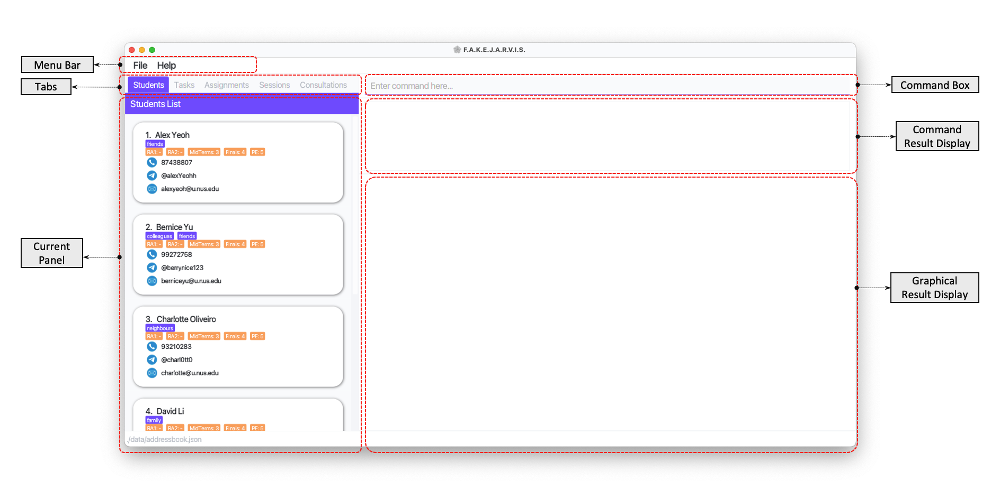

F.A.K.E.J.A.R.V.I.S.'s graphical user interface (GUI) consists of 6 main components:
* Menu Bar
* Tabs
* Command Box
* Command Result Display
* Graphical Result Display
* Current Panel

You may enter your commands in the **Command Box** and then press Enter to execute them. The resulting message will be shown in the **Command Result Display** box, and in **Graphical Result Display** if needed.

The following describes what each tab displays on the **Current Panel**:
* **Student Tab:** Displays your students list and students' details.
* **Tasks Tab:** Displays your tasks list and tasks' details.
* **Assignments Tab:** Displays your assignments list.
* **Sessions Tab:** Displays your sessions list and sessions' details.
* **Consultations Tab:** Displays your consultations list and consultations' details.

 
 

### Student Card
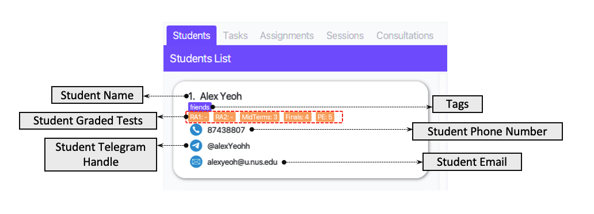

 
 

### Task Card

 
 

### Assignment Cards
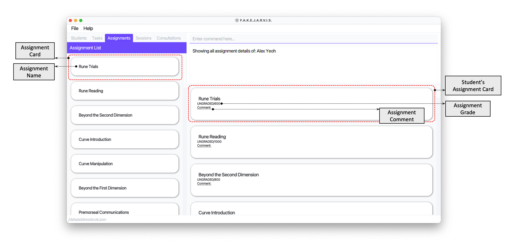

 
 

### Session Card
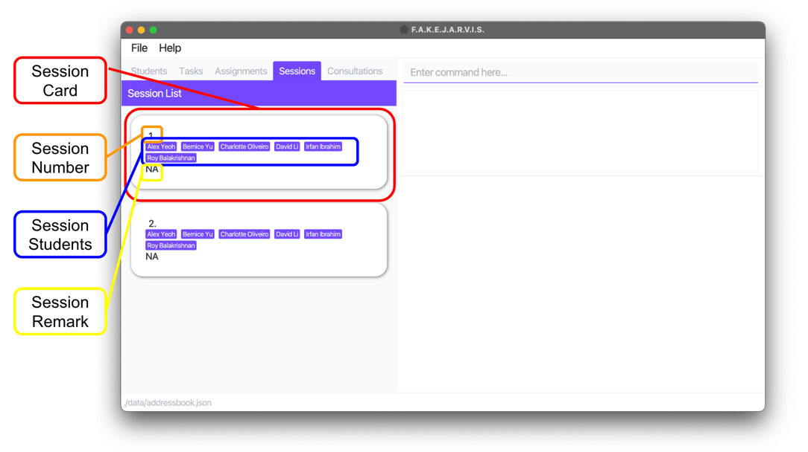

 
 

### Consultation Card
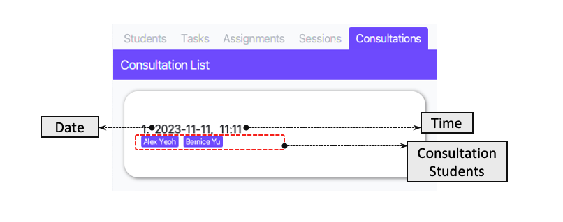

 

--------------------------------------------------------------------------------------------------------------------

 

## Quick start

1. Ensure you have [Java 11](https://www.openlogic.com/openjdk-downloads?field_java_parent_version_target_id=406&field_operating_system_target_id=All&field_architecture_target_id=All&field_java_package_target_id=401) or above installed in your Computer.

2. Download the latest `fakejarvis.jar` from [here](https://github.com/AY2324S1-CS2103T-T15-1/tp/releases).

3. Copy the file to the folder you want to use as the _home folder_ for your F.A.K.E.J.A.R.V.I.S..

4. Open a command terminal, `cd` into the folder you put the jar file in, and use the `java -jar fakejarvis.jar` command to run the application. 
   A GUI similar to the image below should appear in a few seconds.  

   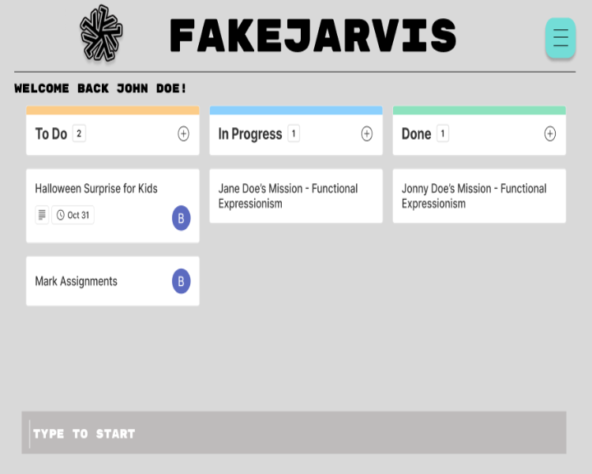

   Note that the app will contain some sample data initially. You can use the `clear` command for a blank state.  

<md>
:warning: **Warning**:

* This action is irreversible
  </md> 

5. Type the command in the command box and press Enter to execute it. e.g. typing **`help`** and pressing Enter will open the help window. 
   Some example commands you can try:

    * `viewtasks` : Lists all tasks.
    * `deletetask 3`: Deletes the 3rd task shown in the current task list.

    * `createconsult d/10/10/2023 tt/15:00 n/John Doe n/ Foo Bar` : Creates a consultation with the students `John Doe` and `Foo Bar`.

    * `createsession s/3 n/John Doe` : Creates a session with session number 3 with the student `John Doe`.

    * `exit` : Exits the app.

6. Refer to the [Features](#features) below for details of each command and the [Command Format](#command-format) for the specifications of each command.

 

[Back to Table of Contents](#table-of-contents)

 

--------------------------------------------------------------------------------------------------------------------

 

## Command Format

**The commands in the user guide adopt the following conventions:** 

* Words in `UPPER_CASE` are the **parameters** to be supplied by the user. 
  e.g. in `addtask tn/TASK_NAME`, `TASK_NAME` is a parameter which can be specified, such as `addtask tn/Do User Guide`.

* Items in square brackets are **optional**. 
  e.g `tn/TASK_NAME [td/TASK_DESCRIPTION]` can be used as `tn/Do User Guide td/do before feedback` or as `tn/Do user Guide`.

* Items with `…`​ after them can be used **multiple times** including zero times. 
  e.g. `[n/NAME]…​` can be used as ` ` (i.e. 0 times), `n/John Doe`, `n/John Doe n/ Foo Bar` etc.

* Parameters can be **in any order**. 
  e.g. if the command specifies `tn/TASK_NAME td/TASK_DESCRIPTION`, `td/TASK_DESCRIPTION tn/TASK_NAME` is also acceptable.

* Extraneous parameters for commands that do not take in parameters (such as `help`, `list`, `exit` and `clear`) will be ignored. 
  e.g. if the command specifies `help 123`, it will be interpreted as `help`.

<md>
:information_source: **Note**: 

* If you are using a PDF version of this document, be careful when copying and pasting commands that span multiple lines as space characters surrounding line-breaks may be omitted when copied over to the application.

</md> 

 
 

### Command Parameters
Most commands given in the user guide utilise various parameters which are also known as prefixes. To add a prefix to your command, follow this format: `PREFIX/MESSAGE`. A list of prefixes and their respective constraints are given in the table below.

|      **Field**       | **Prefix** |                                                   **Commands**                                                    | 
**Description**
                                                                                                                                                                                                                                     |
|:--------------------:|:----------:|:-----------------------------------------------------------------------------------------------------------------:|----------------------------------------------------------------------------------------------------------------------------------------------------------------------------------------------------------------------------------------------------------------------|
|         NAME         |    `n/`    | `add` `edit` `addtoconsult` `createconsult` `removefromconsult` `createsession` `takeattendance` `viewattendance` | The Name of a Student. <ul><li>Names should only contain alphanumeric characters and spaces.</li><li> Names should not be blank.</li></ul>                                                                                                                           |
|        PHONE         |    `p/`    |                                                   `add` `edit`                                                    | The Phone Number of a Student. <ul><li>Phone numbers should only contain numbers.</li><li> Numbers should be at least 3 digits.</li></ul>                                                                                                                            |
|        EMAIL         |    `e/`    |                                                   `add` `edit`                                                    | The Email of a Student. <ul><li>Emails should be of the format `local-part@domain`.</li><li>The local-part should only contain alphanumeric characters and these special characters `+_.-`.</li><li>The domain name must be `@u.nus.edu`.</li> </ul>                 |
|   TELEGRAM_HANDLE    |   `th/`    |                                                   `add` `edit`                                                    | The Telegram Handle of a Student. <ul><li>Telegram Handles can only use a-z, 0-9 and underscores.</li></ul>                                                                                                                                                          |
|         TAG          |    `t/`    |                                                   `add` `edit`                                                    | The Tag belonging to a Student. <ul><li>Tags should only contain alphanumeric characters. </li></ul>                                                                                                                                                                 |
|     GRADED_TEST      |   `gt/`    |                                                   `add` `edit`                                                    | The Scores of respective Graded Tests. <ul><li>Graded Test should only contain alphanumeric characters and spaces. </li><li>Graded Test field should follow this format: <code>gt/RA1:0 &#124; RA2:0 &#124; MidTerms:0 &#124; Finals:0 &#124; PE:0</code>.</li></ul> |
| READING_ASSESSMENT_1 |   `ra1/`   |                                                 `editgradedtest`                                                  | The Score of Reading Assessment 1. <ul><li>Score should be a positive number.</li></ul>                                                                                                                                                                              |
| READING_ASSESSMENT_2 |   `ra2/`   |                                                 `editgradedtest`                                                  | The Score of Reading Assessment 2. <ul><li>Score should be a positive number.</li></ul>                                                                                                                                                                              |
|       MIDTERMS       |   `mt/`    |                                                 `editgradedtest`                                                  | The Score of a MidTerms exam. <ul><li>Score should be a positive number.</li></ul>                                                                                                                                                                                   |
|        FINALS        |    `f/`    |                                                 `editgradedtest`                                                  | The Score of a Finals exam. <ul><li>Score should be a positive number.</li></ul>                                                                                                                                                                                     |
|    PRACTICAL_EXAM    |   `pe/`    |                                                 `editgradedtest`                                                  | The Score of a Practical exam. <ul><li>Score should be a positive number.</li></ul>                                                                                                                                                                                  |
|      ASSIGNMENT      |   `as/`    |                                     `deletecomment` `editcomment` `editgrade`                                     | The Name of an Assignment. <ul><li>Name should exist in the list of possible assignments.</li></ul>                                                                                                                                                                  |
|        GRADE         |    `g/`    |                                                    `editgrade`                                                    | The Grade of an Assignment. <ul><li>Grade should be a positive number.</li><li>Grade should be less than or equal to (max grade + 75).</li><li>Grade should not have leading 0's.</li></ul>                                                                          |
|       COMMENT        |    `c/`    |                                                   `editcomment`                                                   | The Comment of an Assignment. <ul><li>Comment should be less than 200 characters.</li><li>Comment should not be empty.</ul>                                                                                                                                          |
|         DATE         |    `d/`    |                                       `addtask` `viewtasks` `createconsult`                                       | The Date.  <ul><li>The format must be dd/MM/yyyy.</li></ul>                                                                                                                                                                                                          |
|         TIME         |   `tt/`    |                                                  `createconsult`                                                  | The Time. <ul><li>The format must be HH:mm.</li><li>Time must also be in 24-hour format.</li></ul>                                                                                                                                                                   |
|    SESSION_NUMBER    |    `s/`    |                      `createsession` `deletesession` `takeattendance` `updatesessionremark`                       | The Session Number of a Session. <ul><li> Session Number must only contain numbers. </li><li>Session Number should not be blank.</li> </ul>                                                                                                                          |
|    SESSION_REMARK    |    `r/`    |                                               `updatesessionremark`                                               | The Remarks of a Session. <ul><li> Remark must only contain alphanumeric characters and spaces. </li></ul>                                                                                                                                                           |
| ATTENDANCE_PRESENCE  |   `ap/`    |                                                 `takeattendance`                                                  | The Presence of a student. <ul><li> Only 2 possible values are allowed: `PRESENT`, `ABSENT`. </li></ul>                                                                                                                                                              |
|      TASK_NAME       |   `tn/`    |                                               `addtask` `viewtasks`                                               | The Name of a Task. <ul><li> Name should only contain alphanumeric characters and spaces. </li><li>Name should not be blank.</li></ul>                                                                                                                               |
|   TASK_DESCRIPTION   |   `td/`    |                                               `addtask` `viewtasks`                                               | The Description of a Task. <ul><li> Description should be less than 100 characters. </li></ul>                                                                                                                                                                       |
|    TASK_PRIORITY     |   `tp/`    |                                               `addtask` `viewtasks`                                               | The Priority of a Task. <ul><li> Only 3 possible values are allowed: `HIGH`, `MEDIUM`, `LOW`. </li></ul>                                                                                                                                                             |
|    TASK_PROGRESS     |  `tprog/`  |                                      `addtask` `viewtasks` `updateprogress`                                       | The Progress of a Task. <ul><li> Only 3 possible values are allowed: `NOT_STARTED`, `PENDING`, `DONE`. </li></ul>                                                                                                                                                    |
|      TAB_INDEX       |            |                                                       `tab`                                                       | The Index of a Tab. <ul><li> Only 5 possible values are allowed: `1`, `2`, `3`, `4`, `5`. </li></ul>                                                                                                                                                                 |
|    STUDENT_INDEX     |            |    `edit` `delete` `viewassignments` `editgrade` `deletegrade` `editcomment` `deletecomment` `editgradedtest`     | The Index of a Student shown in the Student list. <ul><li> Only positive integers are allowed.</li><li>Student Index should exist in the Student list.</li></ul>                                                                                                     |
|      TASK_INDEX      |            |                                           `updateprogress` `deletetask`                                           | The Index of a Task. <ul><li> Only positive integers are allowed.</li><li>Task Index should exist.</li></ul>                                                                                                                                                         |
|  CONSULTATION_INDEX  |            |                                `addtoconsult` `removefromconsult` `deleteconsult`                                 | The Index of a Consultation. <ul><li> Only positive integers are allowed.</li><li>Consultation Index should exist.</li></ul>                                                                                                                                         |

[Back to Table of Contents](#table-of-contents)

 

--------------------------------------------------------------------------------------------------------------------

 

## Features
This section describes each of the commands and features available in F.A.K.E.J.A.R.V.I.S.

 
 

### General Commands
This section describes commands that fit in no special category.

 
 

#### 👀Viewing help : `help`

You can view a message detailing how to access the user guide if you require assistance in understanding the different commands and their formats.

Format: `help`

> **📖Example 1:**
>
> **Input:** `help` Opens up the help window.
>
> **Output:**
> `Opened help window.`
>
> **Output Image:**
> 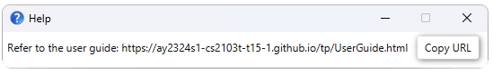

 
 

#### 🔀Switching between different Tabs: `tab`

You can navigate between different tabs in F.A.K.E.J.A.R.V.I.S. to view different lists on the current panel.

Format: `tab TAB_INDEX`

| **Parameter** |          **Description**           |
|:-------------:|:----------------------------------:|
|   TAB_INDEX   | The index of the tab to switch to. |

 

<md>
:information_source: **Note**: 

For the list of tab indexes to use:
* **Students List:** `1`
* **Tasks List:** `2`
* **Assignments List:** `3`
* **Sessions List:** `4`
* **Consultations List:** `5`

</md> 

 

> **📖Example 1:**
>
> **Input:** `tab 1` Switches to the student list tab.
>
> **Output:**
> `Switched to tab 1`
>
> **Output Image:**
> 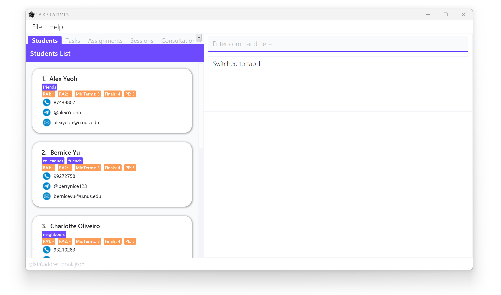

 
 

#### Clearing all Entries : `clear`

You can clear all data from F.A.K.E.J.A.R.V.I.S. if you need to delete the database.

Format: `clear`

 

<md>
:warning: **Warning**:

* This action is irreversible
  </md> 

 

> **📖Example 1:**
>
> **Input:** `clear` Deletes all data in F.A.K.E.J.A.R.V.I.S.
>
> **Output:**
> `Address book has been cleared!`
>
> **Output Image:**
> 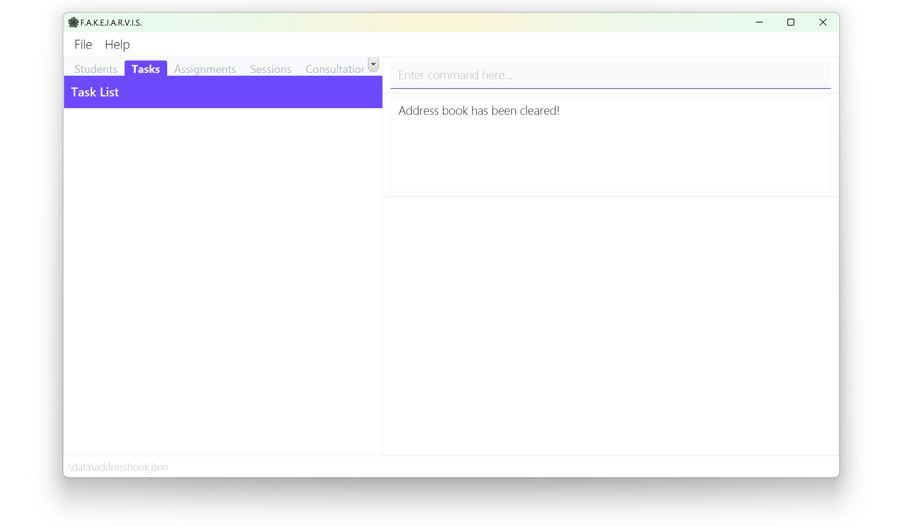

 
 

#### 🏃🚪Exiting F.A.K.E.J.A.R.V.I.S. : `exit`

You can exit the F.A.K.E.J.A.R.V.I.S. application if you're done using the application.

Format: `exit`

 
 

#### 💾Saving the Data

F.A.K.E.J.A.R.V.I.S. data are saved in the hard disk automatically after any command that changes the data. There is no need to save the data manually.

 
 

#### 🛠️Editing the Data File

F.A.K.E.J.A.R.V.I.S. data are saved automatically as a JavaScript Object Notation (JSON) file `[JAR file location]/data/fakejarvis.json`. Advanced users are welcome to update the data directly by editing that data file.

<md>
:warning: **Caution**:

* If your changes to the data file makes its format invalid, F.A.K.E.J.A.R.V.I.S. will discard all data and start with an empty data file at the next run. Hence, it is recommended to make a backup of the file before editing it.
</md>

 
 

#### 💾Archiving Data Files `[coming in v2.0]`

_Stay tuned for more features and enhancements in `v2.0`, including archiving data files and more!_

 

[Back to Table of Contents](#table-of-contents)

 

--------------------------------------------------------------------------------------------------------------------

 

### Student Management
This section describes commands that help you manage your students.

 

#### 📝Adding a Student: `add`

You can add a student to F.A.K.E.J.A.R.V.I.S. if you need to keep track of new students.

Format: `add n/NAME p/PHONE_NUMBER e/EMAIL th/TELEGRAM_HANDLE [t/TAG]…​ [gt/GRADED_TEST]`

|  **Parameter**  |                       **Description**                       |
|:---------------:|:-----------------------------------------------------------:|
|      NAME       |                  The name of the student.                   |
|  PHONE_NUMBER   |              The phone number of the student.               |
|      EMAIL      |              The email address of the student.              |
| TELEGRAM_HANDLE |             The telegram handle of the student.             |
|       TAG       |            The tags associated with the student.            |
|   GRADED_TEST   | The scores of the graded tests associated with the student. |

 

<md>
:information_source: **Note**: 

* You can add any number of tags to a student! (including 0)
* The format for `gt/` is `gt/RA1:0 | RA2:0 | MidTerms:0 | Finals:0 | PE:0`.

</md> 

 

<md>
:bulb: **Tip**:

* You can use `gt/default` to set graded tests scores as '-' !
  </md> 

 

> **📖Example 1:**
>
> **Input:** `add n/John Doe p/98765432 e/johnd@u.nus.edu th/johnny01 gt/RA1:0 | RA2:0 | MidTerms:0 | Finals:0 | PE:0` Adds a person called John Doe into F.A.K.E.J.A.R.V.I.S. He has 98765432 as his phone number, johnd@u.nus.edu as his email and johnny01 as his telegram handle. All his grades are also set to `0`.
>
> **Output:**
> `New person added: Name: John Doe; Phone: 98765432; Email: johnd@u.nus.edu; Telegram Handle: johnny01; Tags: ; GradedTest: `
>
> **Output Image:**
> 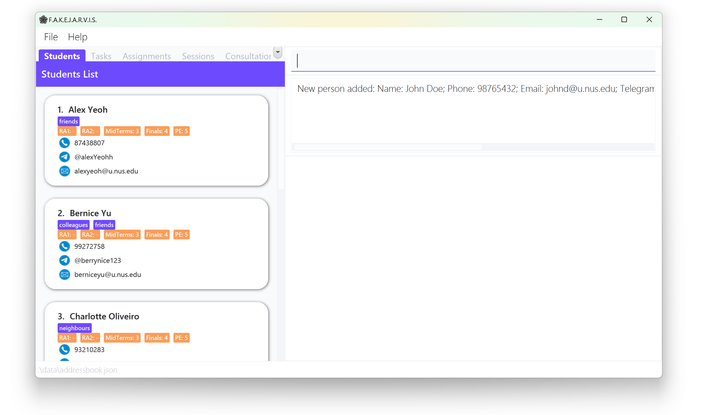

 
 

#### 👀Listing all Students : `list`

You can list out all students in F.A.K.E.J.A.R.V.I.S. if you need to view the complete student list.

Format: `list`

 

> **📖Example 1:**
>
> **Input:** `list` Shows all the students currently in F.A.K.E.J.A.R.V.I.S.
>
> **Output:**
>`Listed all persons`
>
> **Output Image:**
> 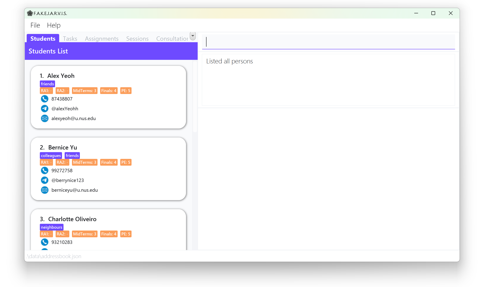

 
 

#### 🛠️Editing a Student Field : `edit`

You can edit an existing student's fields in F.A.K.E.J.A.R.V.I.S. if you need to make changes to a student's information.

Format: `edit STUDENT_INDEX [n/NAME] [p/PHONE] [e/EMAIL] [th/TELEGRAM_HANDLE] [t/TAG]…​ [gt/GRADED_TEST]`

|  **Parameter**  |                         **Description**                         |
|:---------------:|:---------------------------------------------------------------:|
|  STUDENT_INDEX  |                    The index of the student.                    |
|      NAME       |                  The new name of the student.                   |
|      PHONE      |              The new phone number of the student.               |
|      EMAIL      |              The new email address of the student.              |
| TELEGRAM_HANDLE |             The new telegram handle of the student.             |
|       TAG       |            The new tags associated with the student.            |
|   GRADED_TEST   | The new scores of the graded tests associated with the student. |

 

<md> :information_source: **Note**: 

* Edits the person at the specified `STUDENT_INDEX`.
* The student index refers to the index number shown in the displayed student list.
* The student index **must be a positive integer** 1, 2, 3, …​
* At least one of the optional fields must be provided. (i.e `NAME`, `PHONE`, `EMAIL`, `TELEGRAM_HANDLE`, `TAG`, `GRADED_TEST`)
* Editing tags overwrites existing tags; it's not cumulative.
* You can remove all the person’s tags by typing `t/` without specifying any tags after it.
* The format for `gt/` is `gt/RA1:0 | RA2:0 | MidTerms:0 | Finals:0 | PE:0`.

</md>

 

<md>
:bulb: **Tip**:

* You can use `gt/default` to set graded tests scores as '-' !
  </md> 

 

> **📖Example 1:**
>
> **Input:** `edit 1 p/91234567 e/johndoe@u.nus.edu` Edits the phone number and email address of the 1st person to be `91234567` and `johndoe@u.nus.edu`.
>
> **Output:**
>`Edited Person: Name: Alex Yeoh; Phone: 91234567; Email: johndoe@u.nus.edu; Telegram Handle: alexYeohh; Tags: [friends]; Graded Test: RA1: 10; RA2: 10; MidTerms: 3; Final: 4; PE: 5`
>
> **Output Image:**
> 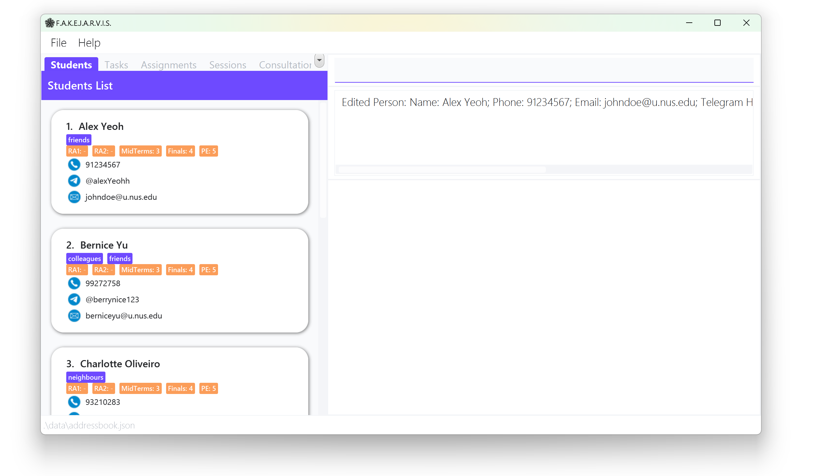

 
 

#### 🔎Finding Student by Name: `find`

You can find a student in F.A.K.E.J.A.R.V.I.S. if you're looking for certain students by their names.

Format: `find KEYWORD…`

| **Parameter** |        **Description**        |
|:-------------:|:-----------------------------:|
|    KEYWORD    | The keyword(s) to search for. |

 

 <md> :information_source: **Note**: 

* The search is case-insensitive. e.g `hans` will match `Hans`.
* The order of the keywords does not matter. e.g. `Hans Bo` will match `Bo Hans`.
* Only full words will be matched e.g. `Han` will not match `Hans`.
* Persons matching at least one keyword will be returned (i.e. `OR` search). e.g. `Hans Bo` will return `Hans Gruber`, `Bo Yang`.

</md>

 

> **📖Example 1:**
>
> **Input:** `find John` Finds students who have the `john` in their name.
>
> **Output:**
>`1 persons listed!`
>
> **Output Image:**
> 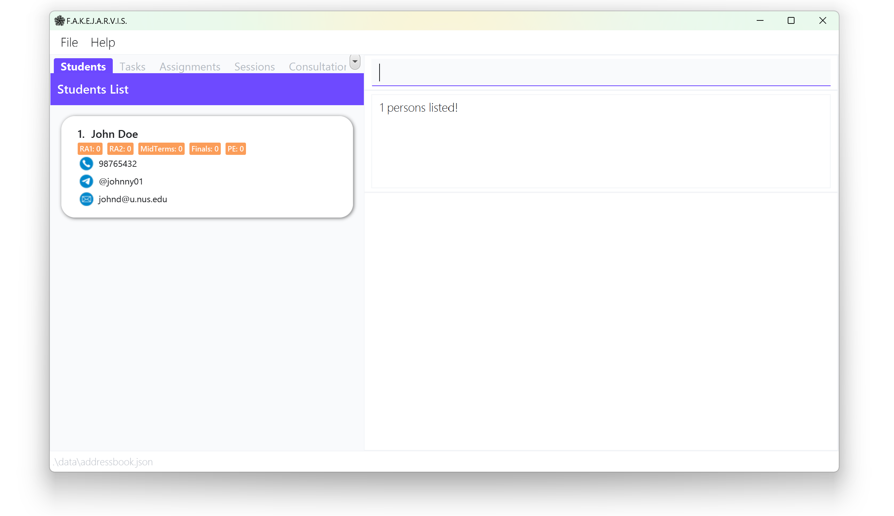

 
 

#### ❌Deleting a Student : `delete`

You can delete a specific student from F.A.K.E.J.A.R.V.I.S. if you no longer require their information in the system.
Format: `delete STUDENT_INDEX`

| **Parameter** |             **Description**             |
|:-------------:|:---------------------------------------:|
| STUDENT_INDEX | The index of the student to be deleted. |

 

 
<md>

:information_source: **Note**:

* Deletes the person at the specified `STUDENT_INDEX`.
* The student index refers to the index number shown in the displayed student list.
* The student index **must be a positive integer** 1, 2, 3, …​

</md>

 

> **📖Example 1:**
>
> **Input:** `list` followed by `delete 2` Deletes the 2nd student in F.A.K.E.J.A.R.V.I.S.
>
> **Output:**
>`Deleted Person: Name: Bernice Yu; Phone: 99272758; Email: berniceyu@u.nus.edu; Telegram Handle: berrynice123; Tags: [colleagues][friends]; Graded Test: RA1: -; RA2: -; MidTerms: 3; Final: 4; PE: 5`
>
> **Output Image:**
> 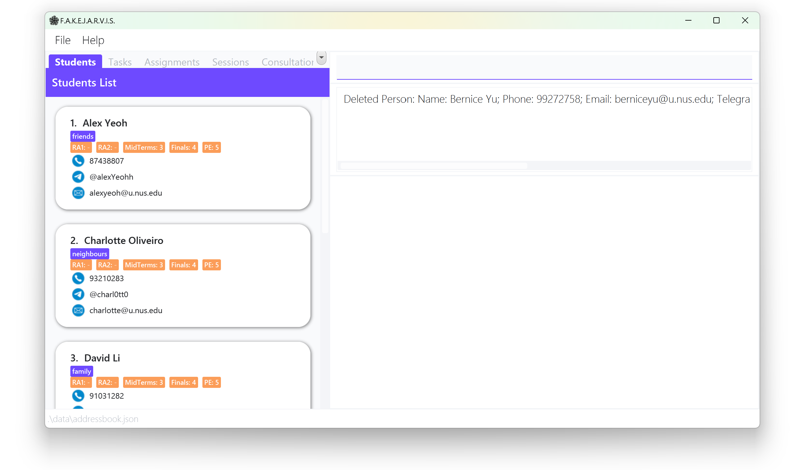

[Back to Table of Contents](#table-of-contents)

 

--------------------------------------------------------------------------------------------------------------------

 

### Task Management

This section describes commands that help you manage your tasks.

 
 

#### 📝Adding a Task: `addtask`

You can add a task to your task list if you have a new item to include in your list of things to do.

Format: `addtask tn/TASK_NAME td/TASK_DESCRIPTION d/DUE_DATE tp/TASK_PRIORITY`

|  **Parameter**   |                           **Description**                           |
|:----------------:|:-------------------------------------------------------------------:|
|    TASK_NAME     |                        The name of the task.                        |
| TASK_DESCRIPTION |                    The description of the task.                     |
|     DUE_DATE     |                The due date or deadline of the task.                |
|  TASK_PRIORITY   | The priority level of the task. Given as `HIGH`, `MEDIUM` or `LOW`. |

 

> **📖Example 1:**
>
> **Input:** `addtask tn/Prepare Lecture slides d/30/09/2023 tp/high` Creates a task to prepare lecture slides with a high priority due on September 30, 2023.
>
> **Output:**
>`Task has been added: Prepare Lecture slides; Description: No Description Provided; Priority: HIGH; Date: 2023-09-30; Progress: NOT_STARTED`
>
> **Output Image:**
> 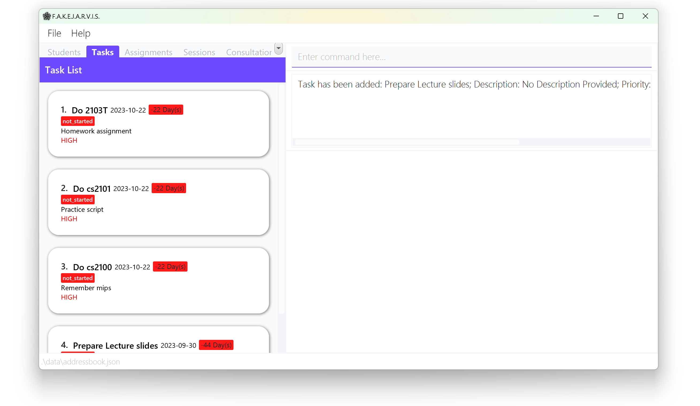

 
 

#### 👀Viewing Tasks: `viewtasks`

You can view your list of tasks if you want to check and manage your current set of to-do list.

Format: `viewtasks [tn/TASK_NAME] / [td/TASK_DESCRIPTION] / [d/DUE_DATE] / [tp/TASK_PRIORITY] / [tprog/TASK_PROGRESS]`

|  **Parameter**   |                               **Description**                                |
|:----------------:|:----------------------------------------------------------------------------:|
|    TASK_NAME     |                            The name of the task.                             |
| TASK_DESCRIPTION |                         The description of the task.                         |
|     DUE_DATE     |                    The due date or deadline of the task.                     |
|  TASK_PRIORITY   |     The priority level of the task. Given as `HIGH`, `MEDIUM` or `LOW`.      |
|  TASK_PROGRESS   | The progress level of the task. Given as `DONE`, `PENDING` or `NOT_STARTED`. |

 

 
<md>

:information_source: **Note**:

* Only the task name, task description, due date, task priority and task progress are searched.
* Only one field can be searched at a time.
* The search is case-insensitive, e.g. `cs2101` will match `CS2101`.
* The order of the keywords does not matter, e.g. `quant book` will match `book quant`.
* If no task matching the search criteria is found, the resulting task list will be blank.

</md>

 

> **📖Example 1:**
>
> **Input:** `viewtasks` Displays all tasks in the user's task list.
>
> **Output:**
>`4 tasks listed!`
>
> **Output Image:**
> 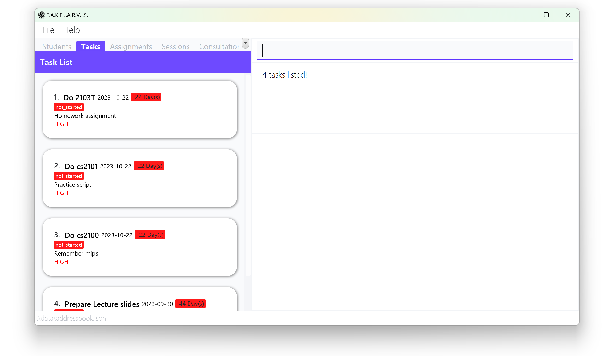

> **📖Example 2:**
>
> **Input:** `viewtasks d/30/09/2023` Displays tasks due on September 30, 2023.
>
> **Output:**
>`1 tasks listed!`
>
> **Output Image:**
> 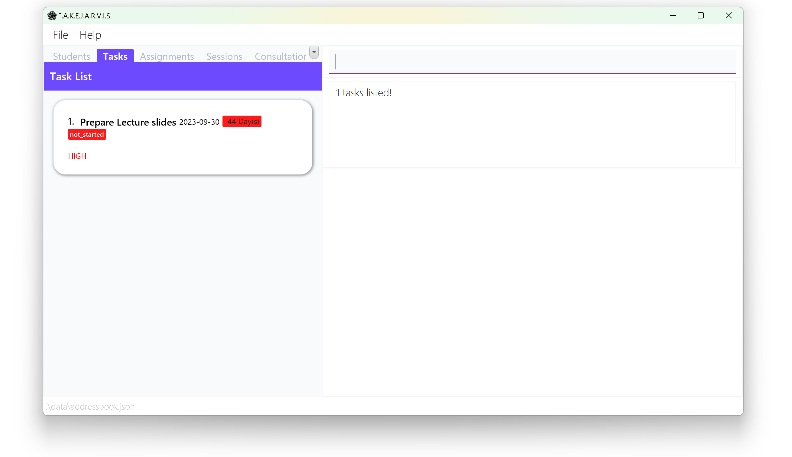

 
 

#### 🛠️Updating a Task's Progress: `updateprogress`

You can update a task's progress if there are changes to the status of a particular task on your list.

Format: `updateprogress TASK_INDEX tprog/NEW_PROGRESS`

| **Parameter** |                                  **Description**                                  |
|:-------------:|:---------------------------------------------------------------------------------:|
|  TASK_INDEX   |                   The index of the task to update the progress.                   |
| NEW_PROGRESS  | The new progress level of the task. Given as `DONE`, `PENDING`, or `NOT_STARTED`. |

 

 
<md>

:information_source: **Note**:

* The task index refers to the index number shown in the displayed task list.
* The task index **must be a positive integer** 1, 2, 3, …​ that is within the range of the task list.

</md>

 

> **📖Example 1:**
>
> **Input:** `updateprogress 1 tprog/pending` Updates the progress of the 1st task as pending.
>
> **Output:**
>`Updated Task: Do 2103T; Description: Homework assignment; Priority: HIGH; Date: 2023-10-22; Progress: PENDING`
>
> **Output Image:**
> 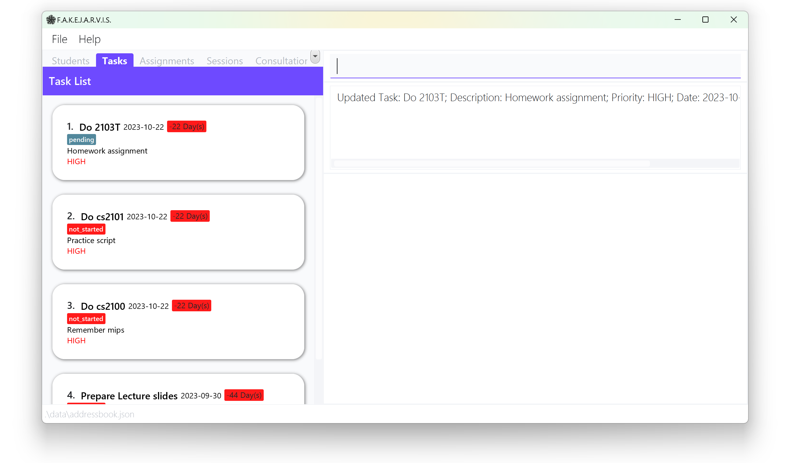

 
 

#### ❌Deleting a Task: `deletetask`

You can delete a task from your task list if you no longer need to keep it on your list of things to do.

Format: `deletetask TASK_INDEX`

| **Parameter** |         **Description**          |
|:-------------:|:--------------------------------:|
|  TASK_INDEX   | The index of the task to delete. |

 

 
<md>

:information_source: **Note**:

* The task index refers to the index number shown in the displayed task list.
* The task index **must be a positive integer** 1, 2, 3, …​ that is within the range of the task list.

</md>

 

> **📖Example 1:**
>
> **Input:** `deletetask 3` Deletes the 3rd task from the task list.
>
> **Output:**
>`Deleted Task: Do cs2100; Description: Remember mips; Priority: HIGH; Date: 2023-10-22; Progress: DONE`
>
> **Output Image:**
> 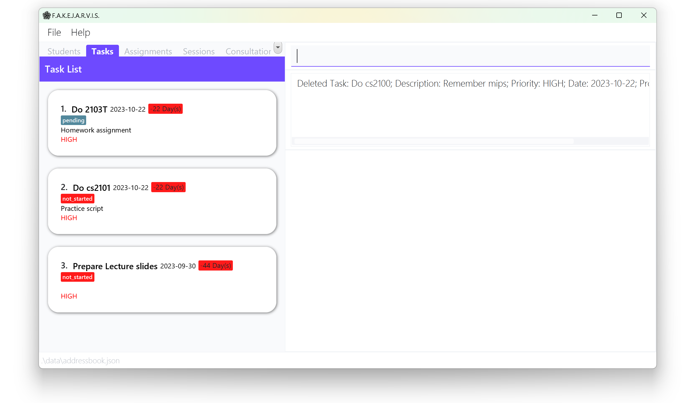

[Back to Table of Contents](#table-of-contents)

 

--------------------------------------------------------------------------------------------------------------------

 

### Attendance Management
This section describes commands that help you manage your students' attendance.

 
 

#### 📆Taking Attendance: `takeattendance`

You can take the attendance of your student(s) if you need to record their presence or absence for a particular session.

Format: `takeattendance n/STUDENT_NAME s/SESSION_NUMBER ap/PRESENCE`

| **Parameter**  |                            **Description**                            |
|:--------------:|:---------------------------------------------------------------------:|
|  STUDENT_NAME  |                       The name of the student.                        |
| SESSION_NUMBER |                  The session number of the session.                   |
|    PRESENCE    | The attendance status of the student. Given as `PRESENT` or `ABSENT`. |

 

 
<md>

:information_source: **Note**:

* The student must exist in F.A.K.E.J.A.R.V.I.S.
* The session with the session number must exist in F.A.K.E.J.A.R.V.I.S.

</md>

 

> **📖Example 1:**
>
> **Input:** `takeattendance n/Alex Yeoh s/1 ap/present` Marks Alex Yeoh as present on the 1st session.
>
> **Output:**
>`Attendance taken`
>
> **Output Image:**
> 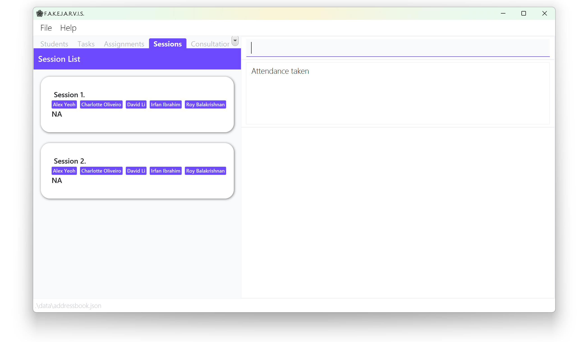

 
 

#### 👀Viewing Attendance: `viewattendance`

You can view the attendance list of your students if you want to check and review their attendance records.

Format: `viewattendance [n/STUDENT_NAME]…`

| **Parameter** |                        **Description**                         |
|:-------------:|:--------------------------------------------------------------:|
| STUDENT_NAME  | The name of the student(s) you want to view the attendance of. |

 

 
<md>

:information_source: **Note**:

* The student must exist in F.A.K.E.J.A.R.V.I.S.
* Omitting `n/STUDENT_NAME` will display the overall attendance across all students and sessions.

</md>

 

> **📖Example 1:**
>
> **Input:** `viewattendance` Displays the overall attendance across all students and sessions.
>
> **Output:**
>`2 sessions listed!`
>
> **Output Image:**
> 

> **📖Example 2:**
>
> **Input:** `viewattendance n/David Li n/Alex Yeoh` Displays all the sessions that David Li and Alex Yeoh have attended.
>
> **Output:**
>`2 sessions listed!`
>
> **Output Image:**
> 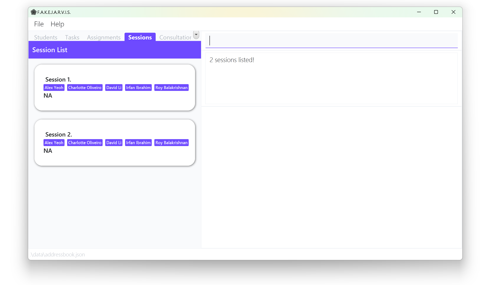

[Back to Table of Contents](#table-of-contents)

 

--------------------------------------------------------------------------------------------------------------------

 

### Assignment Management
This section describes commands that help you manage your students' assignments.

 

#### 👀Viewing a list of Assignments: `viewassignments`

You can view the list of assignment grades and comments of a student if you want to assess and review the feedback provided for each assignment.

Format: `viewassignments STUDENT_INDEX`

| **Parameter** |      **Description**      |
|:-------------:|:-------------------------:|
| STUDENT_INDEX | The index of the student. |

 

 
<md>

:information_source: **Note**:

* The student index refers to the index number shown in the displayed student list.
* The student index **must be a positive integer** 1, 2, 3, …​ that is within the range of the student list.

</md>

 

> **📖Example 1:**
>
> **Input:** `viewassignments 2` shows a list of the 2nd student's assignment names, grades and comments.
>
> **Output:**
>`Showing all assignment details of: Charlotte Oliveiro`
>
> **Output Image:**
> 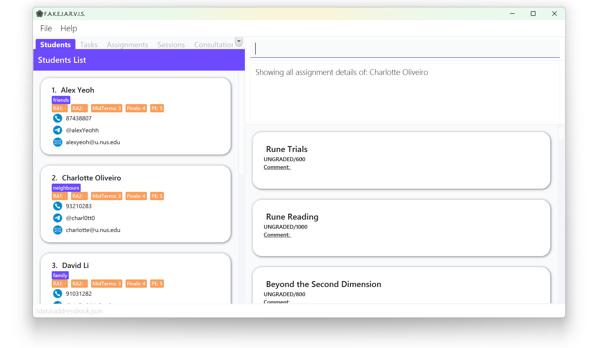

 
 

#### 🛠️Editing an Assignment Grade: `editgrade`

You can edit your student's assignment grade if there is a need to make adjustments or corrections to the initially assigned grade.

Format: `editgrade STUDENT_INDEX as/ASSIGNMENT g/GRADE`

| **Parameter** |        **Description**        |
|:-------------:|:-----------------------------:|
| STUDENT_INDEX |   The index of the student.   |
|  ASSIGNMENT   |  The name of the assignment.  |
|     GRADE     | The new score of the student. |

 

 
<md>

:information_source: **Note**:

* The student index refers to the index number shown in the displayed student list.
* The student index **must be a positive integer** 1, 2, 3, …​ that is within the range of the student list.
* The name of the assignment must exist in F.A.K.E.J.A.R.V.I.S.
* The grade **must not be a negative integer**.
* The grade **must not be greater than** the maximum grade of the assignment by more than 75.

</md>

 

> **📖Example 1:**
>
> **Input:** `editgrade 1 as/Rune Trials g/600` Edits the grade of the 1st student's Rune Trial assignment to 600.
>
> **Output:**
>`Edited grade to assignment: Rune Trials`
>
> **Output Image:**
> 

 
 

#### ❌Deleting an Assignment Grade: `deletegrade`

You can delete your student's assignment grade if you need to remove or reset the previously assigned grade for a particular assignment.

Format: `deletegrade STUDENT_INDEX as/ASSIGNMENT`

| **Parameter** |       **Description**       |
|:-------------:|:---------------------------:|
| STUDENT_INDEX |  The index of the student.  |
|  ASSIGNMENT   | The name of the assignment. |

 

 
<md>

:information_source: **Note**:

* The student index refers to the index number shown in the displayed student list.
* The student index <b>must be a positive integer</b> 1, 2, 3, …​ that is within the range of the student list.
* The name of the assignment must exist in F.A.K.E.J.A.R.V.I.S.
* The assignment **must have already been graded**.

</md>

 

> **📖Example 1:**
>
> **Input:** `deletegrade 1 as/Rune Trials` deletes the 1st student's Rune Trials grade if its graded.
>
> **Output:**
>`Deleted grade from assignment: Rune Trials`
>
> **Output Image:**
> 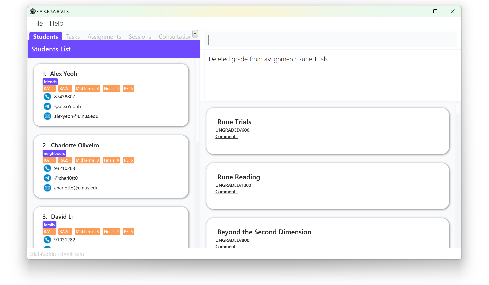

 
 

#### 🛠️Editing an Assignment Comment: `editcomment`

You can edit the comment of your student's assignment if you need to make changes or additions to the feedback provided for a specific assignment.

Format: `editcomment STUDENT_INDEX as/ASSIGNMENT c/COMMENT`

| **Parameter** |       **Description**       |
|:-------------:|:---------------------------:|
| STUDENT_INDEX |  The index of the student.  |
|  ASSIGNMENT   | The name of the assignment. |
|    COMMENT    |      The new comment.       |

 

 
<md>

:information_source: **Note**:

* The student index refers to the index number shown in the displayed student list.
* The student index **must be a positive integer** 1, 2, 3, …​ that is within the range of the student list.
* The name of the assignment must exist in F.A.K.E.J.A.R.V.I.S.
* The comment **must not be empty**
* The comment **must be within 200 characters**.

</md>

 

> **📖Example 1:**
>
> **Input:** `editcomment 1 as/Rune Trials c/Decent` Changes the comment on the 1st student's Rune Trials assignment to “Decent”.
>
> **Output:**
>`Edited comment to assignment: Rune Trials`
>
> **Output Image:**
> 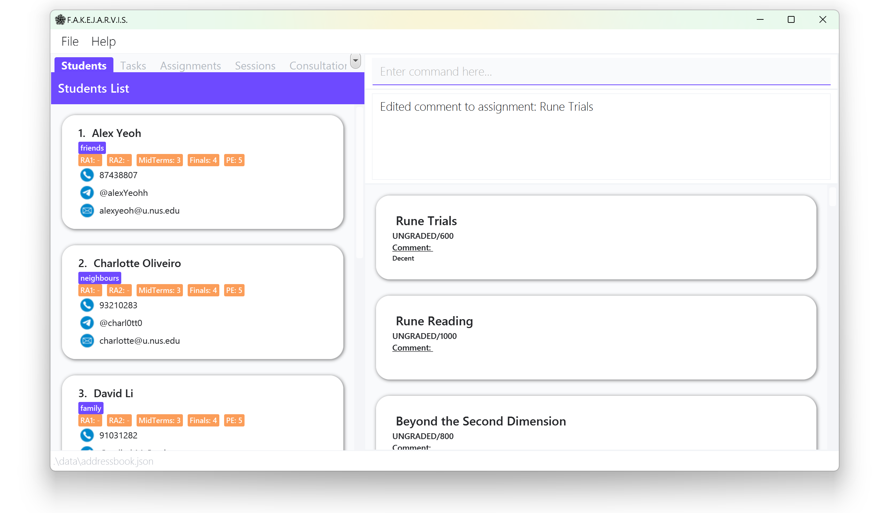

 
 

#### ❌Deleting an Assignment Comment: `deletecomment`

You can delete the comment tagged to your student's assignment if you want to remove or revise the feedback associated with that particular assignment.

Format: `deletecomment STUDENT_INDEX as/ASSIGNMENT`

| **Parameter** |       **Description**       |
|:-------------:|:---------------------------:|
| STUDENT_INDEX |  The index of the student.  |
|  ASSIGNMENT   | The name of the assignment. |

 

 
<md>

:information_source: **Note**:

* The student index refers to the index number shown in the displayed student list.
* The student index **must be a positive integer** 1, 2, 3, …​ that is within the range of the student list.
* The name of the assignment must exist in F.A.K.E.J.A.R.V.I.S.
* The assignment **must have already been commented on**.

</md>

 

> **📖Example 1:**
>
> **Input:** `deletecomment 1 as/Rune Trials` Deletes the comment on the 1st student's Rune Trials assignment if it exists.
>
> **Output:**
> `Deleted comment from assignment: Rune Trials`
>
> **Output Image:**
> 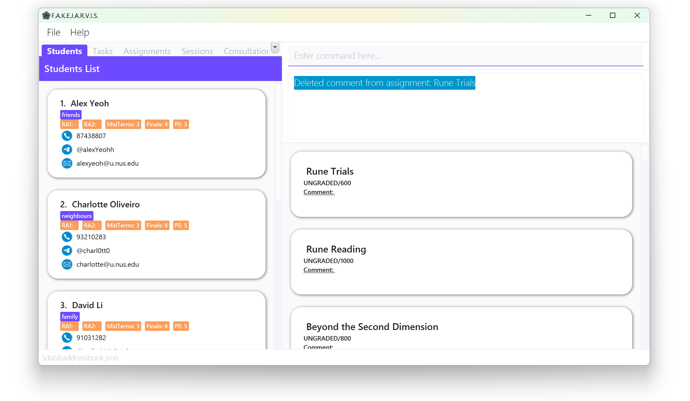

[Back to Table of Contents](#table-of-contents)

 

--------------------------------------------------------------------------------------------------------------------

 

### Graded Test Management
This section describes commands tht help you manage your students' graded tests.

 

#### 🛠️Editing a Graded Test Score: `editgradedtest`

You can edit your student's graded test scores if you need to make adjustments or corrections to their initially recorded test scores.

Format: `editgradedtest STUDENT_INDEX [ra1/READING_ASSESSMENT_1] [ra2/READING_ASSESSMENT_2] [mt/MIDTERMS] [f/FINALS]
[pe/PRACTICAL_EXAM] `

|    **Parameter**     |                   **Description**                    |
|:--------------------:|:----------------------------------------------------:|
|    STUDENT_INDEX     |              The index of the student.               |
| READING_ASSESSMENT_1 | The new score of the student's Reading Assessment 1. |
| READING_ASSESSMENT_2 | The new score of the student's Reading Assessment 2. |
|       MIDTERMS       |       The new score of the student's MidTerms.       |
|        FINALS        |   The new score of the student's Final Assessment.   |
|    PRACTICAL_EXAM    |    The new score of the student's Practical Exam.    |

 

 
<md>

:information_source: **Note**:

* The student index refers to the index number shown in the displayed student list.
* The student index **must be a positive integer** 1, 2, 3, …​ that is within the range of the student list.
* The order of the graded test field(s) does not matter.
* At least one of the optional fields must be provided. (i.e `READING_ASSESSMENT_1`, `READING_ASSESSMENT_2`, `MIDTERMS`, `FINALS`, `PRACTICAL_EXAM`)

</md>

 

> **📖Example 1:**
>
> **Input:** `editgradedtest 1 ra1/1 ra2/2 mt/3 f/4 pe/5` Edits the corresponding graded test scores for the 1st person Alex Yeoh.
>
> **Output:**
>`Edited Person: Name: Alex Yeoh; Phone: 91234567; Email: johndoe@u.nus.edu; Telegram Handle: alexYeohh; Tags: [friends]; Graded Test: RA1: 1; RA2: 2; MidTerms: 3; Final: 4; PE: 5`
>
> **Output Image:**
> 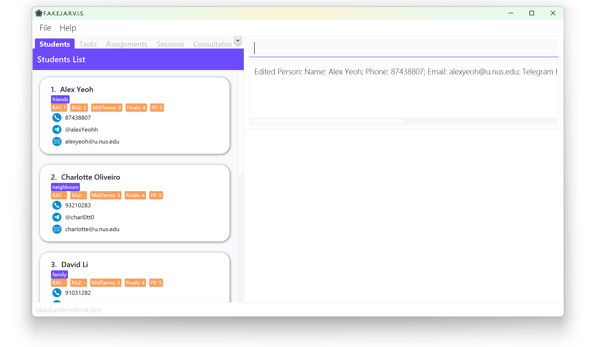

[Back to Table of Contents](#table-of-contents)

 

--------------------------------------------------------------------------------------------------------------------

 

### Session Management
This section describes commands that help you manage your sessions.

 

#### 📝Creating a Session: `createsession`

You can create a session for any upcoming or past sessions if you need to schedule or document your class sessions in the system.

Format: `createsession s/SESSION_NUMBER n/STUDENT_NAME…`

| **Parameter**  |          **Description**           |
|:--------------:|:----------------------------------:|
| SESSION_NUMBER | The session number of the session. |
|  STUDENT_NAME  |    The name of the student(s).     |

 

 
<md>

:information_source: **Note**:

* The name of the student must exist in F.A.K.E.J.A.R.V.I.S.
* The session with the session number must not exist in F.A.K.E.J.A.R.V.I.S.

</md>

 

> **📖Example 1:**
>
> **Input:** `createsession s/3 n/Alex Yeoh` Creates a session, which has session number 3 with Alex Yeoh.
>
> **Output:**
>`New session added: Session: 3; Students: Alex Yeoh; Remark: NA`
>
> **Output Image:**
> 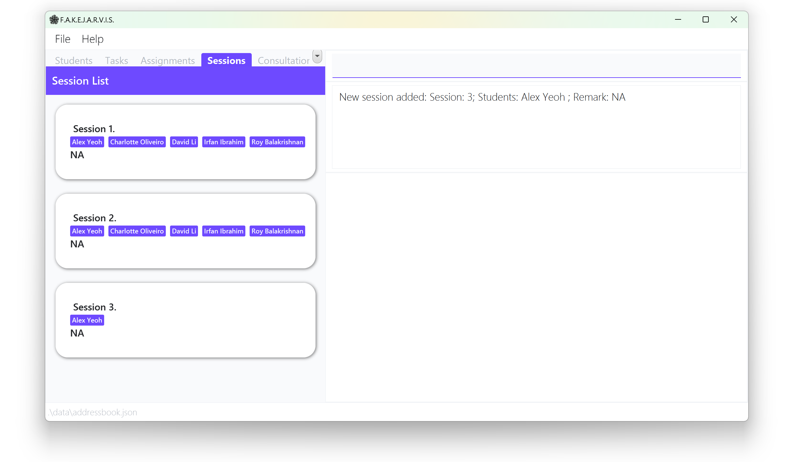

 
 

#### 🛠️Updating a Session's Remark: `updatesessionremark`

You can update an existing session's remark if you need to change or add additional information to the session notes or details.

Format: `updatesessionremark s/SESSION_NUMBER r/REMARK`

| **Parameter**  |                **Description**                |
|:--------------:|:---------------------------------------------:|
| SESSION_NUMBER |      The session number of the session.       |
|     REMARK     | The new remark to be updated for the session. |

 

 
<md>

:information_source: **Note**:

* The session with the session number must exist in F.A.K.E.J.A.R.V.I.S.

</md>

 

> **📖Example 1:**
>
> **Input:** `updatesessionremark s/2 r/Teach Essence of Recursion` Updates the remark for session number 2 to "Teach Essence of Recursion".
>
> **Output:**
>`Session remarks updated: Session: 2; Students: Charlotte Oliveiro David Li Alex Yeoh Irfan Ibrahim Roy Balakrishnan ; Remark: Teach Essence of Recursion`
>
> **Output Image:**
> 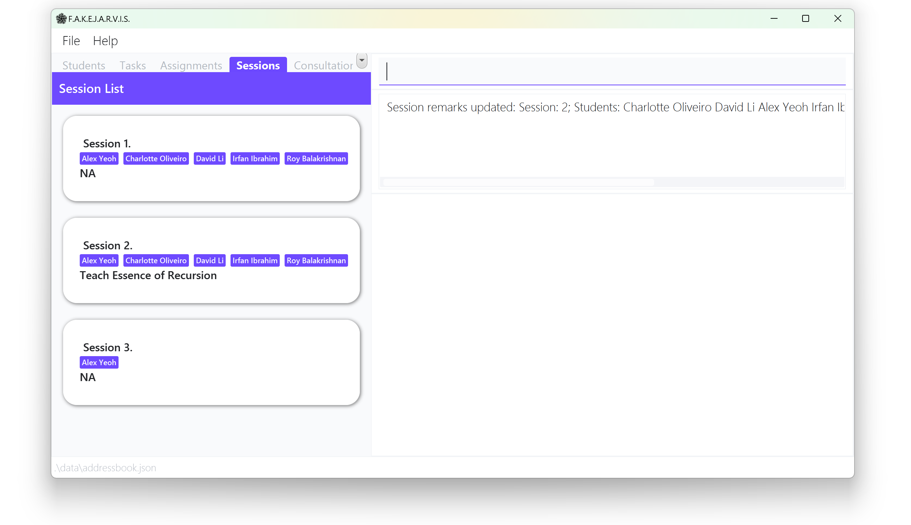

 
 

#### ❌Deleting a Session: `deletesession`

You can delete an existing session specified by its session number if you need to remove or clear the session record from the system.

Format: `deletesession s/SESSION_NUMBER`

| **Parameter**  |          **Description**           |
|:--------------:|:----------------------------------:|
| SESSION_NUMBER | The session number of the session. |

 

 
<md>

:information_source: **Note**:

* The session number must exist in F.A.K.E.J.A.R.V.I.S.

</md>

 

> **📖Example 1:**
>
> **Input:** `deletesession s/1` Deletes the session with session number 1 from the session list.
>
> **Output:**
>`Deleted Session: Session: 1; Students: Charlotte Oliveiro David Li Alex Yeoh Irfan Ibrahim Roy Balakrishnan ; Remark: NA`
>
> **Output Image:**
> 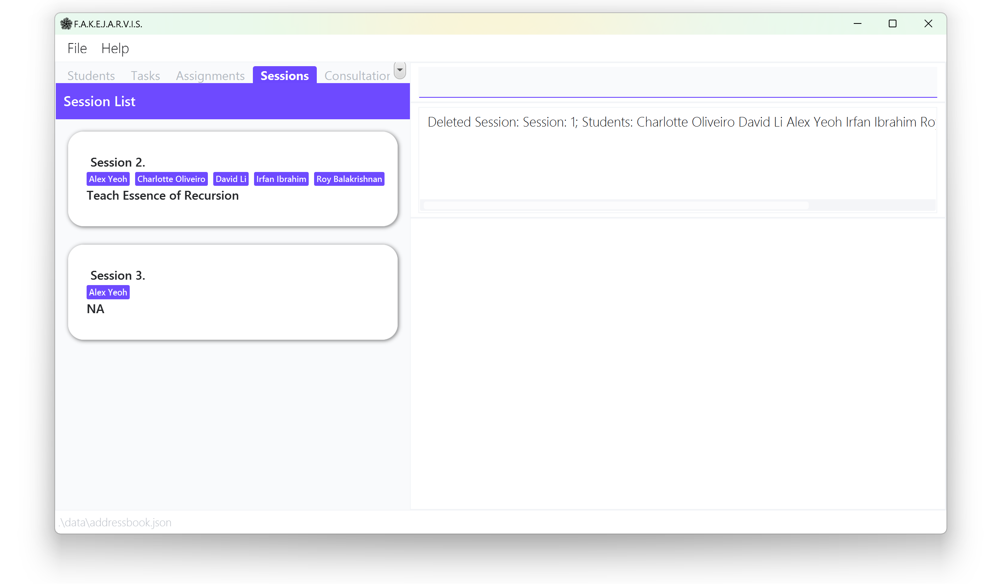

[Back to Table of Contents](#table-of-contents)

 

--------------------------------------------------------------------------------------------------------------------

 

### Consultation Management
This section describes commands that help you manage your consultations with students.

 

#### 📝Creating a Consultation: `createconsult`
You can create a consultation with your students if you need to schedule or document consultations in the system.

Format: `createconsult d/DATE tt/TIME n/STUDENT_NAME…`

| **Parameter**  |       **Description**       |
|:--------------:|:---------------------------:|
|      DATE      |  The date of consultation.  |
|      TIME      |  The time of consultation.  |
|  STUDENT_NAME  | The name of the student(s). |

 

 
<md>

:information_source: **Note**:

* The name of the students must exist in F.A.K.E.J.A.R.V.I.S.

</md>

 

> **📖Example 1:**
>
> **Input:** `createconsult d/30/10/2023 tt/12:30 n/Alex Yeoh` Creates a consultation for Alex Yeoh on 2023-10-30 12:30.
>
> **Output:**
>`New consultation added: Date: 2023-10-30; Time: 12:30; Students: Alex Yeoh`
>
> **Output Image:**
> 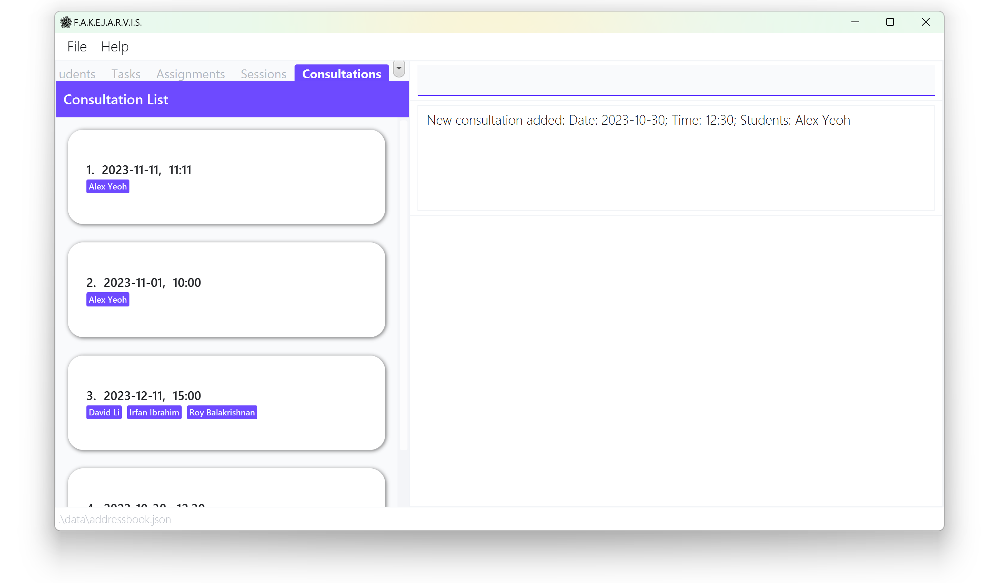

 
 

#### 📝️Adding Students to a Consultation: `addtoconsult`
You can add your student(s) into a consultation slot if you need to assign specific individuals for your consultation.

Format: `addtoconsult CONSULTATION_INDEX n/STUDENT_NAME…`

|   **Parameter**    |                           **Description**                            |
|:------------------:|:--------------------------------------------------------------------:|
| CONSULTATION_INDEX | The index of the consultation in the list of upcoming consultations. |
|    STUDENT_NAME    |       The name of the student to be added to the consultation.       |

 

 
<md>

:information_source: **Note**:

* The consultation index refers to the index number shown in the displayed consultation list.
* The consultation index **must be a positive integer** 1, 2, 3, …​ that is within the range of the consultation list.
* The name of the student must exist in F.A.K.E.J.A.R.V.I.S.

</md>

 

> **📖Example 1:**
>
> **Input:** `addtoconsult 1 n/David Li n/Roy Balakrishnan` Adds David Li and Roy Balakrishnan to the 1st consultation in the list.
>
> **Output:**
>`New student(s) added to consultation at index 1: Date: 2023-11-11; Time: 11:11; Students: Bernice Yu, David Li, Alex Yeoh, Roy Balakrishnan`
>
> **Output Image:**
> 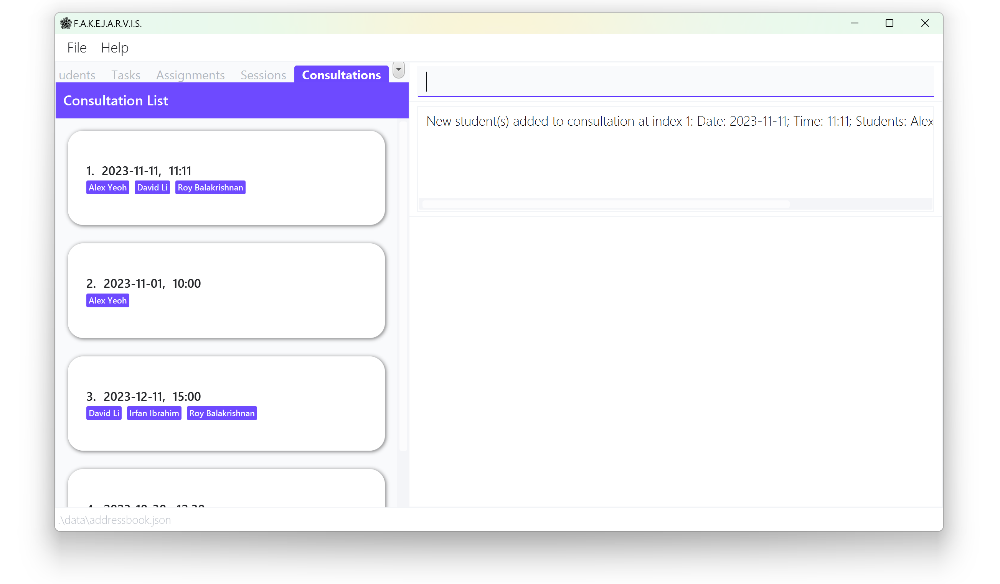

 
 

#### ❌Removing Students from a Consultation: `removefromconsult`

You can remove your student(s) from a consultation if you need to cancel your student's participation in the scheduled consultation.

Format: `removefromconsult CONSULTATION_INDEX n/STUDENT_NAME…`

|   **Parameter**    |                           **Description**                            |
|:------------------:|:--------------------------------------------------------------------:|
| CONSULTATION_INDEX | The index of the consultation in the list of upcoming consultations. |
|    STUDENT_NAME    |     The name of the student to be removed from the consultation.     |

 

 
<md>

:information_source: **Note**:

* The consultation index refers to the index number shown in the displayed consultation list.
* The consultation index **must be a positive integer** 1, 2, 3, …​ that is within the range of the consultation list.
* The name of the student must exist in F.A.K.E.J.A.R.V.I.S.

</md>

 

> **📖Example 1:**
>
> **Input:** `removefromconsult 1 n/David Li` Removes David Li from the 1st consultation in the list.
>
> **Output:**
>`Student(s) removed from consultation at index 1: Date: 2023-11-11; Time: 11:11; Students: Alex Yeoh, Roy Balakrishnan`
>
> **Output Image:**
> 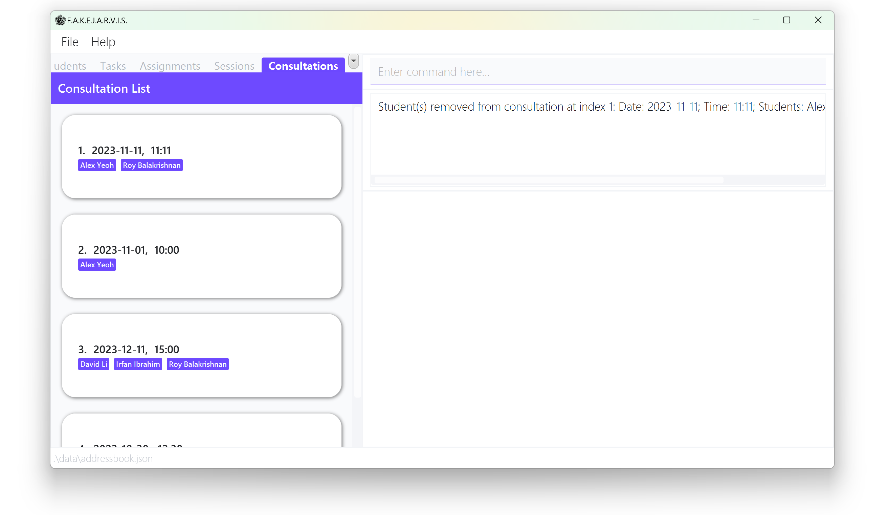

 
 

#### ❌Deleting a Consultation: `deleteconsult`

You can delete the consultation slot specified by an index if you need to remove or clear the scheduled consultation from the system.

Format: `deleteconsult CONSULTATION_INDEX`

|   **Parameter**    |                           **Description**                            |
|:------------------:|:--------------------------------------------------------------------:|
| CONSULTATION_INDEX | The index of the consultation in the list of upcoming consultations. |

 

 
<md>

:information_source: **Note**:

* The consultation index refers to the index number shown in the displayed consultation list.
* The consultation index **must be a positive integer** 1, 2, 3, …​ that is within the range of the consultation list.

</md>

 

> **📖Example 1:**
>
> **Input:** `deleteconsult 1` Deletes the 1st consultation in the consultation list.
>
> **Output:**
>`Deleted Consultation: Date: 2023-11-11; Time: 11:11; Students: Alex Yeoh, Roy Balakrishnan`
>
> **Output Image:**
> 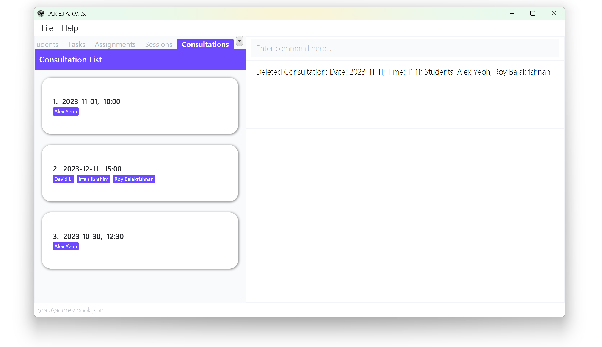

[Back to Table of Contents](#table-of-contents)

 

--------------------------------------------------------------------------------------------------------------------

 
 

## FAQ

<box type="info" seamless icon=":fas-question:">

<md>

**Q**: How do I transfer my data to another computer? 

**A**: You can install the app in the other computer and replace the sample data files with the data files in your previous F.A.K.E.J.A.R.V.I.S. folder.

</md>
</box>

<box type="info" seamless icon=":fas-question:">

<md>

**Q**: How do I reset all the grades of my student? 

**A**: You can use the `edit` command and enter the following: `edit STUDENT_INDEX gt/default`, and all the scores will be set to `-`.

</md>
</box>

<box type="info" seamless icon=":fas-question:">

<md>

**Q**: How can I efficiently edit my student's graded test score 

**A**: You can use the `editgradedtest` command to dynamically update your student's graded test scores.

<md>
:information_source: **Note**:

* Please refer to [EditGradedTest Command](#editing-a-graded-test-score-editgradedtest) for more information.

</md> 

</md>
</box>

 

--------------------------------------------------------------------------------------------------------------------

 

## Known Issues

<box background-color="#fcfcfc" border-left-color="#000000">
<md>

**Issue:** I cannot access F.A.K.E.J.A.R.V.I.S. after using multiple screens on my device.  
* If you move the F.A.K.E.J.A.R.V.I.S. to a secondary screen, and later switch to using only the primary screen, the GUI will open off-screen. 

**Fix:** 
* To solve this issue, simply delete the `preferences.json` file created by F.A.K.E.J.A.R.V.I.S. before running the application again.

<md>
:information_source: **Note**: 

* The `preferences.json` file can be found in the folder where you downloaded/saved F.A.K.E.J.A.R.V.I.S. 

</md> 

</md>
</box>

<box background-color="#fcfcfc" border-left-color="#000000">
<md>

**Issue:** I cannot add Names, Tags and TelegramHandles with special characters.  
* Names, Tags and TelegramHandles are not able to accept special characters (e.g `Spencer O'Brian`, `Mohan S/O Rohan`, `façade`, `bob.the.best123`). 

**Fix:** 
* As a workaround, you may omit the special characters and input just the alphanumeric characters.
* For TelegramHandles, you may replace `.`(dot) with `_`(underscore).

</md>
</box>

<box background-color="#fcfcfc" border-left-color="#000000">
<md>

**Issue:** I cannot add other email domains to the list.  
* Emails are only limited to NUS emails.

**Fix:** 
* Unfortunately, as of the current version of F.A.K.E.J.A.R.V.I.S. we only support NUS emails ending with `@u.nus.edu`. 

</md>
</box>

 

--------------------------------------------------------------------------------------------------------------------

 

## Command summary

### General commands
|     **Action**     |                                                            **Format**                                                            | 
**Examples**
                                                                                                      |
|:------------------:|:--------------------------------------------------------------------------------------------------------------------------------:|------------------------------------------------------------------------------------------------------------------------------------|
|      **Help**      |                                                              `help`                                                              | `help`                                                                                                                             |
|  **Switch Tabs**   |                                                         `tab TAB_INDEX`                                                          | `tab 4`                                                                                                                            |
|      **Exit**      |                                                              `exit`                                                              | `exit`                                                                                                                             |
|     **Clear**      |                                                             `clear`                                                              | `clear`                                                                                                                            |

 

### Student commands
|     **Action**     |                                                           **Format**                                                            | 
**Examples**
                                                                                                      |
|:------------------:|:-------------------------------------------------------------------------------------------------------------------------------:|------------------------------------------------------------------------------------------------------------------------------------|
|  **Add Student**   |                        `add n/NAME p/PHONE_NUMBER e/EMAIL th/TELEGRAM_HANDLE [t/TAG]…​ [gt/GRADED_TEST]`                        | `add n/James Ho p/12345678 e/jamesho@u.nus.edu th/james03 t/friend t/colleague gt/default`                                         |
| **List Students**  |                                                             `list`                                                              | `list`                                                                                                                             |
|  **Edit Student**  |              `edit STUDENT_INDEX [n/NAME] [p/PHONE_NUMBER] [e/EMAIL] [th/TELGRAM_HANDLE] [t/TAG]…[gt/GRADEDTEST]`               | `edit 2 n/James Lee e/jameslee@u.nus.edu gt/default`                                                                               |
|  **Find Student**  |                                                 `find KEYWORD [MORE_KEYWORDS]`                                                  | `find John`  `find alex david`                                                                                                  |
| **Delete Student** |                                                     `delete STUDENT_INDEX`                                                      | `delete 3`                                                                                                                         |

 

### Task commands
|          **Action**          |                                                            **Format**                                                            | 
**Examples**
                                                                                                      |
|:----------------------------:|:--------------------------------------------------------------------------------------------------------------------------------:|------------------------------------------------------------------------------------------------------------------------------------|
|         **Add Task**         |                              `addtask tn/TASK_NAME td/TASK_DESCRIPTION d/DUE_DATE tp/TASK_PRIORITY`                              | `addtask tn/Prepare Lecture slides d/30/09/2023 tp/high`,  `addtask tn/Read Chapter 5`                                          |
|        **View Tasks**        |       `viewtasks [tn/TASK_NAME] / [td/TASK_DESCRIPTION] / [d/DUE_DATE] / [tp/TASK_PRIORITY] /  [tprog/TASK_PROGRESS]`        | `viewtasks`,  `viewtasks tp/high`,  `viewtasks d/30/09/2023`                                                                 |
|     **Update Progress**      |                                          `updateprogress TASK_INDEX tprog/NEW_PROGRESS`                                          | `updateprogress 1 tprog/pending`, `updateprogress 3 tprog/done`                                                                 |
|       **Delete Task**        |                                                     `deletetask TASK_INDEX`                                                      | `deletetask 3`, `deletetask 2`                                                                                                  |

 

### Attendance commands
|          **Action**          |                                                            **Format**                                                            | 
**Examples**
                                                                                                      |
|:----------------------------:|:--------------------------------------------------------------------------------------------------------------------------------:|------------------------------------------------------------------------------------------------------------------------------------|
|     **Take Attendance**      |                                       `takeattendance n/STUDENT_NAME s/SESSION p/PRESENCE`                                       | `takeattendance n/John Doe s/5 present`, `takeattendance n/Foo Bar s/2 absent`                                                  |
|     **View Attendance**      |                                                `viewattendance [n/STUDENT_NAME]…`                                                | `viewattendance`, `viewattendance n/Rayan`,  `viewattendance n/Jayson n/Resley`                                              |

 

### Assignment commands
|          **Action**          |                                                            **Format**                                                            | 
**Examples**
                                                                                                      |
|:----------------------------:|:--------------------------------------------------------------------------------------------------------------------------------:|------------------------------------------------------------------------------------------------------------------------------------|
|     **View Assignments**     |                                                 `viewassignments STUDENT_INDEX`                                                  | `viewassignments 1`, `viewassignments 2`                                                                                        |
|        **Edit Grade**        |                                         `editgrade STUDENT_INDEX as/ASSIGNMENT g/GRADE`                                          | `editgrade 1 as/Functional Expressionism g/1200`, `editgrade 2 as/Rune Reading g/1000`                                          |
|       **Delete Grade**       |                                            `deletegrade STUDENT_INDEX as/ASSIGNMENT`                                             | `deletegrade 1 as/Functional Expressionism`, `deletegrade 2 as/Rune Reading`                                                    |
|       **Edit Comment**       |                                       `editcomment STUDENT_INDEX as/ASSIGNMENT c/COMMENT`                                        | `editcomment 1 as/Functional Expressionism c/Decent`,  `editcomment 2 as/Rune Reading c/Great`                                  |
|      **Delete Comment**      |                                           `deletecomment STUDENT_INDEX as/ASSIGNMENT`                                            | `deletecomment 1 as/Functional Expressionism`,  `deletecomment 2 as/Rune Reading`                                               |

 

### Graded Test commands
|          **Action**          |                                                            **Format**                                                             | 
**Examples**
                                                               |
|:----------------------------:|:---------------------------------------------------------------------------------------------------------------------------------:|---------------------------------------------------------------------------------------------|
|     **Edit Graded Test**     | `editgradedtest STUDENT_INDEX [ra1/READING_ASSESSMENT_1] [ra2/READING_ASSESSMENT_2] [mt/MIDTERMS] [f/FINALS] [pe/PRACTICAL_EXAM]` | `editgradedtest 1 ra1/90 ra2/80 mt/85 f/88 pe/95`, `editgradedtest 2 mt/78 ra1/33 f/80`  |

 

### Session commands
|          **Action**          |                                                            **Format**                                                            | 
**Examples**
                                                                                                      |
|:----------------------------:|:--------------------------------------------------------------------------------------------------------------------------------:|------------------------------------------------------------------------------------------------------------------------------------|
|      **Create Session**      |                                         `createsession s/SESSION_NUMBER n/STUDENT_NAME…`                                         | `createsession s/4 n/Betsy Crower n/David Li`                                                                                      |
|  **Update Session Remark**   |                                         `updatesessionremark s/SESSION_NUMBER r/REMARK`                                          | `updatesessionremark s/2 r/Teach Essence of Recursion`,  `updatesessionremark s/4 r/Taught streams and metacircular evalutator` |
|      **Delete Session**      |                                                 `deletesession s/SESSION_NUMBER`                                                 | `deletesession s/1`, `deletesession s/4`                                                                                        |

 

### Consultation commands
|          **Action**          |                                                            **Format**                                                            | 
**Examples**
                                                                                                      |
|:----------------------------:|:--------------------------------------------------------------------------------------------------------------------------------:|------------------------------------------------------------------------------------------------------------------------------------|
|   **Create Consultation**    |                                          `createconsult d/DATE tt/TIME n/STUDENT_NAME…`                                          | `createconsult d/30/10/2023 tt/12:30 n/Alex Yeoh`, `createconsult d/30/09/2023 tt/15:30 n/Alex Yeoh n/Betsy Crower n/David Li`  |
|   **Add To Consultation**    |                                        `addtoconsult CONSULTATION_INDEX n/STUDENT_NAME…`                                         | `addtoconsult 2 n/Betsy Crower`, `addtoconsult 1 n/David Li n/Roy Balakrishnan`                                                 |
| **Remove From Consultation** |                                      `removefromconsult CONSULTATION_INDEX n/STUDENT_NAME…`                                      | `removefromconsult 2 n/Betsy Crower`                                                                                               |
|   **Delete Consultation**    |                                                `deleteconsult CONSULTATION_INDEX`                                                | `deleteconsult 1`                                                                                                                  |

 

[Back to Table of Contents](#table-of-contents)

 

--------------------------------------------------------------------------------------------------------------------

 

## Encountering Errors
If you encounter any issues while using F.A.K.E.J.A.R.V.I.S., please refer to this section for troubleshooting advice. This section aims to help you better understand the messages that you may receive and what it means to you. If the issue persists, please contact support (see next section).

|                                    **Error**                                    | 
**What it means**
                                                                                                                  | 
**How to resolve**
                                                                                                                           |
|:-------------------------------------------------------------------------------:|-----------------------------------------------------------------------------------------------------------------------------------------------------|---------------------------------------------------------------------------------------------------------------------------------------------------------------|
|                               **Unknown command**                               | You have supplied a command that was unrecognisable.   e.g. Command word was given in upper case.                                               | 1. Double-check the spelling and case of the command.   2. Refer to the [features](#features) section above for the correct commands.                     |
|                           **Invalid command format!**                           | You have supplied a command with the incorrect format.   e.g. Command is missing the compulsory parameters.                                     | 1. Double-check the command format and the parameters required.   2. Refer to the [features](#features) section above for the correct command formats.    |
|                        **The Index provided is invalid**                        | You have provided an index that is out of the range of the items.                                                                                   | 1. Only provide Indexes that are within the range of the list.   e.g. if there are 3 items in the list, the valid indexes that can be used are (1, 2, 3). |
|                **At least one field to edit must be provided.**                 | You have not provided a field to edit.                                                                                                              | 1. Double-check that a prefix and a field was provided together with the command.                                                                             |                                   
| **This `task` / `person` already exists in the `task list` / `students list`.** | You have tried to either add a duplicate entry with the same fields, or edit an entry such that all the fields are duplicates of an existing entry. | 1. Double-check that the fields supplied are correct.   2. Remove the old entry from F.A.K.E.J.A.R.V.I.S.                                                 |
|   **Date needs to be in the format dd/MM/yyyy, or date has already crossed.**   | You have either supplied the date in an unrecognisable format, or provided a date that is in the past.                                              | 1. Double-check that the format of the date provided is dd/MM/yyyy (e.g. 28/10/2023)   2. Choose a date from today or later.                             |
|                    **Time needs to be in the format HH:mm.**                    | You have supplied the time in an unrecognisable format.                                                                                             | 1. Double-check that the format of the time provided is HH:mm (e.g. 22:00)                                                                                    |

[Back to Table of Contents](#table-of-contents)

## Contacting Support
If you need further assistance with F.A.K.E.J.A.R.V.I.S. please contact our support team at `support@fakejarvis.org`.
